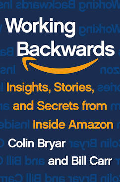

# Working Backwards, by Bryar and Carr

It's kind of an [ad][] for the authors' consulting, but it's also
interesting to hear how Amazon works. They quote a lot of
[shareholder letters][] (NDA concerns?) and are no doubt biased, but
some Amazon ideas seem okay. The chapter organization is decent:

[ad]: https://www.workingbackwards.com/
[shareholder letters]: https://ir.aboutamazon.com/annual-reports-proxies-and-shareholder-letters/

 1. "Building Blocks: [Leadership Principles][] and Mechanisms"
     * I've heard there are also team-specific (and other?)
       "[tenets][]" that sort of layer on top of the Leadership
       Principles.
 2. "Hiring: Amazon's Unique Bar Raiser Process"
     * Quite structured, focused on specifics/data/anecdotes, with a
       facilitator expert in hiring process.
 3. "Organizing: Separable, Single-Threaded Leadership"
     * Make it somebody's only responsibility. They don't use
       [two-pizza teams][] that much any more, but this
       single-threaded idea is still emphasized.
 4. "Communicating: Narratives and the Six-Pager"
     * They listened to [Tufte][]! No PowerPoint!
 5. "Working Backwards: Start with the Desired Customer Experience"
     * They write a press release and FAQ for the thing, as if they're
       launching it today, before they decide to do it at all.
 6. "Metrics: Manage Your Inputs, Not Your Outputs"
     * Makes a lot of sense, assuming you really know how inputs
       connect to outputs... Studying that is probably somebody's job.

And then they talk about Kindle, Prime, Prime Video, and AWS in part two.

[Leadership Principles]: https://www.amazon.jobs/en/principles
[tenets]: https://medium.com/fact-of-the-day-1/tenets-at-amazon-a2bb8a56ae94
[two-pizza teams]: https://www.theguardian.com/technology/2018/apr/24/the-two-pizza-rule-and-the-secret-of-amazons-success
[Tufte]: https://www.edwardtufte.com/tufte/powerpoint

---

> "In its first shareholder letter back in 1997, Amazon's first year
> as a public company, you'll find the phrases "Obsess Over
> Customers," "It's All About the Long Term," and "We will continue to
> learn from both our successes and our failures." One year later the
> term "Operational Excellence" entered the discussion, completing the
> four-faceted description of Amazon's corporate culture that endures
> today." (page xi)

> "Of course, these four cultural touchstones don't quite get at the
> "how," that is, how people can work, individually and collectively,
> to ensure that they are maintained. And so Jeff and his leadership
> team crafted a set of 14 [now 16] Leadership Principles, as well as
> a broad set of explicit, practical methodologies, that constatntly
> reinforce its cultural goals. These include: the Bar Raiser hiring
> process that ensures that the company continues to acquire top
> talent; a bias for separable teams run by leaders with a singular
> focus that optimizes for speed of delivery and innovation; the use
> of written narratives instead of slide decks to ensure that deep
> understanding of complex issues drives well-informed decisions; a
> relentless focus on input metrics to ensure that teams work on
> activities that propel the business. And finally there is the
> product development process that gives this book its name: working
> backwards from the desired customer experience." (page xi)

---

Around page 12, they talk about how the Leadership Principles tried to
capture the culture, not create it. They were first listed in
2004-2005, ten years after Amazon was founded.

---

> "In my tenure at Amazon I heard him [Jeff Bezos] say many times that
> if we wanted Amazon to be a place where builders can build, we
> needed to eliminate communication, not encourage it." (page 61)

---

> "The metrics used to measure progress were agreed upon. For example,
> In-stock Product Pages Displayed divided by Total Product Pages
> Displayed, weighted at 60 percent; and Inventory Holding Cost,
> weighted at 40 percent." (page 70)

Reading this quickly, it seems to make sense. But the values are on
different scales: one is between zero and one (I hope) and the other
is a cost, presumably measured in dollars. So what is this really?

Also, for product pages, an ebook is always in stock, so is there an
incentive to show ebooks rather than physical books? Is that
desirable?

---

> "If you're good at course correcting, being wrong may be less costly
> than you think, whereas being slow is going to be expensive for
> sure." (page 71, quoting the 2016 Bezos shareholder letter)

---

> "Sometimes it's best to start slow in order to move fast." (page 71)

---

> "Fitness Functions Were Actually Worse Than Their Component Metrics
>
> Two-pizza teams had been meant to increase the velocity of product
> development, with custom-tailored fitness functions serving as the
> directional component of each team's velocity. By pointing each team
> in the right direction and alerting them early if they drifted off
> course, fitness functions were supposed to align the team uniquely
> to its goals. We tried them out for more than a year, but fitness
> functions never really delivered on their promise for a couple of
> important reasons.
>
> First, teams spent an inordinate amount of time struggling with how
> to construct the most meaningful fitness function. Should the
> formula be 50 percent for Metric A plus 30 percent for Metric B plus
> 20 percent for Metric C? Or should it be 45 percent for Metric A
> plus 40 percent for Metric B plus 15 percent for Metric C? You can
> imagine how easy it was to get lost in those debates. The
> discussions became less useful and ultimately distracting—just
> another argument that people needed to win.
>
> Second, some of these overly complicated functions combined seven or
> more metrics, a few of which were composite numbers built from their
> own submetrics. When graphed over time, they might describe a trend
> line that went up and to the right, but what did that mean? It was
> often impossible to discern what the team was doing right (or wrong)
> and how they should respond to the trend. Also, the relative
> weightings could change over time as business conditions changed,
> obscuring historic trends altogether.
>
> We eventually reverted to relying directly on the underlying metrics
> instead of the fitness function. After experimenting over many
> months across many teams, we realized that as long as we did the
> up-front work to agree on the specific metrics for a team, and we
> agreed on specific goals for each input metric, that was sufficient
> to ensure the team would move in the right direction. Combining them
> into a single, unifying indicator was a very clever idea that simply
> didn't work." (pages 73-74)

---

> "What was originally known as a two-pizza team leader (2PTL) evolved
> into what is now known as a single-threaded leader (STL). The STL
> extends the basic model of separable teams to deliver their key
> benefits at any scale the project demands. Today, despite their
> initial success, few people at Amazon still talk about two-pizza
> teams." (page 75)

---

> "When the retail, operations, and finance teams began to construct
> the initial Amazon WBR [Weekly Business Review], they turned to a
> well-known Six Sigma process improvement method called DMAIC, an
> acronym for Define-Measure-Analyze-Improve-Control." (page 124)

> "Amazon takes this philosophy
> [of understanding how inputs affect outputs] to heart, focusing most
> of its effort on leading indicators (we call these "controllable
> input metrics") rather than lagging indicators ("output metrics")."
> (page 124)

---

> "When Amazon teams come across a surprise or a perplexing problem
> with the data, they are relentless until they discover the root
> cause. Perhaps the most widely used technique at Amazon for these
> situations is the Correction of Errors (COE) process, based upon the
> "Five Whys" method developed at Toyota and used by many companies
> worldwide." (page 132)

---

> "Anecdotes and exception reporting are woven into the
> [Weekly Business Review] deck." (page 135)

> "Data Combined with Anecdote to Tell the Whole Story: Numerical data
> become more powerful when combined with real-life customer stories."
> (page 142)

> "These stories remind us that the work we do has direct impact on
> customers' lives." (page 143)

> "Data and anecdotes make a powerful combination when they're in
> sync, and they are a valuable check on one another when they are
> not." (page 145)

---

> "Even the best process can only improve the quality of your
> decision-making; no process will make the decision for you." (page
> 159)

---

> "With each modification [of the org structure], the scope of each
> leader's responsibilities would become narrower, but the intended
> scale of each role was greater. At most companies, reducing a
> leader's scope would be considered a demotion, and in fact there
> were many VPs and directors who saw each of these changes in that
> way. At Amazon, it was not a demotion." (page 174)

There's some interesting organizational psychology here; maybe it's
obvious, but it seems interesting to me.

---

> "Steve asked Gregg to build out a hardware organization, which he
> did with the code name Lab126 (the 1 and 26 stood for the letters A
> and Z) and earmarked a meaningful amount of capital to the effort."
> (page 181)

---

> "... we learned from studies that the average consumer would only
> bother to connect their iPod to their PC once a year. That meant
> most people walked around without the latest music on their devices.
> It was known as the "stale iPod" syndrome." (page 183)

This kind of thing is fascinating - often I would never guess the real
behavior of real people, on average.

---

> "... in Amazonian terms, a "strong general athlete" (SGA)." (page 202)

Seems like this phrase shows up sometimes on Amazon job descriptions...

---

> "Jeff and other Amazon leaders often talk about the "institutional
> no" and its counterpart, the "institutional yes." The institutional
> no refers to the tendency for well-meaning people within large
> organizations to say no to new ideas." (pages 203-204)

---

> "Jeff said he wanted to build a moat around our best customers.
> Prime would be a premium experience for convenience-oriented
> customers." (page 208)

---

Wrapping up with recommendations:

> * "Ban PowerPoint
> * Establish the Bar Raiser hiring process
> * Focus on controllable input metrics
> * Move to an organizational structure that accomodates autonomous
>   teams with single-threaded leaders
> * Revise the compensation structure for leaders
> * Articulate the core elements of the company's culture
> * Define a set of leadership principles
> * Depict your flywheel" (pulled from pages 261-262)
