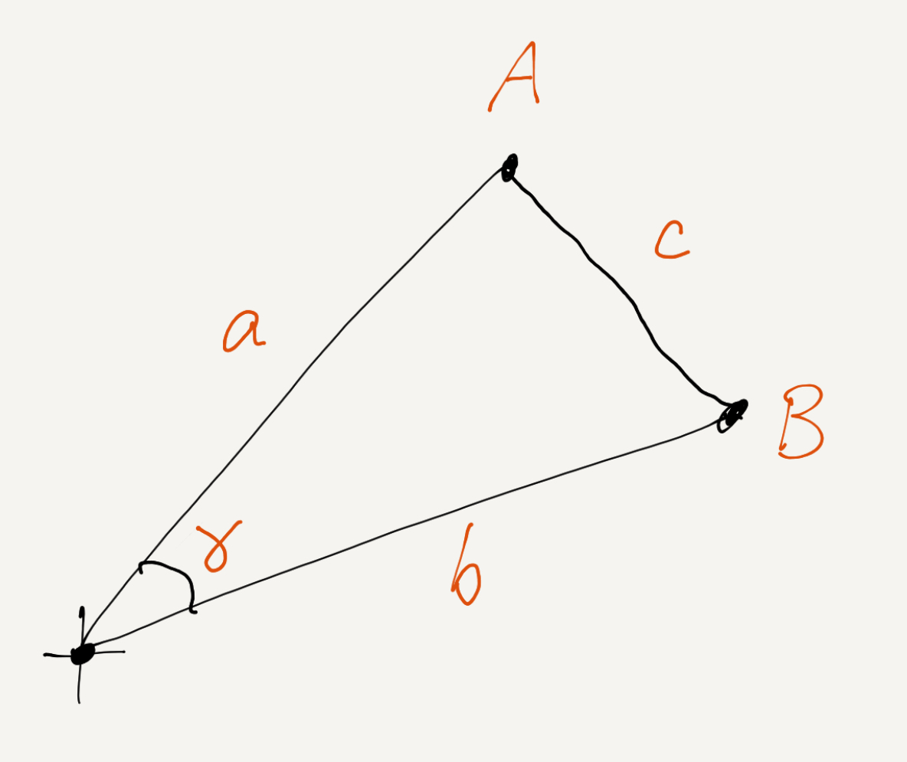

# Dot product really does give you cosine

The [dot product][] of \\( A \\) and \\( B \\) gives you the
[cosine][] of the angle \\( \gamma \\) between them, scaled by the
product of their lengths, \\( a \\) and \\( b \\) (Equation 1). Here's
a proof using the Law of Cosines.

[dot product]: https://en.wikipedia.org/wiki/Dot_product
[cosine]: https://en.wikipedia.org/wiki/Trigonometric_functions

\\[ A \cdot B = \cos \left( \gamma \right) a b \tag{1} \\]

Equation 1 is invoked, for example, in defining [cosine similarity][],
often without derivation.

[cosine similarity]: https://en.wikipedia.org/wiki/Cosine_similarity

If, in \\( n \\) dimensions, the [Cartesian coordinates][] of a point
\\( X \\) are \\( x_1, x_2, \dotso, x_n \\), then the dot product \\(
A \cdot B \\) is the sum of element-wise products as in Equation 2.

[Cartesian coordinates]: https://en.wikipedia.org/wiki/Cartesian_coordinate_system

 \\[ A \cdot B = \sum_{i=1}^n{a_i b_i} \tag{2} \\]

The dot product is so simple, it's a little surprising a nice
trigonometric function like cosine should come out of it in arbitrary
high-dimensional spaces.

Notation has been chosen so as to write the [Law of Cosines][] as
usual in Equation 3.

[Law of Cosines]: https://en.wikipedia.org/wiki/Law_of_cosines

\\[ c^2 = a^2 + b^2 - 2 a b \cos \left( \gamma \right) \tag{3} \\]

The \\( c^2 \\) in Equation 3 is the square of the distance from \\( A
\\) to \\( B \\) and can also be written, using the
[Pythagorean theorem][], as in Equation 4.

[Pythagorean theorem]: https://en.wikipedia.org/wiki/Pythagorean_theorem

\\[ c^2 =
    \sum_{i=1}^k{ \left( a_i - b_i \right)^2 } =
    \sum_{i=1}^k{ a_i^2 + b_i^2 - 2 a_i b_i } =
    a^2 + b^2 - 2 \sum_{i=1}^k{ a_i b_i } \tag{4} \\]

Equating the right hands of Equations 3 and 4, and recognizing the dot
product as in Equation 2, we've built Equation 1 from scratch. \\(
\Box \\)

---

It's also possible to use two-dimensional right triangle visualization
thinking to see how dot product projects one vector onto another, with
scaling by the lengths of the vectors. 3Blue1Brown has a great
[video][]. It's easy to connect to the usual definition of cosine.

[video]: https://www.youtube.com/watch?v=LyGKycYT2v0&list=PLZHQObOWTQDPD3MizzM2xVFitgF8hE_ab&index=10

Since you can always rotate your coordinate frame to get one vector
with all zero coordinates except for one, and the other vector with
all zero coordinates except for that one and one more, it's clear that
dot product should give cosine in that frame, but it isn't necessarily
obvious (to me) that everything works out in other coordinate frames.
The proof above gives me confidence that it does. (Not that I didn't
believe it before, but it's nice to have a reason.)

---

I wasn't quite satisfied with cosine similarity via dot product for a
long time. My satisfaction now and the proof above is based quite
directly on the proof Hamming generously gives on pages 117-118 of
[The Art of Doing Science and Engineering][]. As he says there
(italics in original):

[The Art of Doing Science and Engineering]: /20200725-art_of_doing_science_and_engineering/

> "I have found it very valuable in important situations to review
> _all the basic derivations involved_ so I have a firm feeling for
> what is going on."

He uses different (possibly better?) notation, and his figure is
certainly nicer than mine.
