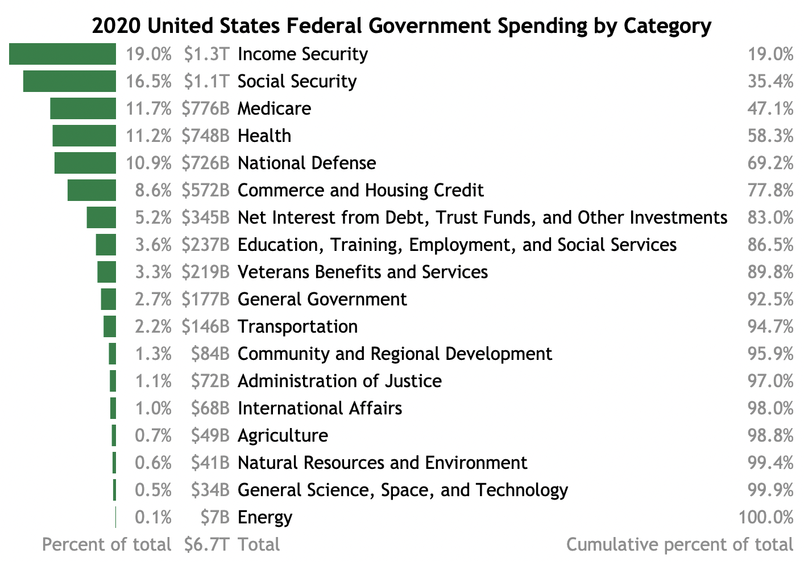
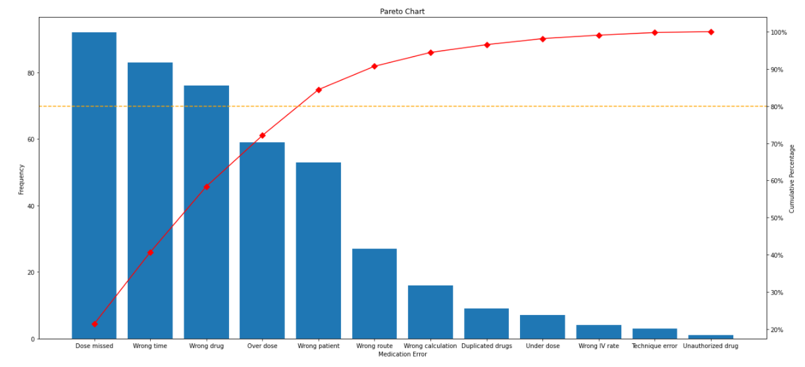
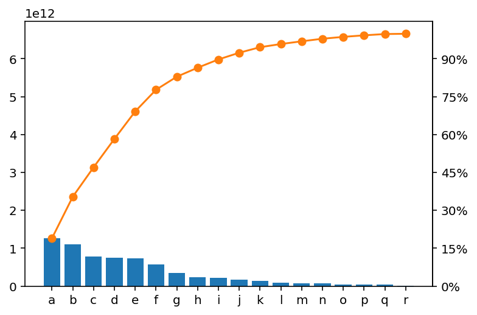
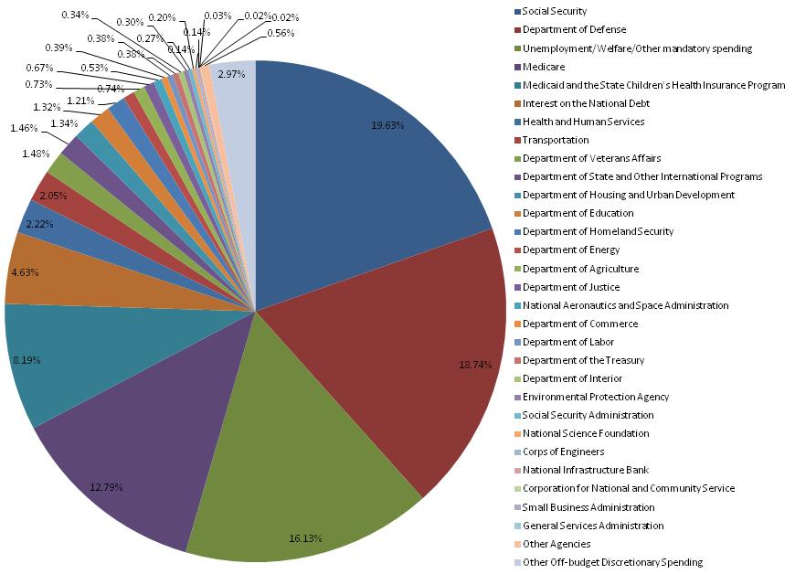
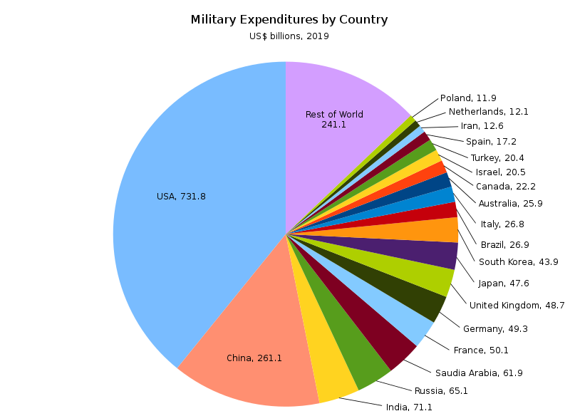

# Try a table instead of a Pareto chart

I thought [Pareto charts][] might be fine if they didn't use multiple
vertical axes, but I was wrong. Pareto charts have lots of problems,
especially with many items and long labels. Pareto chart information
is better presented horizontally, as in a table.

[Pareto charts]: https://en.wikipedia.org/wiki/Pareto_chart

The Pareto chart image at left is the same width as the table image
shown at right.

---

 * [Multiple vertical axes?](#multi_vert)
 * [The cumulative percentage line is bad](#cumulative_bad)
 * [Pie charts are also bad for labeling](#labeling_pie)
 * [Stacked bar charts are also hard to label](#labeling_bar)
 * [Bar charts: Hard to label](#label_bar)
 * [Just make a table](#table)
 * [Categories are problematic](#categories)
 * [Change over time?](#change)
 * [Data for this example](#data)
 * [Code for this example](#code)

---

### <a name="multi_vert" href="#multi_vert">Multiple vertical axes?</a>

Here's an example I [found][] of a Pareto chart where both the
individual bars and cumulative line use all the vertical space, which
looks nice visually.

[found]: https://medium.com/swlh/pareto-chart-with-python-5200459ee65c

In my opinion the confusion introduced by having two different
vertical axes is unacceptable.

This particular example is especially egregious because the right hand
cumulative percentage scale starts at 20% rather than 0%, which makes
it look like the leftmost category somehow accounts for almost none of
the cumulative total.

This example also shows how text on visualizations can become a
disaster by getting tiny. Don't make people squint.

The problem of having two vertical scales isn't necessary; the same
scale can be used, and presented as both raw value and percent of
total. But often, this introduces a lot of whitespace.

The vertical axis labels could be improved here, but the main visual
effect is to foreground the cumulative percentage line, squishing the
bars. Is the cumulative percentage line worth it?

---

### <a name="cumulative_bad" href="#cumulative_bad">The cumulative percentage line is bad</a>

Ordering things by size is interesting and useful for understanding
what components are largest, but it isn't really a natural ordering.
It could change, for example. So while there is a cumulative value in
the sense of "the top 5 items account for X% of the total", these
values aren't cumulative in the sense of summing over a natural order
the way you might to get the probability of rolling a 3 or lower, for
example.

There's also no meaning to the cumulative value "between" two
categories, generally. Using a line to connect the cumulative sums
suggests a smoothness of transition which is misleading.

The main use you might put the cumulative line to is identifying the
number of categories that add up to some percentage of the total, like
50% or 80%. This leads immediately to trying to do this using the
figure's axes, which is clumsy. Better to include the values, and if
you do this via direct labeling, your figure is becoming a table with
awkward alignment.

---

### <a name="labeling_pie" href="#labeling_pie">Pie charts are also bad for labeling</a>

The main thing people love to hate about pie charts is the difficulty
we have interpreting relative sizes of pieces of pie, and this is
valid. But it's also a huge pain to label those slices.

If you take the easy way out with a separate legend, as in this
[extreme example][], you create a miserable game of hide and seek for
the viewer.

[extreme example]: https://en.wikipedia.org/wiki/File:Fy2010_spending_by_category.jpg

This example struggles even to label the percentages of the tiny
slices, and matching labels to slices is very difficult.

Attempting direct labeling with a pie chart is better, as in this
[example][] comparing military spending.

[example]: https://commons.wikimedia.org/wiki/File:Military_Expenditures_by_Country_2019.svg

There are two reasons direct labeling is possible here: country names
tend to be short, and most countries get tossed into "Rest of World".
In general, pie chart labeling won't work as well as this.

And of course the problems with using a circular representation remain
as well.

---

### <a name="labeling_bar" href="#labeling_bar">Stacked bar charts are also hard to label</a>

A stacked bar chart should be better than a pie chart in that it
allows viewers to compare linear distances, but it's still hard to
label. I tried a couple different ways.

I tried mocking up direct labeling on a stacked bar, but I gave up
before I finished adding all the lines because it was just a
nightmare. Too many lines, too close together.

The alternative then is to use proximity. But what do you do with the
labels that won't fit?

Here's one clumsy answer, just stacking the labels once there isn't
space to put them in the right places. It starts to just look like a
table with wasted space.

A variation puts all the unlabelable categories into a catch-all,
which I don't really love either.

The horizontal text is at least readable, and it isn't a pie chart,
but it's also still not really so easy to compare lengths between
segments at the top and the bottom of the stacked bar.

---

### <a name="label_bar" href="#label_bar">Bar charts: Hard to label</a>

With languages that write left-to-right or right-to-left, it's
difficult to label a bunch of vertical bars. Especially with longer
labels, it can get ridiculous.

Arguably, a big part of the value of a Pareto chart _is the labels_
because they've been put in order so that the biggest factors come
first. Readability is important. The Pareto chart generally fails to
have highly readable labeling.

---

### <a name="table" href="#table">Just make a table</a>

A horizontal bar chart with the cumulative line dropped could make for
a better Pareto chart. You could adjust orientation and add numeric
labeling so that viewers can read off useful values. At this point
what you have is really a table with one column of [SPARKLINE][] bars.

[SPARKLINE]: https://support.google.com/docs/answer/3093289

Using a table lets you easily align data in columns for easy reference
and scanning, increasing information density without making an
irregular Where's Waldo of numbers.

---

### <a name="categories" href="#categories">Categories are problematic</a>

Categories are generally epiphenomena of human perception.

In this example, why is "Medicare" separate from "Health"? Why use the
divisions here and not others? Sometimes big categories here are
omitted by others as non-discretionary; why not do that?

Questions of this kind are probably a bigger deal than the
visualization you choose, but are outside scope here.

---

### <a name="change" href="#change">Change over time?</a>

Data is shown for a single year here, but changes over time are super
interesting. "Income security" is the top category for 2020, but
that's because of COVID-19: it was fifth for 2019. "National defense"
was second in 2019. I'm not sure what the best way to show these
changes over time; the [trends][] page from the data provider isn't
bad.

[trends]: https://datalab.usaspending.gov/americas-finance-guide/spending/trends/

---

### <a name="data" href="#data">Data for this example</a>

The data is from [USAspending.gov][]'s Data Lab
[Federal Spending by Category and Agency][]. I dropped "Offsetting
Revenue Collected But Not Attributed to Functions" on the grounds that
I don't understand how it's spending. Really I think their displays
are pretty good.

[USAspending.gov]: https://www.usaspending.gov/
[Federal Spending by Category and Agency]: https://datalab.usaspending.gov/americas-finance-guide/spending/categories/

---

### <a name="code" href="#code">Code for this example</a>

A brief Python notebook is [on GitHub][]. I mocked some stuff up in a
[Google Slides deck][], and the main table is in a [Google Sheet][].
All of these are fairly clumsy and I'd love to find better ways of
doing this kind of thing.

[on GitHub]: https://github.com/ajschumacher/pareto_chart
[Google Slides deck]: https://docs.google.com/presentation/d/1hpaWIa7o0OvJkJZUQPotfGkvMxM548Gc6n5ruEZ8rTE/edit?usp=sharing
[Google Sheet]: https://docs.google.com/spreadsheets/d/1o6fo5obvkJAUW-r12EAzqvmoNnEhd-Q05RUFMlq1xuw/edit?usp=sharing
