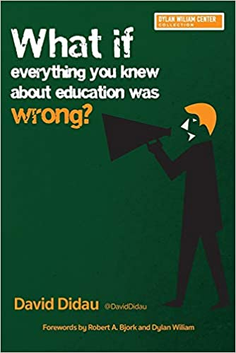

# David Didau's 2015 book endorses eugenics

The most salient thing about Didau's _What if everything you knew
about education was wrong?_ turns out to be that it has an appendix by
[Andrew Sabisky][] which recommends as an "excellent and readable
introduction to behavior genetics" an [infamous article][] by
eugenicist [Arthur Jensen][], among other more and less explicitly
racist, backward things.

[Andrew Sabisky]: https://www.theguardian.com/politics/2020/feb/17/andrew-sabisky-boris-johnsons-ex-adviser-in-his-own-words
[infamous article]: https://files.eric.ed.gov/fulltext/ED023722.pdf
[Arthur Jensen]: https://www.splcenter.org/fighting-hate/extremist-files/individual/arthur-jensen

This harmful propaganda was not only published, but also hasn't been
corrected since. The book is still for sale. Didau's [site][] still
says "Andrew Sabisky has elegantly debunked a series of the most
enduring edu-myths about intelligence" in it. While in a
[later book][] Didau describes eugenics as "an unpleasant and
inherently racist ideology" (page 96) he hasn't disavowed the contents
of his earlier book, including when asked directly ([1][], [2][]).

[site]: https://learningspy.co.uk/featured/have-you-read-the-wrongbook/
[later book]: /20210914-didaus_2019_book_plagiarism_and_one_main_bad_idea/
[1]: https://twitter.com/planarrowspace/status/1432060069961736204
[2]: https://twitter.com/planarrowspace/status/1433458397647708163

Didau's chapters themselves dog-whistle a little more subtly, as when
he smirks at political correctness by referencing an
[obscure incident][] (page 76) or (in his [later book][]) disparages a
feminist paper without considering its contents (page 204).

[obscure incident]: https://metro.co.uk/2008/06/20/dont-brainstorm-take-a-thought-shower-204354/

The book otherwise advocates for explicit instruction and trying to
get kids to remember things via, for example, spaced repetition. Didau
supports a knowledge-rich curriculum like [Hirsch][] and wants
everybody to stop hassling teachers so much. His thinking here reminds
me of a [meme][] from
[Seven Years of Spaced Repetition Software in the Classroom][].

[Hirsch]: https://en.wikipedia.org/wiki/E._D._Hirsch
[meme]: https://knowyourmeme.com/memes/iq-bell-curve-midwit
[Seven Years of Spaced Repetition Software in the Classroom]: https://www.lesswrong.com/posts/F6ZTtBXn2cFLmWPdM/seven-years-of-spaced-repetition-software-in-the-classroom-1

Approach with caution.

---

While this is always the case, I feel like it's especially important
with a book like this for me to point out that selected quotes below
do not indicate my agreement with or support for any particular quote.

---

> "To make things even more challenging for us as learners and/or
> teachers, conditions of instruction or practice that appear to
> result in rapid progress and learning can fail to produce good
> long-term retention of skills and knowledge, or transfer of such
> skills or knowledge to new situations where they are relevant,
> whereas other conditions that pose challenges for the learner — and
> appear to slow the learning process — can enhance such long-term
> retention and transfer. Conditions of the latter type, which I have
> labelled "desirable difficulties", include spacing, rather than
> massing, repeated study opportunities; interleaving, rather than
> blocking, instruction or practice on the separate components of a
> given task; providing intermittent, rather than continuous, feedback
> to learners; varying the conditions of learning, rather than keeping
> them constant and predictable; and using tests, rather than
> re-presentations, as learning opportunities." (pages iv-v)

---

> "These are the _threshold concepts_ of the book:
>
>   * Seeing shouldn't always result in believing (Chapter 1).
>   * We are all victims of cognitive bias (Chapter 2).
>   * Compromise doesn't always result in effective solutions (Chapter
>     4).
>   * Evidence is not the same as proof (Chapter 5).
>   * Progress is a gradual, non-linear process (Chapters 6 and 7).
>   * Learning is invisible (Chapter 8).
>   * Current performance is not only a poor indication of learning, it
>     actually seems to prevent it (Chapters 8 and 9).
>   * Forgetting aids learning (Chapter 9).
>   * Experts and novices learn diffferently (Chapter 10).
>   * Making learning more difficult can make it more durable (Chapter
>     11)." (page 2)

---

> "Because curriculum time is always limited, we need to decide which
> is more important: teaching or learning." (page 3)

---

> "This leads us to [naive realism][] — the belief that our senses
> provide us with an objective and reliable awareness of the world."
> (page 16)

[naive realism]: https://en.wikipedia.org/wiki/Na%C3%AFve_realism_(psychology)

---

> "For the most part 'anecdotal evidence' is an oxymoron." (page 18)

---

> "The fusion of these beliefs is _enactivism_: there really is an
> objective reality out there, but we cannot perceive it directly.
> Instead we share in the generation of meaning; we don't just
> exchange information and ideas, we change the world by our
> participation in it. We take the evidence of our senses and
> construct our own individual models of the world. But because we
> start with the same objective reality, our individual constructed
> realities have lots of points of contact." (page 21)

I'm not sure that's quite what others mean by [enactivism][]...

[enactivism]: https://en.wikipedia.org/wiki/Enactivism

---

> "This is what Michael Shermer calls "patternicity": the tendency to
> find meaningful patterns in random noise." (page 26)

This is citing "The Believing Brain: From Ghosts and Gods to Politics
and Conspiracies—How We Construct Beliefs and Reinforce Them as
Truths".

See also: [apophenia](https://en.wikipedia.org/wiki/Apophenia).

---

> "Our inability to think statistically causes us to routinely
> misinterpret what data tells us. In a survey of school results in
> Pennsylvania, many of the top performing schools were very small.
> Intuitively this makes sense — in a small school teachers will
> better know their students and will be able to give much more
> tailored support. This finding encouraged the Bill and Melinda Gates
> Foundation to make a $1.7 billion investment in founding a string of
> small schools. Sadly the project was a failure. The finding that
> smaller schools do better was a confound; the worst schools in the
> Pennsylvania survey were also small schools. Statistically small
> schools are not better. In fact, larger schools tend to produce
> better results due to the diversity of curriculum options they can
> offer. OUr desire to find patterns and explanations trips us up. We
> ignore the statistical fact that small populations tend to yield
> more extreme results than larger populations, and we focus instead
> on causes and narratives." (page 27)

This cites "Evidence That Smaller Schools Do Not Improve Student
Achievement" by Wainer and Zwerling.

---

On page 55 he talks about the British system of "target grades", which
is surprising and weird to me. Every student gets some explicit target
grade for their big exams at the end of high school. Wacky. He cites a
[blog post][].

[blog post]: https://othmarstrombone.wordpress.com/2014/07/18/how-to-eat-50-hot-dogs-in-12-minutes-and-why-setting-targets-may-hold-back-progress/

After talking to Jay about this, it's possible having "target grades"
isn't so different from how things often play out in the US, when
student performance on standardized tests sorts them into tracked
classes... Not exactly the same thing, but maybe not _so_ foreign.

---

> "Assigning numerical values to our preferences and biases gives them
> the power of data, but they're still just made up." (page 58)

---

> "The philosopher Bertrand Russell pointed out, "in the modern world
> the stupid are cocksure while the intelligent are full of doubt"."
> (page 62)

The citation is Russell's "[The Triumph of Stupidity]".

[The Triumph of Stupidity]: https://russell-j.com/0583TS.HTM

---

I hadn't heard of "thought-showering" instead of "brain-storming"...
The phrase seems to have had a [short history][]. The citation of
[Productivity Loss in Brainstorming Groups: A Meta-Analytic Integration][]
is more relevant. (page 76)

[short history]: https://metro.co.uk/2008/06/20/dont-brainstorm-take-a-thought-shower-204354/
[Productivity Loss in Brainstorming Groups: A Meta-Analytic Integration]: https://www.tandfonline.com/doi/abs/10.1207/s15324834basp1201_1

---

> "Rushing students into situations where they are expected to behave
> like experts misses the fact that they don't yet know enough to do
> so. Simply making students work in groups will not create better
> workers." (page 77)

---

> "The point of collaboration is that it opens us up to the ideas of
> others. But so does reading books." (page 77)

---

> "If the evidence tells us that teacher led instruction is an
> effective way to teach and discovery learning is an ineffective way
> of teaching (and it does), why would you do a bit of both?" (101)

That highly opinionated bit contrasts with this nearby selection:

> "Teaching cannot be child centered and teacher led at the same time.
> You have to make a choice. I'm not arguing that one position is
> better than the other, just that they are mutually exclusive." (page
> 102)

He's trying to make an argument here, and it might even be right, but
he isn't making it very well.

---

> "My own suspicion is that most teachers put on a child-centered show
> when observed and then revert to teaching from the front when the
> classroom door is closed. The only real effect that being told
> teaching should be relevant, active and collaborative has had is to
> make us feel guilty for teaching." (page 109)

This is quite a claim.

---

On page 111, I was interested to see the
[Cone of Experience][]/"Learning Pyramid" ("people remember X% of what
they Y") debunked. I remember seeing a poster version back in middle
school, and I never questioned it. Didau cites
[Multimodal Learning Through Media][], which opens with a good
critique of the "Learning Pyramid" thing.

[Cone of Experience]: https://en.wikipedia.org/wiki/Edgar_Dale#Cone_of_Experience
[Multimodal Learning Through Media]: https://www.cisco.com/c/dam/en_us/solutions/industries/docs/education/Multimodal-Learning-Through-Media.pdf

---

> "Making it harder to learn is more effective than making it easy."
> (page 115)

---

> "Instead of endlessly seeking to find out new things, we should
> think more carefully about the things we've already found out."
> (page 127)

I like this, but maybe it's not an "instead of" but "in addition
to"...

---

> "It's not clear whether 'direct instruction' refers to generic
> teacher-led whole-class teaching or Siegfried Engelmann's
> [Direct Instruction][], in which lessons are scripted and which
> outperformed all other teaching methods in the largest and most
> expensive education study ever undertaken, Project Follow Through."
> (page 131)

[Direct Instruction]: https://www.nifdi.org/

If scripted lessons are so great, why is video not so great?

---

> "Education researcher and author Geoff Petty [says][], "This
> strategy of top-down diktat does not work, it has been carefully
> evaluated and it fails. So if you are forced to do “evidence based
> teaching”, you are not doing Evidence Based Teaching! You are being
> bullied with an ineffective management strategy!"" (page 133)

[says]: https://geoffpetty.com/geoffs-books/evidence-based-teaching-ebt/

---

> "Coe has [suggested][] this axiom: "Learning happens when people
> have to think hard.""

[suggested]: https://img1.wsimg.com/blobby/go/ede177f2-5088-4fee-a850-d64ccdf72d47/downloads/Improving%20Education%20Coe%20Inaugural%20June%202013.pdf?ver=1621348419849

---

> "Understanding and recognizing the most important conceptual areas
> of our subjects upon which all else rests might help us to make
> better decisions about both what and how to teach." (page 164)

---

> "The notion of ability is as much about how we see ourselves and how
> others see us as it is about intelligence." (page 172)

---

> "We want our students to have an understanding of the deep structure
> of a domain of knowledge, but we have to be patient. If we want
> someone to have an insight, simply telling them what the insight is
> 'meant to be' robs them of seeing it for themselves. Instead, we can
> tell them as much about the surface features of a problem as we can
> and wait for them to join our dots. Mimicry is a necessary waiting
> room in the chaos of liminal space. Feeling frustrated that children
> know, say, their times tables, but are unable to do long division,
> is silly. As they learn more facts, see more examples and get more
> practice, they will slowly but surely move towards an expert's
> understanding of the subject." (page 201)

For someone who doesn't like discovery learning, this seems similar to
discovery learning...

---

> "The path to mastery isn't smooth, but it becomes a lot less bumpy
> when we accept that it's hard and that we're supposed to struggle."
> (page 209)

---

> "Testing can (and should) include some of the tricks and techniques
> we've been misusing and misunderstanding as Formative Assessment. In
> fact, it doesn't really matter how we test students as long as our
> emphasis changes. Testing should not be used primarily to assess the
> efficacy of your teaching and students' learning; it should be used
> as a powerful tool in your pedagogical armory to _help_ them learn."
> (page 234)

---

> "Trying harder makes a big difference. Getting students to
> understand what they should be doing is hard enough, but motivating
> them to actually do it is the master skill." (page 256)

For something that's "the master skill", this topic isn't given much
attention... There is some though...

---

> "The fourth reason
> [for students to decide to invest effort, "To improve their performance"]
> is the one we should seek to develop. How can we give feedback which
> harnesses students' desire to improve their performance? ... What we
> want is for students to see their success as being directly causes
> by their effort. ... The point of all this, as William concludes, is
> for students to believe that "It's up to me" (internal) and "I can
> do something about it" (stable)." (pages 259-261)

---

Quoting Dylan William:

> "So, as a general rule, I advise teachers not to give feedback
> unless the first 10 to 15 minutes of the next lesson is allocated to
> students responding to the feedback." (page 267)

---

> "One of my favorite models for classroom observation is the one
> taken by Doug Lemov and the Uncommon Schools network. The idea is
> ridiculously simple: you look at the data to find out which teachers
> have the best results and then you observe them to find out what
> they're doing. Lemov's teaching manual, _Teach Like A Champion_, is
> a compendium of some of the strategies common to these über-teachers
> which can be practiced and replicated by us mere mortals." (page
> 302)

---

> "As we know, children are complex and classrooms more complex still.
> We're probably interested in more than students 'merely' acquiring
> new skills and knowledge within the domains of the subjects we
> teach. We may also have an interest in fostering a 'love of
> learning' and turning students into 'lifelong learners'. Whatever
> the current trend might be, we want our students to somehow be
> changed and improved by their experiences in school." (page 309)

---

Quoting [Duckworth et al.][]:

> "Grittier spellers engaged in deliberate practice more so than their
> less gritty counterparts, and hours of deliberate practice fully
> mediated the prospective association between grit and spelling
> performance." (page 310)

[Duckworth et al.]: https://journals.sagepub.com/doi/abs/10.1177/1948550610385872 "Deliberate Practice Spells Success: Why Grittier Competitors Triumph at the National Spelling Bee"

---

Quoting [Richard Sennett][]:

> "We share in common and in roughly equal measure the raw abilities
> that allow us to become good craftsmen: it is the motivation and
> aspiration for quality that takes people along different paths in
> their lives. Social conditions shape these motivations." (page 320)

[Richard Sennett]: https://en.wikipedia.org/wiki/The_Craftsman_(book)

---

(From here on is from Appendix 2: "Five myths about intelligence" by
Andrew Sabisky, who seems to be [a monster][].)

[a monster]: https://www.theguardian.com/politics/2020/feb/17/andrew-sabisky-boris-johnsons-ex-adviser-in-his-own-words

---

> "Differential psychology — the science that investigates the nature
> and causes of differences between individuals in their cognition
> ..." (page 391)

---

> "Throughout the 19th century, most commentators on mental abilities
> assumed they were independent — a school of thought called 'faculty
> psychology'. [in the sense of multiple intelligences] Such a model
> remained untested until an English psychologist, Charles Spearman,
> found that boys' grades in school subjects were highly correlated;
> the boys who excelled at math were likely to be better than average
> in English and Latin. Spearman developed a novel statistical
> technique called factor analysis to analyze his data and proposed
> that one common factor, _g_, explained most of the variance in a
> battery of mental tests, but that each subtest also had its own
> specific variance (Spearman called this non-shared variation _s_
> factor). Spearman's original finding has since been modified by
> later analyses and the factors derived from analyses of mental tests
> are best thought to fit into a pyramidal structure, with _g_ at the
> top (see Figure A2.1). The finding that all mental tests positively
> inter-correlate is probably the most replicated result in all of
> psychology, and factor analyses is now an extremely popular
> statistical tool used widely across the social and biological
> sciences." (pages 392-393)

---

> "_G_ does not appear to be a chimerical statistical artefact, as has
> sometimes been alleged by Stephen J. Gould and others, but a
> biological reality fundamental to cognition." (page 393)

---

Sabisky references, as an "excellent and readable introduction to
behavior genetics", the article
[How much can we boost IQ and scholastic achievement?][] by
[Arthur Jensen][]. So while Sabisky is a little racist and eugenicist
in his appendix, he's citing (and recommending, even) very racist,
very eugenicist sources.

[How much can we boost IQ and scholastic achievement?]: https://files.eric.ed.gov/fulltext/ED023722.pdf
[Arthur Jensen]: https://www.splcenter.org/fighting-hate/extremist-files/individual/arthur-jensen

---

> "The assumption is taken for granted that all groups are exactly
> equal in their ability and that any differences between them result
> from biased tests." (page 402)

I'm not commenting everywhere, but this is so egregious a straw man I
couldn't skip it.

---

> "The tests that best predict job performance also discriminate the
> most against non-Asian ethnic minorities, and especially blacks. The
> dilemma this gives rise to is known in industrial-organizational
> psychology as the _diversity-validity trade-off_." (page 403)

---

> "Do we want to assess the intellectual ability of our students? Such
> tests are certainly of great value to universities and even more to
> many employers. Or do we want to assess the competence of our
> teachers by making sure that our students have in fact learned, with
> some reasonable proficiency, a core stock of knowledge that we value
> as a society?" (page 406)

---

I didn't know quite what "[grammar school][]" means in the UK...

[grammar school]: https://www.bbc.com/news/education-34538222

---

> "Large, permanent individual differences in talent are a fact of
> life and are not going to go away for the foreseeable future." (page
> 408)
