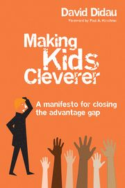

# Didau's 2019 book: Plagiarism and one main bad idea

Former English teacher David Didau seems to have [plagiarised][]
Wikipedia in his book called _Making kids cleverer_. At least it's
less into eugenics than his [older book][]. The main bad idea is a
central desire to shape curriculum so as to perpetuate existing
systems of power.

[plagiarised]: #plagiarism
[older book]: /20210914-david_didaus_2015_book_endorses_eugenics/ "David Didau's 2015 book endorses eugenics"

Didau's titular thesis is that the goal of schools is to make kids
cleverer, in the sense of [crystallized intelligence][], by teaching
knowledge, broadly construed. When it comes time to discuss _which_
knowledge, he pivots from arguing in support of cleverness to arguing
in support of dead white men on the grounds that this knowledge is
culturally valued—implicitly, valued by the culture he values.

[crystallized intelligence]: https://en.wikipedia.org/wiki/Fluid_and_crystallized_intelligence

I think it's [possible][] to make an argument for some shared
knowledge, in the tradition of [Hirsch][], but I think it's a
different argument than arguing for knowledge that best helps students
think more effectively in the sense of moving toward a global maximum.
Similarly, the [Lindy effect][] is about longevity, but not
necessarily quality. I think it would be much more interesting to look
at curriculum design by taking seriously the idea of giving students
the best mental toolkit possible. This is not what Didau does.

[possible]: https://www.theatlantic.com/politics/archive/2015/07/what-every-american-should-know/397334/
[Hirsch]: https://en.wikipedia.org/wiki/E._D._Hirsch
[Lindy effect]: https://en.wikipedia.org/wiki/Lindy_effect

Didau discusses the [Flynn effect][], and subscribes to the
"scientific spectacles" interpretation that general skills with
scientific abstraction explain increases in average IQ over time, but
at the same time argues one-sidedly for teaching concrete knowledge,
not general skills.

[Flynn effect]: https://en.wikipedia.org/wiki/Flynn_effect

I do think that students can and probably should learn and remember
much more, generally, than they sometimes do, but Didau is a
problematic advocate, and I don't think his obsession with IQ is
useful.

---

While this is always the case, I feel like it's especially important
with a book like this for me to point out that selected quotes below
do not indicate my agreement with or support for any particular quote.

---

> "Over the course of this book, I will explain that, unlike many
> other qualities we might value, intelligence has the advantages of
> being malleable, measurable and meaningful." (page 7)

---

> "By 'making cleverer' what I really mean, of course, is raising
> intelligence—increasing children's intellectual capacity." (page 7)

---

> "Arthur Scargill, tub-thumping leader of the National Union of
> Mineworkers, who led the opposition to Margaret Thatcher's struggle
> to break the power of the trade unions, wrote, "My father still
> reads the dictionary every day. He says your life depends on your
> power to master words."" (page 9)

---

> "Trying to develop children's ability by teaching generic skills
> directly is fundamentally unfair. Children with higher fluid
> intelligence and those from more advantaged backgrounds will be
> further privileged." (page 11)

---

> "This is the central thesis of the book: more knowledge equals more
> intelligence." (page 11)

---

> "It's my view that '21st century skills' depend on knowing things
> rather than on simply being able to look stuff up on the internet."
> (page 12)

---

> "Developing children's character depends ont on attempting to
> explicitly teach some ephemeral set of 'non-cognitive' skills but on
> a combination of high expectations, accountability and modeling. As
> Kalenze suggests, probably the best way to teach resilience is to
> give children challenging work to do; the best way to teach respect
> and politeness is to model it; and the best way to teach children
> how to be functional, happy citizens is to set up systems which hold
> them to account for their behaviour." (page 25)

---

> "[Kevin] Laland points out that "Humanity's success is sometimes
> attributed to our cleverness, but culture is actually what makes us
> smart. Intelligence is not irrelevant of course, but what singles
> out our species is an ability to pool our insights and knowledge and
> build on each other's solutions."" (page 43)

---

> "Some children may be born with a greater capacity for solving
> problems and thinking critically than others. These children are
> lucky. At the same time, some children will possess more (and more
> useful) knowledge of the world on which to apply these skills. These
> children will tend to be from more privileged backgrounds. What
> happens in school matters far less to both these groups of children
> than it does to the less fortunate and the less advantaged. The
> killer argument against a curriculum that focuses on 21st century
> skills—or any other kind of generic competencies—is that it is
> inherently iniquitous." (page 45)

---

> "The purpose of schools, as much as anything else, is to provide an
> environment where children are made to attend to what they would
> otherwise prefer to avoid." (page 53)

---

> "... the position I will advance in this book is that intelligence
> is as much a product of what we know as it is a mechanism for
> acquiring knowledge." (page 57)

---

> "Although we might perceive some children to be more 'able' than
> others, this is unimportant because there's not really anything we
> can do about it. We can, however, do an awful lot about developing
> the quantity and quality of what children know." (page 60)

---

> "While correlation is not proof that one thing causes another,
> causation is implied." (page 65)

This follows shortly after a section called "Correlation ≠ causation"...

---

[Intelligence and class mobility in the British population][] by
Nettle is cited on page 67.

[Intelligence and class mobility in the British population]: https://www.danielnettle.org.uk/download/023.pdf

---

> "Using the environment to increase crystallised intelligence is
> central to making kids cleverer; fluid intelligence, and its
> associated individual differences, is largely a distraction." (page
> 77)

---

[Can IQ change?][] by Howe is cited on page 77.

[Can IQ change?]: https://thepsychologist.bps.org.uk/volume-11/edition-2/can-iq-change

---

> "The difference of natural talents in different men is, in reality,
> much less than we are aware of ... The difference between the most
> dissimilar characters, between a philosopher and a common street
> porter, for example, seems to arise not so much from nature as from
> habit, custom, and education." (page 85, quoting Adam Smith, The
> Wealth of Nations)

---

[Schooling Makes You Smarter: What Teachers Need to Know about IQ][]
by Nisbett is cited on page 88. Decent?

[Schooling Makes You Smarter: What Teachers Need to Know about IQ]: https://www.aft.org/periodical/american-educator/spring-2013/schooling-makes-you-smarter

---

[Socioeconomic status modifies heritability of IQ in young children][]
by Turkheimer et al. is cited on page 89.

[Socioeconomic status modifies heritability of IQ in young children]: https://pubmed.ncbi.nlm.nih.gov/14629696/

---

[Mainstream Science on Intelligence: An Editorial With 52 Signatories, History, and Bibliography][] by Gottfredson is cited on page 95.

[Mainstream Science on Intelligence: An Editorial With 52 Signatories, History, and Bibliography]: http://www1.udel.edu/educ/gottfredson/reprints/1997mainstream.pdf

---

[Black Americans reduce the racial IQ gap: evidence from standardization samples][]
by Dickens and Flynn is cited on page 97.

[Black Americans reduce the racial IQ gap: evidence from standardization samples]: https://pubmed.ncbi.nlm.nih.gov/17100793/

---

> "The IQ score of the same person taking a test on different days
> would produce a correlation of about 0.87." (pages 100-101)

And this is _good_ reliability? Hmm.

---

> "Whether or not this [set of recommendations for schools] results in
> a measurable increase in IQ is largely irrelevant. I think we can
> all agree that intellectual curiosity and a lifelong love of
> learning are things we want for all children, and these suggestions
> seems like a reasonable bet for getting what we want." (page 111)

But the title of the book is "Making kids cleverer"... that was the
whole goal you were working on!

---

> "The rule seems to be that education raises crystallised
> intelligence but not fluid intelligence." (page 118)

---

[A Cross-Temporal Meta-Analysis of Raven's Progressive Matrices: Age groups and developing versus developed countries](http://www.iapsych.com/iqmr/fe/LinkedDocuments/wongupparaj2015.pdf) by Wongupparaj et al. is cited on page 128.

---

[Flynn effect and its reversal are both environmentally caused](https://www.pnas.org/content/115/26/6674) by Bratsberg and Rogeberg is referenced on page 129.

---

> "It's much more likely that a growth mindset follows from
> experiencing success." (page 131)

> "As we've seen, motivation is a product of being successful." (page
> 267)

The earlier bit has no reference. The later cites [The Relation of Academic Self-Concept to Motivation among University EFL Students](http://citeseerx.ist.psu.edu/viewdoc/download?doi=10.1.1.1056.1518&rep=rep1&type=pdf), but that paper is reporting correlation, not causation. The closest they get to causation is actually in the reverse direction:

> "results support numerous research findings that academic
> self-concept is an important determinant of students’ academic
> performance"

---

> "Beliefs about the malleability of basic ability appear to be
> largely irrelevant: achievement is all about work." (page 135)

---

> "However, if you want to, you can take an A level [course][] in
> thinking skills." (140)

[course]: https://www.cambridgeinternational.org/images/164766-2016-syllabus.pdf

---

> "[Cognitive Acceleration through Science Education (CASE)](https://en.wikipedia.org/wiki/Cognitive_acceleration)"
> (page 140)

---

> "The main reason children end up not learning what they're taught in
> school isn't that they're not capable of remembering it; it's that
> their teachers don't sufficiently value kids knowing stuff and don't
> use the sorts of consolidation strategies which would help them to
> remember." (page 157)

---

> "I have to show you how to use a comma in a wide variety of contexts
> and then get you to practise writing correctly punctuated
> sentences." (page 179)

So his focus on "knowledge" includes skills and application; not just
memorization.

---

> "The general rule is that expert knowledge always trumps raw
> ability." (page 180)

---

> "Knowledge is most truly flexible when it is automatised." (page
> 183)

---

On page 183, Didau references a student's test response as "empty and
worthless". His book doesn't include the question prompt visible in
[the original][]. With that context, the answer doesn't seem so crazy
to me. Doesn't seem like a very good question, really.

[the original]: https://i2.wp.com/www.learningspy.co.uk/wp-content/uploads/2016/11/Screen-Shot-2016-11-09-at-15.12.38.png

---

> "So what does it mean to be skilled at making inferences? Nothing:
> it is indistinguishable from being knowledgeable." (page 186)

---

> "We are unable to think with anything that we are dependent on
> looking up." (page 191)

---

> "It's only when people ask us to explain what we think we know that
> we find out whether we know it." (page 197)

---

Many references to Michael Young's "powerful knowledge" idea. Here's
one [applied explainer][] I found. I also stumbled on this
[critique][], which includes in its abstract: "The first part of the
article focuses on the definitional connection that Young makes
between 'powerful knowledge' and systematic relationships between
concepts. It argues that most of the school subjects that Young sees
as providing 'powerful knowledge' fall short on this requirement."

[applied explainer]: https://files.eric.ed.gov/fulltext/EJ1085994.pdf
[critique]: https://www.researchgate.net/publication/323587483_The_Weakness_of_Powerful_Knowledge

---

> "Being able to quote Shakespeare or knowing Pythagoras' theorem may
> seem like trivia, but it enables us to access society in a way which
> would be impossible if we didn't know any of this." (page 209)

---

> "One much chewed bone of contention is who gets to decide what
> knowledge children should learn. The assumption seems to be that
> there's some shadowy elite inflicting their preferences on the rest
> of us. This is nonsense. No one chooses; we all choose. No one
> person knows enough to make this choice but collectively we have
> access to the vast accumulation of human culture. The most important
> things to know are those things that last and which most influence
> other cultural developments; those things that inspire the most
> 'conversations' backwards and forwards through time and across
> space; those things that allow us to trace our cultural inheritance
> through threads of thought from the discoveries of modern science
> and the synthesis of modern art back to their ancient origins."
> (page 210)

This is a mess on multiple levels. Leaving aside the most obvious
issues around who he means by "we", he's abandoned his original claim
of arguing for making children cleverer: lasting a long time and being
culturally popular does not imply useful for thought, and then we're
back to who he means when he says "our cultural inheritance".

---

> "On the face of it, building a curriculum around the thoughts and
> deeds of historically marginalised groups looks like a really good
> idea. Who wouldn't want children to know about the achievements of
> women and people of colour? The trouble is, this isn't shared
> knowledge. It doesn't allow access to the 'knowledge of power', and,
> crucially, it doesn't provide much cultural capital." (page 211)

What happened to making children cleverer? Say, by giving them access
to the powerful idea that everyone can contribute to society, not just
historically dominant (not to say oppressive) people?

Maybe he's arguing against a curriculum based _only_ on historically
marginalised groups, to the exclusion of his buddy Shakespeare, say?

---

> "Does it add to children's knowledge of what others in society
> consider to be valuable?" (page 218)

This is the _first_ in Didau's list of desiderata for what to teach.

---

> "The epistemology of most sciences, for example, is often based upon
> experimentation and discovery and, since this is so, experimentation
> and discovery should be apart of any curriculum aimed at 'producing'
> future scientists. But this does not mean that experimentation and
> discovery should also be the basis for curriculum organization and
> learning-environment designing." (quoting Paul Kirschner, page 223)

I think the opposite (not teaching students _about_ experimentation
and discovery, and letting them try it _at least a little_) is also a
mistake.

---

> "We've already seen that the best way to learn the solutions to
> problems is not by solving problems. Problem solving is the means by
> which new knowledge might be added to the domain; it is not an
> effective means of learning the knowledge already within the
> domain." (page 224)

> "Solving problems is an inefficient way to get better at problem
> solving." (page 236)

This sounds very strange from a math teacher's perspective, where the
goal is often to teach students _to solve problems_, and some even say
the only way to learn it is to solve problems. Here's Lockhart:
"Mental acuity of any kind comes from solving problems yourself, not
from being told how to solve them."

---

Didau's second requirement for a curriculum is that it is "Culturally
rich. (Does the selected content conform to shared cultural agreements
of what is considered valuable to know?)" (page 224)

On page 225 he summarizes "Some knowledge is more culturally rich than
other knowledge — that is, more valued within society."

There is a separate case to be made, maybe, for knowing what other
people know so that you can communicate with them, walk the halls of
power, etc. But it is not, in my opinion, the same as a case for some
knowledge making you cleverer. The argument that historically dominant
knowledge is the best knowledge is problematic.

---

> "As experts, we often assume that others share the same background
> knowledge as us and so it often goes unsaid. And where expert
> knowledge is stated, all too often it isn't understood. Experts are
> unaware of the extent of their knowledge and end up speaking in
> maxims. As we saw in Chapter 7, such maxims are easily understood by
> other experts but are meaningless to novices. Where a novice will be
> confused and frustrated by gaps in explanation, an expert fills them
> within even realising they're doing it. Such is the curse of
> knowledge. This lack of insight into the source of expertise can
> lead us into neglecting the teaching of the vital nuts and bolts on
> which our expert performances depend." (page 234)

---

> "It's worth noting that we can't create mental representations just
> through study — we have to get our hands dirty by trying to do the
> thing we want to improve at." (page 240)

---

### <a name="plagiarism" href="#plagiarism">Plagiarism</a>

I happened to look up the [expertise reversal effect][] on Wikipedia.
I'll put in bold parts that correspond word for word.

[expertise reversal effect]: https://en.wikipedia.org/wiki/Expertise_reversal_effect

Here's what Didau's book includes on page 245:

> "**_The worked-example effect_** — **worked examples** (**a problem
> statement followed by a step-by-step demonstration of how to solve
> it**) **are often contrasted with open-ended problem solving in
> which the learner is responsible for providing the step-by-step
> solution.** Although novices **benefit more from studying structured
> worked examples than from solving problems on their own, as
> knowledge increases, open-ended problem solving becomes more
> effective.**"

Here's Wikipedia:

> "Interactions between levels of knowledge and **the worked-example
> effect**: **Worked examples** provide **a problem statement followed
> by a step-by-step demonstration of how to solve it**. Worked
> examples **are often contrasted with open-ended problem solving in
> which the learner is responsible for providing the step-by-step
> solution.** Low-knowledge learners **benefit more from studying
> structured worked**-out **examples than from solving problems on
> their own**. However, **as knowledge increases, open-ended problem
> solving becomes** the **more effective** learning activity."

I think a teacher grading a paper would have to call this plagiarism.

---

[Domain-Specific Knowledge and Why Teaching Generic Skills Does Not Work](https://www.jstor.org/stable/43549795) by André Tricot and John Sweller is cited on page 245.

---

> "We should always remember that novices are not less intelligent,
> they are less knowledgeable. Everyone gets cleverer the more they
> know and the more they practise." (page 246)

---

> "The point of these desirable difficulties is to confront us with
> the illusion of knowledge and reveal the true extent of our
> ignorance." (page 254)

---

> "If students simply struggle they will learn to hate school. If they
> struggle too much, or too soon, this will also be undesirable.
> Struggle is only desirable after success has been encoded." (page
> 254)

---

> "_The point is not that children should sink or swim, it's that they
> should all swim._" (page 255)

---

> 1. "Encode success.
> 2. Promote internalisation.
> 3. Increase challenge.
> 4. Repeat." (page 255)

---

> "Developing good explanations and accurate analogies is probably the
> key area of subject specialist knowledge teachers most need to
> develop." (page 257)

---

> "Attempting to follow along in their own copy of a text while
> simultaneously having to listen as the text is read aloud is
> impossible. Children are forced to task switch between the printed
> material and the sound of the teacher's voice, meaning they lose
> track of what it is they're supposed to be reading and remember far
> less than if they had either read or listened without trying to do
> both at once." (page 261)

This is presented without citation. It would be interesting if it was
supported by some evidence. I feel like I remember plenty of following
along in texts while others read in my early education at least, and I
don't recall it being difficult. References welcome.

---

> "And thinking about what we teach is enhanced by remembering that
> our aim is to help children become more creative, be better problem
> solvers, think more critically and be more collaborative." (page
> 269)

---

> "Some knowledge is both more powerful (allows for thinking more
> thoughts) and more culturally rich (has a higher cultural value)
> than other kinds of knowledge; as such, it results in more useful
> schemas." (page 276)

Here at least he recognizes a distinction.
