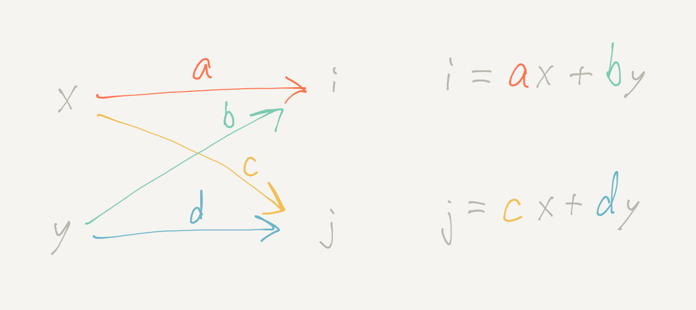

# The flow metaphor for matrix multiplication

> _“I cannot believe that anything so ugly as multiplication of
> matrices is an essential part of the scheme of nature.” (Arthur
> Eddington, 1936)_

Even [Strang][] introduces matrix multiplication by saying “there is
only one possible rule, and I am not sure who discovered it. It makes
everything work.” This is not satisfying or helpful for understanding.
The flow metaphor of graphical linear algebra makes matrix
multiplication seem natural and helps provide intuition for
understanding linear algebra.

[Strang]: https://smile.amazon.com/Linear-Algebra-Its-Applications-4th/dp/0030105676/

 * [A simple diagram style](#diagram)
 * [Matrix multiplication](#mult)
 * [Aligning directions](#directions)
 * [Sources](#sources)

---

### <a name="diagram" href="#diagram">A simple diagram style</a>

The inputs _x_ and _y_ pass from left to right along the arrow
paths—getting multiplied by _a_, _b_, _c_, and _d_, respectively—and
then adding up to outputs _i_ and _j_.

The diagram is equivalent to the usual notation for a simple
vector-matrix multiplication.

\\[ \begin{bmatrix} i \\\ j \end{bmatrix} =
    \begin{bmatrix} a & b \\\ c & d \end{bmatrix}
    \begin{bmatrix} x \\\ y \end{bmatrix} =
    \begin{bmatrix} ax+by \\\ cx+dy \end{bmatrix} \\]

You can visualize inputs entering at the top and outputs going out the
side. For example, the _x_ enters the 2-by-2 matrix over the _a_, and
then exits to the left to contribute _ax_ to _i_. The _y_ enters over
the _b_ and exits to the left to contribute _by_ to _i_.

---

### <a name="mult" href="#mult">Matrix multiplication</a>

To compose two matrix diagrams, follow the paths from inputs to
outputs. For example, to go from _x_ to _u_, there's the _ae_ path
that goes via _i_, and there's the _cf_ path that goes via _j_, so the
simplified single path from _x_ to _u_ is _ae + cf_.

This is matrix multiplication that makes sense. After the input-output
behavior [above][] is established, there's no other way for matrix
multiplication to come out.

[above]: #diagram

\\[ \begin{bmatrix} e & f \\\ g & h \end{bmatrix}
    \begin{bmatrix} a & b \\\ c & d \end{bmatrix} =
    \begin{bmatrix} ae+cf & be+df \\\ ag+ch & bg+dh \end{bmatrix} \\]

Why do the inner dimensions need to be the same for two matrices
you're multiplying? Because you have to match up outputs from one with
inputs for the other.

I find this [metaphor][] really helpful, and I suspect it could help
people learning linear algebra for the first time as well. I think it
can be complementary with thinking about (and [visualizing][]) vector
spaces.

[metaphor]: https://en.wikipedia.org/wiki/Where_Mathematics_Comes_From "Where Mathematics Comes From: How the Embodied Mind Brings Mathematics into Being"
[visualizing]: https://www.youtube.com/playlist?list=PLZHQObOWTQDPD3MizzM2xVFitgF8hE_ab "Essence of linear algebra, from 3Blue1Brown"

---

### <a name="directions" href="#directions">Aligning directions</a>

I think it's a good thing that the diagrams make it obvious that
direction matters. I'd rather have both the diagrams and matrix
notation read naturally from left to right, but I don't think
everybody will change how they write their linear algebra.

There's nothing special about the usual orientation. Both directions
are “on” by default; you can multiply a row vector and matrix, which
is like going right to left along the diagram for the matrix. You can
see the result isn't equivalent unless you transpose.

Transpose is the operation that swaps inputs with outputs For example,
\\( (A B)^T = B^T A^T \\). Visualize rotating two connected pieces of
pipe.

---

### <a name="sources" href="#sources">Sources</a>

I started thinking about this based on §3.2.2.4 in Spivak's _Category
Theory for the Sciences_. A complete, rigorous formulation as
Graphical Linear Algebra is nicely introduced in
[Sobocinski's blog][]. The best brief introduction I've seen is in a
[presentation from Paixão][]. (Thanks to Spivak and Sobocinski for
helpful pointers over email as well!)

[Sobocinski's blog]: https://graphicallinearalgebra.net/
[presentation from Paixão]: https://www.youtube.com/watch?v=ptWK8ehQvyw&t=3379s

The quote at top from [Sir Eddington][] about the ugliness of matrix
multiplication is from page 36 of his _Relativity Theory of Electrons
and Protons_, published in 1936 by Cambridge University Press, as
quoted in Macedo and Oliveira's [Typing linear algebra][].

[Sir Eddington]: https://en.wikipedia.org/wiki/Arthur_Eddington
[Typing linear algebra]: https://arxiv.org/abs/1312.4818
