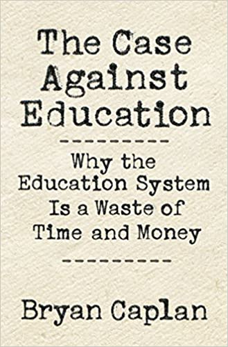

# The Case Against Education, by Caplan

Caplan thinks students aren't learning—“The vast majority are
philistines”—so we should stop trying to teach them. I agree with
Caplan on some of his premises, but I don't follow him all the way to
his libertarian recommendations.

Should everyone be pushed toward college as if it's the only
acceptable path? Probably not. More vocational education seems like a
fine idea. I agree there's a signaling component (possibly large) to
the personal benefit of education, and that many people don't learn as
much as it seems like they should.

Caplan turns his back on equality of opportunity when he recommends
letting the market decide on education. I'm not entirely comfortable
with how casually he cites [Jensen][] (page 60) or ignores that
effects vary substantially by race even in work he cites (page 150).

[Jensen]: https://www.splcenter.org/fighting-hate/extremist-files/individual/arthur-jensen

I think it's inconsistent to treat education as essentially daycare
but not include the provision of that service in the accounting of
economic benefits.

I think the interesting thing is to consider Caplan's critiques and
think about what really effective education could look like. What
really would build human capital? What would make people wiser,
happier, and more productive?

---

> "Bryan Caplan, the foremost whistle-blower in the academy, argues
> persuasively that learning about completely arbitrary subjects is
> attractive to employers because it signals students' intelligence,
> work ethic, desire to please, and conformity—even when such learning
> conveys no cognitive advantage or increase in human capital." (cover
> blurb from Stephen J. Ceci)

---

> "Learning doesn't have to be useful. Learning doesn't have to be
> inspirational. When learning is neither useful nor inspirational,
> though, how can we call it anything but wasteful." (page 2)

---

> "Few jobs require knowledge of higher mathematics, but over 80% of
> high school grads suffer through geometry. Students study history
> for years, but history teachers are almost the only people alive who
> use history on the job." (pages 6-7)

Geometry is higher mathematics? But more importantly, isn't history
important, at least in theory, to having informed voters for
democracy? Caplan later points out that years of history don't usually
yield informed voters in the current system anyway, but it seems
inappropriate to completely neglect civic objectives for education.

---

> "...statistics and econometrics courses at elite colleges emphasize
> mathematical proofs, not hands-on statistical training." (page 11)

That cites [Undergraduate Econometrics Instruction: Through Our Classes, Darkly](https://ftp.iza.org/dp10535.pdf), which includes the following in its abstract:

> "Questions of research design and causality still take a back seat
> in the classroom, in spite of having risen to the top of the modern
> empirical agenda. This essay traces the divergent development of
> econometric teaching and empirical practice, arguing for a
> pedagogical paradigm shift."

---

> "Higher education is the only product where the consumer tries to
> get as little out of it as possible." (page 26, quoting Arnold
> Kling, sort of)

The citation is [College Customers vs. Suppliers](https://www.econlib.org/archives/2006/08/college_custome.html), in which Kling writes:

> "I recall seeing a quote somewhere else to the effect that higher
> education is the only product where the consumer tries to get as
> little out of it as possible."

So who knows where the quote comes from!

Kling proposes separating testing from teaching, to align students and
professors in the direction of rigor rather than easy A's. Maybe so?

---

> "Basic literacy and numeracy are virtually the _only_ book learning
> most American adults possess." (page 40)

---

> "Though college grads spend at least seventeen years in school,
> under a third have the level of literacy and numeracy we assume of
> every college freshman." (page 43)

---

> "Note: Statisticians routinely rely on the approximate equality
> between logged variables and percentages. However, when coefficients
> are large, this approximation breaks down, so I convert results to
> percentages for clarity." (page 302, endnote 8 from page 73)

I don't think this is very clear. What it's getting at is that if
you're fitting a linear model, then a logged outcome variable makes
the additive model multiplicative in the original outcome, so a 0.02
change in the regression outcome is a 2% change in the original
outcome. Gelman has a decent [intro][], maybe. Or [this][], which
notes that "small changes in the natural log of a variable are
directly interpretable as percentage changes, to a very close
approximation" and even a nice table showing how the approximation
breaks down.

[intro]: https://statmodeling.stat.columbia.edu/2019/08/21/you-should-usually-log-transform-your-positive-data/
[this]: https://people.duke.edu/~rnau/411log.htm

---

> "Most strikingly, the standard measure of "fatalism," the Rotter
> Internal-External Locus of Control Scale, is a four-question
> personality test. (page 303, endnote 24 from page 75)

This is misleading. The [Rotter][] instrument has 29 questions. But
Caplan is citing [a 2006 paper][] that uses [NLSY79][] data, which
does indeed [include][] a "four-item abbreviated version of the Rotter
Internal External Locus of Control Scale"—sort of.

[Rotter]: https://www.mccc.edu/~jenningh/Courses/documents/Rotter-locusofcontrolhandout.pdf "Rotter's Locus of Control Scale"
[a 2006 paper]: https://www.nber.org/papers/w12006 "The Effects of Cognitive and Noncognitive Abilities on Labor Market Outcomes and Social Behavior"
[NLSY79]: https://www.bls.gov/nls/nlsy79.htm "National Longitudinal Survey of Youth 1979"
[include]: https://www.nlsinfo.org/content/cohorts/nlsy79/other-documentation/codebook-supplement/nlsy79-appendix-21-attitudinal-scales#rotter

NLSY79 included Rotter questions 28, 13, 15, and 25 (in that order)
and in addition to asking respondents to choose one of two statements
for each, also asked whether their choice was "much closer" or
"slightly closer" to their view. So it's an eight-question instrument
(or at least, it yields eight bits of information).

There are multiple tests for internal-external locus of control, some
[shorter][] than 29 questions, some [longer][]. If you do want a
four-question instrument, consider Kovaleva's [IE-4][] (four
five-point Likert scale questions; see Table 26 on page 81).

[shorter]: https://www.tandfonline.com/doi/abs/10.1080/00223891.1974.10119987 "An Abbreviated Measure of Internal-External Locus of Control"
[longer]: https://psycnet.apa.org/record/1973-21097-001 "A locus of control scale for children"
[IE-4]: https://www.ssoar.info/ssoar/bitstream/handle/document/37119/ssoar-2012-kovaleva-The_IE-4_Construction_and_Validation.pdf "The IE-4: Construction and Validation of a Short Scale for the Assessment of Locus of Control"

---

> "Full-length intelligence tests have a very high reliability; the
> reliability of the [AFQT][], for example, is .94 (ASVAB 2015). Short
> intelligence tests, in contrast, have markedly lower reliability—.74
> in the case of the General Social Survey's [ten-word IQ test][]
> (Caplan and Miller 2010, p. 645)." (page 307, endnote 98 from page
> 93)

[AFQT]: https://en.wikipedia.org/wiki/Armed_Services_Vocational_Aptitude_Battery#Armed_Forces_Qualification_Test
[ten-word IQ test]: https://en.wikipedia.org/wiki/Wordsum

---

> "You'll never apply most of what you study, but so what? Academic
> success opens doors. A dysfunctional game, but if you refuse to
> play, the labor market brands you a loser." (page 108)

---

> "_Signals can affect pay even after employers know the truth._
> Employer learning researchers speak as if the payoff for signaling
> ends as soon as employers know a worker's true worth. They should be
> more circumspect. For starters, firms often give new workers
> valuable on-the-job training. As a result, signaling can indirectly
> boost your productivity. Step 1: Signal in school. Step 2: Land a
> good job. Step 3: Learn useful job skills on the job. Step 4:
> Persistently profit. If your signal modestly overstates your skill,
> your imployer may soon wish they'd hired someone else. By the time
> they spot their mistake, however, your new marketable skills
> permanently justify higher pay." (page 112)

Following the endnote:

> "While research on this story is sparse, Heisz and Oreopoulos 2006
> report the payoff for high-ranked M.B.A. and law degrees _increases_
> with experience, even correcting for individual ability, because
> high-ranked degrees lead to good first jobs, which lead to even
> better jobs down the line." (page 312)

---

> "The Higher Education Research Institute has questioned college
> freshmen about their goals since the 1970s. The vast majority is
> openly careerist and materialist. In 2012, almost 90% called "being
> able to get a better job" a "very important" or "essential" reason
> to go to college. Being "very well-off financially" (over 80%) and
> "making more money" (about 75%) are almost as popular. Less than
> half say the same about "developing a meaningful philosophy of
> life." These results are especially striking because humans
> exaggerate their idealism and downplay their selfishness. Students
> probably prize worldly success even more than they admit." (page
> 126)

---

> "A cynic isn't someone who puts a price on the sacred; a cynic is
> someone who puts a _low_ price on the sacred." (page 126)

---

> "The High School Survey of Student Engagement, probably the single
> best study of how high school students feel about school, reports
> that 66% of high school students say they're bored in class _every
> day_. Seventeen percent say they're bored in _every_ class _every_
> day. Only 2% claim they're never bored in class. Why so bored?
> Eighty-two percent say the material isn't interesting; 41% say the
> material isn't relevant. Another research team gave beepers to
> middle school students to capture their feelings in real time.
> During schoolwork, students were bored 36% of the time, versus 17%
> for all other activities. No wonder a major Gates Foundation study
> ranked boredom the _most_ important reason why kids drop out of high
> school." (page 135)

---

> "How much does your alma mater's rank matter? Research is oddly
> mixed." (page 149)

The endnote points to [Hoxby 2009][], which is about college
selectivity, not how much it matters to student outcomes. It's
interesting though; here's the abstract:

[Hoxby 2009]: https://www.aeaweb.org/articles?id=10.1257/jep.23.4.95

> "Over the past few decades, the average college has not become more
> selective: the reverse is true, though not dramatically. People who
> believe that college selectivity is increasing may be extrapolating
> from the experience of a small number of colleges such as members of
> the Ivy League, Stanford, Duke, and so on. These colleges have
> experienced rising selectivity, but their experience turns out to be
> the exception rather than the rule. Only the top 10 percent of
> colleges are substantially more selective now than they were
> in 1962. Moreover, at least 50 percent of colleges are substantially
> less selective now than they were in 1962. To understand changing
> selectivity, we must focus on how the market for college education
> has re-sorted students among schools as the costs of distance and
> information have fallen. In the past, students' choices were very
> sensitive to the distance of a college from their home, but today,
> students, especially high-aptitude students, are far more sensitive
> to a college's resources and student body. It is the consequent
> re-sorting of students among colleges that has, at once, caused
> selectivity to rise in a small number of colleges while
> simultaneously causing it to fall in other colleges. This has had
> profound implications for colleges' resources, tuition, and
> subsidies for students. I demonstrate that the stakes associated
> with choosing a college are greater today than they were four
> decades ago because very selective colleges are offering very large
> per-student resources and per-student subsidies, enabling admitted
> students to make massive human capital investments."

---

> "Their [Dale and Krueger's] most amazing discovery is that students
> who _submit_ lots of applications to high-quality schools enjoy
> exceptional career success whether or not they attend such schools."
> (page 150)

The citation is [Dale and Krueger 2014][], which has this abstract:

[Dale and Krueger 2014]: https://www.jstor.org/stable/23799087 "Estimating the Effects of College Characteristics over the Career Using Administrative Earnings Data"

> "We estimate the labor market effect of attending a highly selective
> college, using the College and Beyond Survey linked to Social
> Security Administration data. We extend earlier work by estimating
> effects for students that entered college in 1976 over a longer time
> horizon (from 1983 through 2007) and for a more recent cohort
> (1989). For both cohorts, the effects of college characteristics on
> earnings are sizeable (and similar in magnitude) in standard
> regression models. In selection-adjusted models, these effects
> generally fall to close to zero; however, these effects remain large
> for certain subgroups, such as for black and Hispanic students."

It's the last sentence that matters. Caplan only read the first half
of that one, somehow, which I think is a substantial mistake.

---

> "As long as your state's best public school admits you, there's no
> solid reason to pay more." (page 153)

If you're white. I mean, [Dale and Krueger 2014][] is _his_
citation—how can he ignore that?

---

> "American marriage is a diploma-based caste system." (page 156)

---

> "Going to Harvard may not get you a better job but almost certainly
> puts you in an exclusive dating pool for life." (page 157)

---

> "Most Ph.D. students have spent their entire lives at the top of the
> class, yet half wander off before they defend their dissertations."
> (pages 163-164)

---

> "Yet common sense insists the best way to discover useful ideas is
> to search for useful ideas—not to search for whatever fascinates you
> and pray it turns out to be useful." (page 175)

He cites Niskanen 1997 in this opposition to basic research. This is
the common sense of those who don't make the discoveries that enable
the useful ideas of the future.

---

> "The United States—and probably the rest of the world—is
> overeducated." (page 199)

And yet, still so apparently in need of more/better education.

---

> "There really is no need for K-12 to teach history, social studies,
> art, music, or foreign languages." (page 205)

---

> "Better retention efforts will not make Poor Students perform like
> Fair Students, Fair Students like Good Students, or Good Students
> like Excellent Students." (pages 211-212)

---

> "Instead of treating the human capital model as an accurate
> description of education, they could treat it as a noble
> _pre-_scription _for_ education. Let's transform our schools from
> time sinks to skill factories." (page 225)

---

> "Doing _any_ job teaches you how to do a job. If this seems a low
> bar, recall that almost half of dropouts and a third of high school
> graduates these days aren't even _looking_ for work. Acclimating
> them to a any form of employment would be a step up." (page 232)

---

On page 239, Caplan quotes at some length from Malcolm X describing
how he copied a dictionary in prison. It's a bit Hirsch-like, this
advocacy for content, for volume...

---

> "The straightforward story, though, is that high culture requires
> extra mental effort to appreciate—and most humans resent mental
> effort." (page 247)

---

> "Measuring effects issue by issue neatly explains education's
> puzzlingly small impact on ideology and party. Since education
> simultaneously increases social liberalism _and_ economic
> conservatism, its effect on "liberalism" is ambiguous. And while
> their social liberalism makes the well-educated more Democratic,
> their economic conservatism makes them more Republican, leaving
> partisanship nearly untouched." (page 333, endnote 36 from page 249)

---

> "If a world of historical ignorance is scary, you should be scared
> already, because that's where we live." (page 250)

---

> "When you run out of ideas, assign a random Wikipedia article. ...
> Start with the Bureau of Labor Statistics' figures on "employment by
> major occupational group" and "occupations with the most job
> growth." When you run out of ideas, have students check out an
> unfamiliar job from the Bureau of Labor Statistics' _Occupational
> Outlook Handbook_." (page 256)

I do kind of like some of this. In particular, I feel like I didn't
learn in school much of anything about what jobs exist or what people
really do in them.

---

> "I'm cynical about students. The vast majority are philistines. The
> best teachers in the universe couldn't inspire them with sincere and
> lasting love of ideas and culture. I'm cynical about teachers. The
> vast majority are uninspiring; they can't convince even _themselves_
> to love ideas and culture, much less their students. I'm cynical
> about "deciders"—the school officials who control what students
> study. The vast majority think they've done their job as long as
> students obey." (page 259)

---

> "I don't hate education. Rather I love education too much to accept
> our Orwellian substitute." (page 260)

---

> "As Stanford education professor David Labaree remarks, "Motivating
> volunteers to engage in human improvement is very difficult, as any
> psychotherapist can confirm, but motivating conscripts is quite
> another thing altogether. And it is conscripts that teachers face
> every day in the classroom."" (page 260)

---

> "Many idealists object that the Internet provides enlightenment only
> for those who seek it. They're right, but petulant to ask for more."
> (page 261)

---

> "Most humans intrigued by abstract ideas and high culture are
> working adults. Instead of lamenting youthful apathy, passionate
> educators should redirect their energy to humans who are _ready_ for
> enlightenment. There is little money in blogging, podcasting, or
> uploading lectures to YouTube. But if, like me, you love education
> to the depths of your soul, such efforts are their own reward."
> (page 261)

And that's how the book ends, apart from the five dispensable
dialogues that follow.
