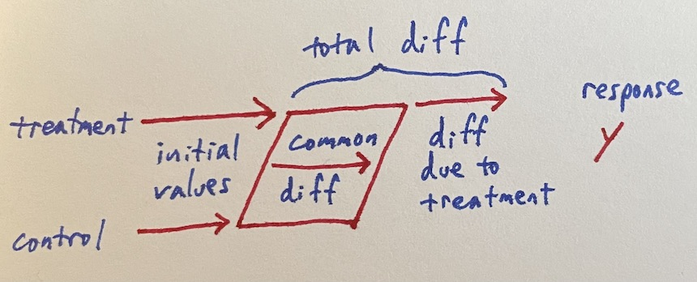
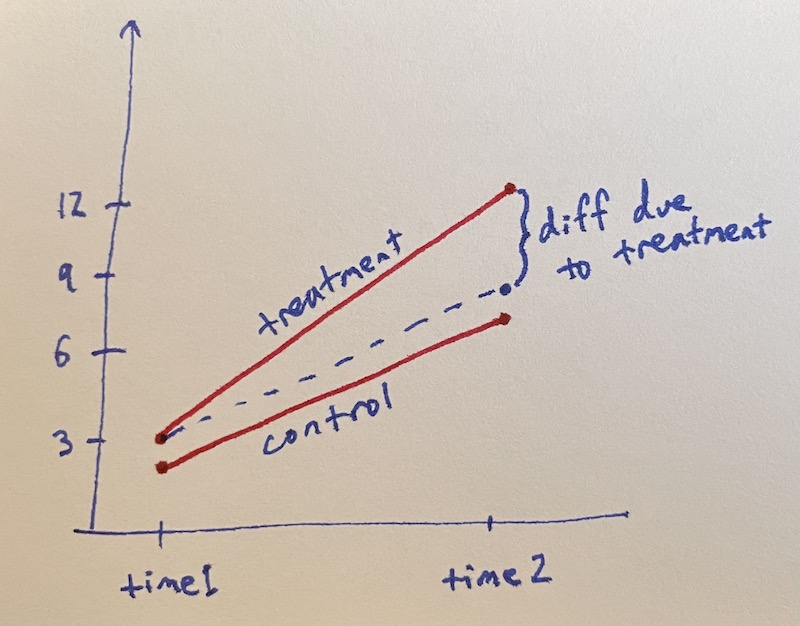

# Simple diff-in-diff

Things are always changing. [Difference in differences][] tries to
identify how much of a change is due to some treatment by comparing to
a control that's also changing over time.

[Difference in differences]: https://en.wikipedia.org/wiki/Difference_in_differences





This is often presented graphically with response value against time.




A noiseless design matrix illustrates how this becomes a diff-in-diff
regression.

```
| treatment base | control base | common diff | treatment diff | response |
|----------------|--------------|-------------|----------------|----------|
| 1              | 0            | 0           | 0              |  3       |
| 0              | 1            | 0           | 0              |  2       |
| 1              | 0            | 1           | 1              | 12       |
| 0              | 1            | 1           | 0              |  7       |

```


Real data will have noise; here's a simulation in [R][].

[R]: https://www.r-project.org/

```r
treatment_base = c(rep(1, 100), rep(0, 100), rep(1, 100), rep(0, 100))
control_base   = c(rep(0, 100), rep(1, 100), rep(0, 100), rep(1, 100))
common_diff    = c(rep(0, 100), rep(0, 100), rep(1, 100), rep(1, 100))
treatment_diff = c(rep(0, 100), rep(0, 100), rep(1, 100), rep(0, 100))
response = c(rnorm(100, mean=3),
             rnorm(100, mean=2),
             rnorm(100, mean=3) + rnorm(100, mean=5) + rnorm(100, mean=4),
             rnorm(100, mean=2) + rnorm(100, mean=5))
summary(lm(response ~ treatment_base + control_base + common_diff + treatment_diff + 0))
##                Estimate Std. Error t value Pr(>|t|)
## treatment_base   3.0747     0.1367   22.50   <2e-16 ***
## control_base     1.9798     0.1367   14.49   <2e-16 ***
## common_diff      5.0990     0.1933   26.38   <2e-16 ***
## treatment_diff   3.9453     0.2733   14.44   <2e-16 ***
```


Diff-in-diff can get [more complicated][], but the simple version
isn't too bad.

[more complicated]: https://andrewcbaker.netlify.app/2019/09/25/difference-in-differences-methodology/


---

Thanks to Dr. Erica Blom for valuable discussion and references on
this topic.


---

### See also

 * Four “back door” regression situations:
   [What should be in your regression?][]
 * [Simple Front Door Regression][]
 * [A simple Instrumental Variable][]


[What should be in your regression?]: /20200912-what_should_be_in_your_regression/
[Simple Front Door Regression]: /20210501-simple_front_door_regression/
[A simple Instrumental Variable]: /20210430-a_simple_instrumental_variable/
