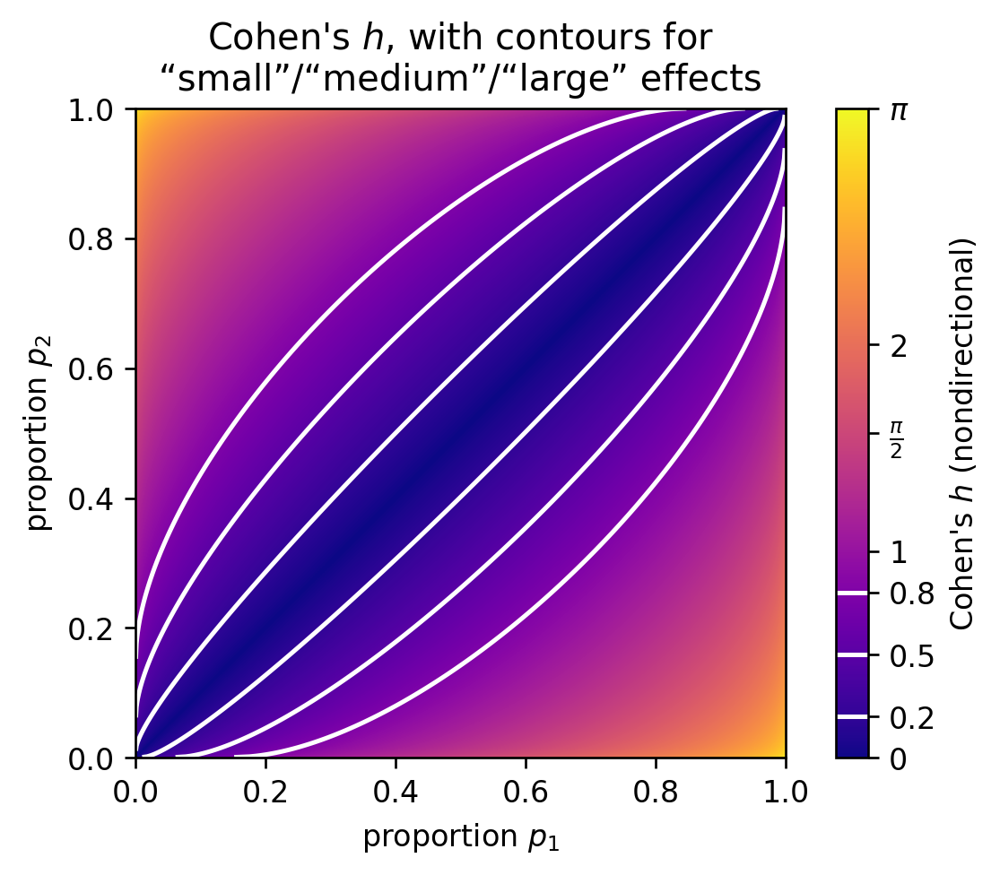

# Visualizing Cohen's _h_

[Cohen's _h_][] is an effect size for differences between two
proportions. It ranges from 0 to \\( \pi \\) (when nondirectional) and
adjusts for whether the proportions are “extreme” (near 0 or 1) so
that equal Cohen's _h_ means equal statistical detectability (Cohen
1988).

[Cohen's _h_]: https://en.wikipedia.org/wiki/Cohen%27s_h

The heuristic values of 0.2 for “small,” 0.5 for “medium,” and 0.8 for
“large” are analogous to the 0.05 confidence level: often taken more
seriously than they should be.

Cohen's _h_ is the difference between the two proportions'
[arcsin transforms][].

[arcsin transforms]: https://en.wikipedia.org/wiki/Binomial_proportion_confidence_interval#Arcsine_transformation

The arcsin transform stretches out values near 0 and 1 more than
values around 0.5. It is bounded though, so for example if your
baseline proportion is 0.95, there is no proportion higher than that
which will register as a “medium” effect size.

You could replace the arcsin transform with [log odds][]; the logit
would allow any size difference anywhere, at least in principle. But I
don't think it would have any useful connection to variance, as the
[arcsin transformation][] does.

[log odds]: https://en.wikipedia.org/wiki/Logit
[arcsin transformation]: https://en.wikipedia.org/wiki/Binomial_proportion_confidence_interval#Arcsine_transformation

---

Code is [on GitHub][].

[on GitHub]: https://github.com/ajschumacher/cohens_h
