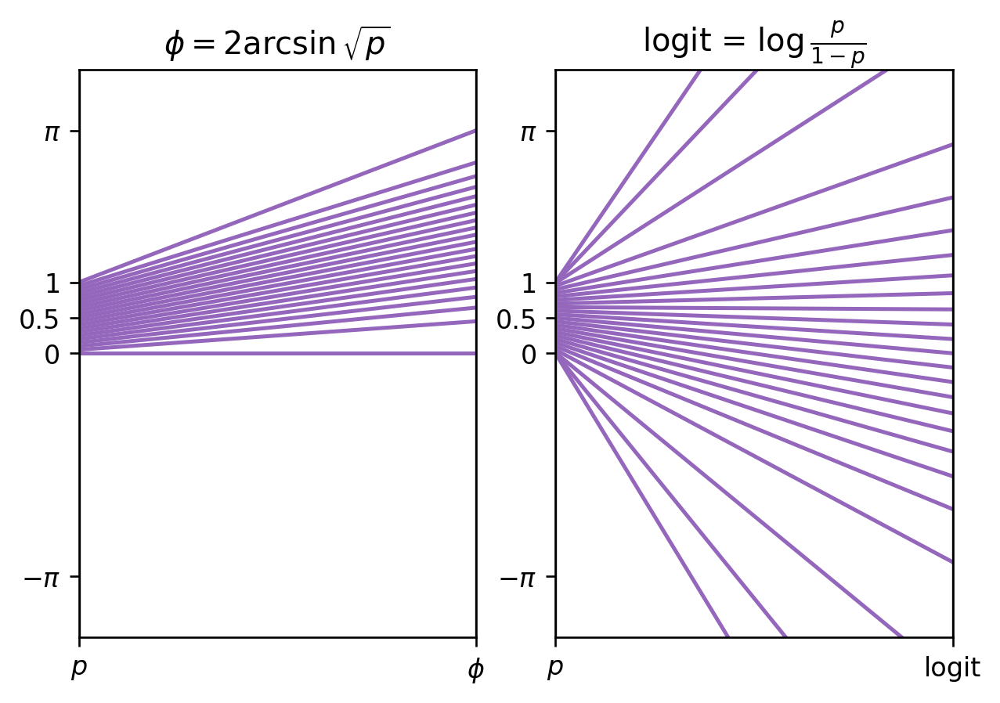
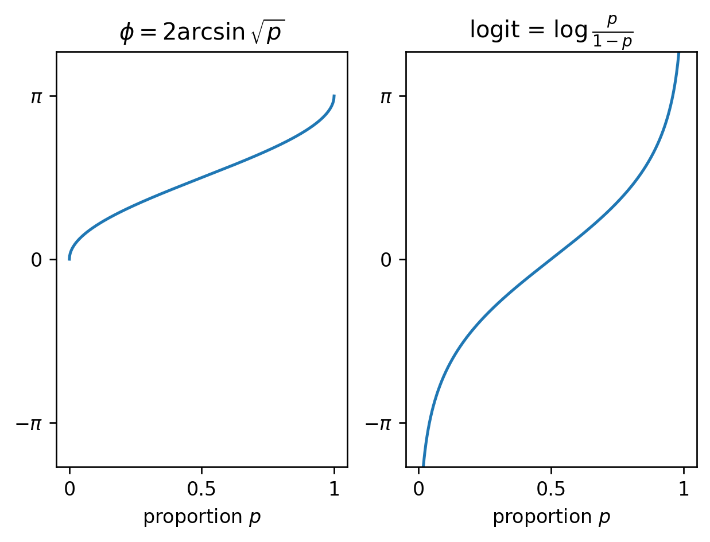

# Parallel coordinate plots for visualizing functions

While thinking about the [arcsin transform][] for [Cohen's _h_][], I
described the function as “stretching” its inputs, and compared it to
the [logit function][]. I wondered whether a
[parallel coordinates plot][] could visualize the “stretching” more
clearly than the traditional Cartesian plot. I think it kind of works!

[arcsin transform]: https://en.wikipedia.org/wiki/Binomial_proportion_confidence_interval#Arcsine_transformation
[Cohen's _h_]: /20211106-visualizing_cohens_h/
[logit function]: https://en.wikipedia.org/wiki/Logit
[parallel coordinates plot]: https://en.wikipedia.org/wiki/Parallel_coordinates

This left-to-right function input-to-output view is pleasing in some
ways. I think it succeeds in showing how the function is “stretching”
the input, as desired. It's hard to show very many input/output pairs
though, and it would be hard to show non-monotonic functions well, or
show multiple functions on the same axes. For the logit, I think it's
less clear in implying the function is unbounded than with the
Cartesian version.

The usual way of plotting functions feels a little drier. “Stretching”
is greater where the plot is more vertical; I feel this less
immediately here than with the parallel coordinates version. Overall
this is still a great way to visualize functions, of course. I
wouldn't mind the occasional parallel coordinates plot as an
alternative visualization though!

---

Code is [on GitHub][].

[on GitHub]: https://github.com/ajschumacher/parallel_coordinate_functions
