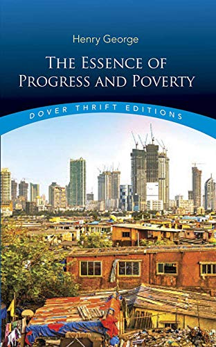

# The Essence of Progress and Poverty, by Henry George

This is a 2020 version of the 1928 abridging (endorsed by
[John Dewey][]) of the 1879 original. It's enough to
[“see the cat”][], I think, but I'm not yet convinced [Georgism][] is
[“how the world could be made a good and happy place”][]. The single
tax on land seems like a decent idea, but I'm not sure it's sufficient
for Star Trek style post-scarcity utopia ([a][], [b][]).

[John Dewey]: https://en.wikipedia.org/wiki/John_Dewey "John Dewey (Wikipedia)"
[“see the cat”]: https://www.henrygeorge.org/catsup.htm "“Seeing the Cat” has long been a slang term for achieving an understanding of Henry George's ideas."
[Georgism]: https://en.wikipedia.org/wiki/Georgism "Georgism (Wikipedia)"
[“how the world could be made a good and happy place”]: /20211017-how_the_world_could_be_made_a_good_and_happy_place/ "(a simple solution to solve all problems)"
[a]: /20210401-trekonomics_by_saadia/ "Trekonomics, by Saadia"
[b]: /20201109-economics_of_star_trek_by_webb/ "The Economics of Star Trek, by Webb"

It's nice to encounter an idea that's _trying_ to be a big solution. I
don't know a good reason not to try it, apart from that those who are
currently own land wouldn't like it.

---

> "It has always been to the newer countries—that is, to the countries
> where material progress is yet in its earlier stages—that laborers
> have emigrated in search of higher wages, and capital has flowed in
> search of higher interest. It is in the older countries—that is to
> say, the countries where material progress has reached later
> stages—that widespread destitution is found in the midst of the
> greatest abundance. Go into a new community where Anglo-Saxon vigor
> is just beginning the race of progress; where the machinery of
> production and exchange is yet rude and inefficient; where the
> increment of wealth is not yet great enough to enable any class to
> live in ease and luxury; where the best house is but a cabin of logs
> or a cloth and paper shanty; and the richest man is forced to daily
> work—and though you will find an absence of wealth and all its
> concomitants, you will find no beggars." (page 4)

Couple things.

 * "Anglo-Saxon vigor"? How deep is this racist-imperialist thinking?
   Does he think only white people are people?
 * Was this ever true, that net migration was from richer to poorer
   countries? Is it true now? Certainly the stereotype is that people
   prefer to move from poorer to richer countries "in search of higher
   wages".
 * Is it really true that the situation he describes is somehow a cure
   for poverty, or is it that George is wrong, or perhaps that people
   who would be poor cannot survive in such settings, so they aren't
   observed, or some combination?

---

> "To educate men who must be condemned to poverty, is but to make
> them restive; to base on a state of most glaring social inequality
> political institutions under which men are theoretically equal, is
> to stand a pyramid on its apex." (page 7)

This makes me think of antagonism toward "elites"... Not a perfect
connection though.

---

> "The reason why, in spite of the increase of productive power, wages
> constantly tend to a minimum which will give but a bare living, is
> that, with increase in productive power, rent tends to even greater
> increase, thus producing a constant tendency to the forcing down of
> wages." (page 26)

But it also isn't that employers keep throwing more money at
employees, and then landlords respond by increasing rents. If rent was
suddenly free, wouldn't employers lower wages in response to the
changed cost of living? Currently we see employers adjusting salaries
of remote employees based on cost of living in various markets, which
is largely driven by cost of housing.

---

> "To extirpate poverty, to make wages what justice demands they
> should be, the full earnings of the laborer, we must therefore
> substitute for the individual ownership of land a common ownership.
>
> "The right of ownership that springs from labor excludes the
> possibility of any other right of ownership." (page 32)

---

> "It [tax upon land values] is the taking by the community, for the
> use of the community, of that value which is the creation of the
> community." (page 37)

---

> "Every productive enterprise, besides its return to those who
> undertake it, yields collateral advantages to others." (page 43)

This is tautological or incorrect.

---

> "It seems to me that in a condition of society in which no one need
> fear poverty, no one would desire great wealth—at least, no one
> would take the trouble to strive and to strain for it as men do
> now." (page 47)

---

> "Shortsighted is the philosophy which counts on selfishness as the
> master motive of human action." (page 57)
