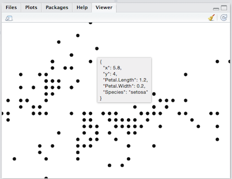

# Try HoloViz for Python plotting

Yang [inspired][] me to check out [HoloViz][], which makes it easy,
among other things, to do interactive scatterplots in Jupyter
Notebooks—and stick them in any HTML!

[inspired]: https://sophiamyang.github.io/DS/visualization/holoviz/holoviz.html "Visualization and Interactive Dashboard in Python"
[HoloViz]: https://holoviz.org/ "High-level tools to simplify visualization in Python"

<link rel="stylesheet" href="https://unpkg.com/@holoviz/panel@0.12.5/dist/css/alerts.css" type="text/css" />
<link rel="stylesheet" href="https://unpkg.com/@holoviz/panel@0.12.5/dist/css/card.css" type="text/css" />
<link rel="stylesheet" href="https://unpkg.com/@holoviz/panel@0.12.5/dist/css/widgets.css" type="text/css" />
<link rel="stylesheet" href="https://unpkg.com/@holoviz/panel@0.12.5/dist/css/markdown.css" type="text/css" />
<link rel="stylesheet" href="https://unpkg.com/@holoviz/panel@0.12.5/dist/css/json.css" type="text/css" />
<link rel="stylesheet" href="https://unpkg.com/@holoviz/panel@0.12.5/dist/css/loading.css" type="text/css" />
<link rel="stylesheet" href="https://unpkg.com/@holoviz/panel@0.12.5/dist/css/dataframe.css" type="text/css" />

I've wanted this to be standard functionality for a long time; six
years ago I briefly started a [project][] that included it in its
proof of concept, as in this screenshot:

[project]: /20150119-gog_a_separate_layer_for_visualization/ "gog: a separate layer for visualization"

The interactive example above is the hvPlot [Scatter example][] saved
to HTML as in [Saving plots][] (code is [on GitHub][]) and then
copy-pasted into my blog Markdown file. The interactive plots
unfortunately don't show up in GitHub's Jupyter Notebook preview.

[Scatter example]: https://hvplot.holoviz.org/reference/pandas/scatter.html "Scatter"
[Saving plots]: https://hvplot.holoviz.org/user_guide/Viewing.html#saving-plots "Saving plots"
[on GitHub]: https://github.com/ajschumacher/try_holoviz

[hvPlot][] is just one corner of HoloViz and related packages, but the
interactive scatterplot functionality alone is enough for me to be a
big fan.

[hvPlot]: https://hvplot.holoviz.org/
