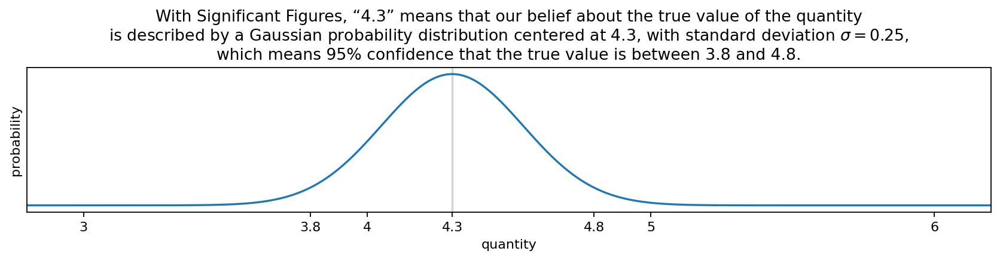
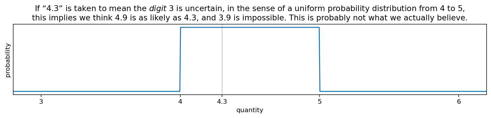

# Significant Figures: Gaussian uncertainty, σ=2.5eN

Significant Figures (or Significant Digits) is a tool for an important
task: tracking precision. Ironically, the meaning of a number with
Significant Figures is often not defined precisely. I propose that if
a number's rightmost significant digit is \\( D \times 10^N \\), this
means uncertainty is Gaussian with standard deviation \\( \sigma = 2.5
\times 10^N \\).

The final digit is “[significant but not certain][]” — which shouldn't
mean we know _nothing_ about what the digit is likely to be, and
shouldn't mean that there's no chance the neighboring digit could be
wrong. A purely digit-based interpretation is unnatural.

[significant but not certain]: https://chem.libretexts.org/Courses/University_of_British_Columbia/CHEM_100%3A_Foundations_of_Chemistry/02%3A_Measurement_and_Problem_Solving/2.03%3A_Significant_Figures_-_Writing_Numbers_to_Reflect_Precision

A particular instrument (or other source) may generate measurements
with a different distribution of uncertainty. In such cases, that
information should be captured specifically, and Significant Figures
alone is not sufficient. For measurements where there isn't more
specific information, a Gaussian distribution is a good choice.

Even when given a precise interpretation, Significant Figures is a
system tied to base ten numbers and manual measurement that asks a
single number to convey both value and uncertainty. There's only so
much one number can mean. Sig Figs is better than not tracking
precision at all, but better yet is to be explicit about precision.

---

I would love to find other sources or interpretations that agree or
disagree with this definition. So far I haven't found anything
explicit enough to really compare one way or another. References (and
feedback of any kind) are especially welcome here!

Visualization code is [on GitHub][].

[on GitHub]: https://github.com/ajschumacher/sigfigs
