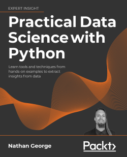

# Practical Data Science with Python, by George

Packt sent me a copy of this [book][] to review. It's 621 pages with
the best and worst characteristics of a typical data science boot
camp: very broad, necessarily shallow, frequently not quite perfect.
Even an imperfect map can tell you a lot about the territory, and it
could be the right book for you.

[book]: https://www.packtpub.com/product/practical-data-science-with-python/9781801071970

George has pulled together a lot of material, some of it good. He
includes introductory Python and command line, enough SQL to be
confused about SQL, examples with Bitcoin prices, an idiosyncratic
survey of visualization, web scraping, statistics, and the big machine
learning models, including the [big three boosted tree algorithms][],
which I appreciate. He includes some NLP, and even some on ethics.

[big three boosted tree algorithms]: /20211003-xgboost_lightgbm_catboost_briefly/

George's own list of omissions (page 571) illustrates what he thinks
is almost in scope:

 * Recommender systems
 * Networks and graph analysis
 * Machine learning explainability
 * Test-driven development (TDD)
 * Reinforcement learning
 * Neural networks

Maybe the moral is that “data science” is too big a topic for one
book. Trying to pack so much in has a cost. Here's the complete
section on “Paired t- and z-tests”:

> One last type of t- or z-test is the paired test. This is for paired
> samples, like before-and-after treatments. For example, we could
> measure the blood pressure of people before and after taking a
> medication to see if there is an effect. A function that can be used
> for this is `scipy.stats.ttest_rel`, which can be used like this:
>
> `scipy.stats.ttest_rel(before, after)`
>
> This will return a t-statistic and p-value like with other `scipy`
> t-test functions.

If you've never heard of a paired t-test before, it's great this book
tells you about it. You can start to ask questions like: Why is this a
separate test? Does it have some advantage over a regular t-test?
Hopefully you also question some parts of the book, as when Bayesian
methods are dismissed as “much more complex to implement than a
t-test.”

This is a map that can point you in a lot of interesting directions,
which is valuable!

