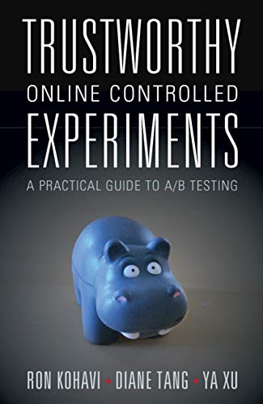

# Trustworthy Online Controlled Experiments

The [HiPPO][] on the cover represents the “Highest Paid Person's
Opinion” and the [book][] is about making decisions in industry based
on experiments instead. It includes [Twyman's Law][] and much more and
is _the_ text to read for online A/B tests. It does have some of the
character of class notes from a busy prof, with details left in other
papers, and the occasional misattribution (quote page 153) and error
(“due to the increase in power that comes from the increase in power”
page 170). Indispensable, but some assembly required.

[HiPPO]: https://exp-platform.com/hippo/ "HiPPO FAQ"
[book]: https://experimentguide.com/ "Trustworthy Online Controlled Experiments: A Practical Guide to A/B Testing"
[Twyman's law]: https://en.wikipedia.org/wiki/Twyman%27s_law

---

> "In statistics, this [Overall Evaluation Criterion (OEC)] is often
> called the _Response_ or _Dependent_ variable (Mason, Gunst and Hess
> 1989, Box, Hunter and Hunter 2005); other synonyms are _Outcome_,
> _Evaluation_ and _Fitness Function_ (Quarto-vonTivadar 2006).
> Experiments can have multiple objectives and analysis can use a
> balanced scorecard approach (Kaplan and Norton 1996), although
> selecting a single metric, possibly as a weighted combination of
> such objectives is highly desired and recommended (Roy 2001, 50,
> 405-429)." (page 7)

The Roy [citation][] is "Design of Experiments Using The Taguchi
Approach: 16 Steps to Product and Process Improvement". "Step 16" is
"Case studies", so I think Roy has confused "step" with "chapter".

[citation]: https://www.wiley.com/en-us/Design+of+Experiments+Using+The+Taguchi+Approach%3A+16+Steps+to+Product+and+Process+Improvement-p-9780471361015

---

> "However, Google's tweaks to the color scheme
> [[the 41 blues test][]] ended up being substantially positive on
> user engagement (note that Google does not report on the results of
> individual changes) and led to a strong partnership between design
> and experimentation moving forward." (page 16)

[the 41 blues test]: https://www.nytimes.com/2009/03/01/business/01marissa.html

This is an interesting take... They say (while saying they can't
support it with evidence) that [the 41 blues test][] was good in
multiple ways, while the popular lore is mostly about how at least one
designer cited that experimentation as the [reason][] they quit
Google. Hmm.

[reason]: http://www.zeldman.com/2009/03/20/41-shades-of-blue/

---

> "One useful concept to keep in mind is [EVI][]: Expected Value of
> Information from Douglas Hubbard (2014), which captures how
> additional information can help you in decision making." (page 24)

[EVI]: https://tcagley.wordpress.com/2016/01/30/how-to-measure-anything-chapter-7-quantifying-the-value-of-information/

---

> "If we use _purchase indicator_ (i.e., did the user purchase yes/no,
> without regard to the purchase amount) instead of using
> _revenue-per-user_ as our OEC, the standard error will be smaller,
> meaning that we will not need to expose the experiment to as many
> users to achieve the same sensitivity." (page 32)

This strikes me as an oversimplification... The measurements aren't on
the same scale, for one, so what does it mean to have a smaller
standard error, exactly? The two are testing different things... You
could imagine a world where the experimental condition convinces 100%
of users to make a $1 purchase, but stops the 5% of users who were
previously making $100 purchases. That's not good. I bet the authors
meant something more precise, and I wish they would have said what.

---

> "In the analysis of controlled experiments, it is common to apply
> the Stable Unit Treatment Value Assumption (SUTVA) (Imbens and Rubin
> 2015), which states that experiment units (e.g., users) do not
> interfere with one another." (page 43)

---

> "Sample Ratio Mismatch (SRM)"

---

> "Zhao et al. (2016) describe how Treatment assignment was done at
> Yahoo! using the [Fowler-Noll-Vo hash function][], which sufficed
> for single-layer randomization, but which failed to properly
> distribute users in multiple concurrent experiments when the system
> was generalized to overlapping experiments. Cryptographic hash
> functions like MD5 are good (Kohavi et al. 2009) but slow; a
> non-cryptographic function used at Microsoft is Jenkins SpookyHash
> ([www.burtleburtle.net/bob/hash/spooky.html][])." (page 47)

[Fowler-Noll-Vo hash function]: https://en.wikipedia.org/wiki/Fowler%E2%80%93Noll%E2%80%93Vo_hash_function
[www.burtleburtle.net/bob/hash/spooky.html]: https://www.burtleburtle.net/bob/hash/spooky.html

---

> "For Bing, over 50% of US traffic is from bots, and that number is
> higher than 90% in China and Russia." (page 48)

---

> "*Goal metrics*, also called _success metrics_ or _true north
> metrics_, reflect what the organization ultimately cares about."

> "*Driver metrics*, also called _sign post metrics_, _surrogate
> metrics_, _indirect_ or _predictive metrics_, tend to be
> shorter-term, faster-moving, and more-sensitive metrics than goal
> metrics." (page 91)

> "*Guardrail metrics* guard against violated assumptions and come in
> two types: metrics that protect the business and metrics that assess
> the trustworthiness and internal validity of experiment results."
> (page 92)

---

> "Between 1945 and 1960, the federal Canadian government paid 70
> cents a day per orphan to orphanages, and psychiatric hospitals
> received $2.25 per day, per patient. Allegedly, up to 20,000
> orphaned children were falsely certified as mentally ill so the
> Catholic Church could get $2.25 per day, per patient (Wikipedia
> contributors, Data dredging 2019)." (page 101)

---

> "... many unconstrained metrics are gameable. A metric that measures
> ad revenue _constrained_ to space on the page or to a measure of
> quality is a much better metric to ensure a high-quality user
> experience." (page 101)

---

> "Generally, we recommend using metrics that measure user value and
> actions." (page 101)

---

> "Combining Key Metrics into an OEC"
>
> "Given the common situation where you have multiple goal and driver
> metrics, what do you do? Do you need to choose just one metric, or
> do you keep more than one? Do you combine them all into single
> combination metric?"
>
> "While some books advocate focusing on just one metric (_Lean
> Analytics_ (Croll and Yoskovitz 2013) suggest the One Metric that
> Matters (OMTM) and _The 4 Disciplines of Execution_ (McChesney,
> Covey and Huling 2012) suggest focusing on Wildly Important Goal
> (WIG)), we find that motivating but an oversimplification. Except
> for trivial scenarios, there is usually no single metric that
> captures what a business is optimizing for. Kaplan and Norton (1996)
> give a good example: imagine entering a modern jet airplane. Is
> there a single metric that you should put on the pilot's dashboard?
> Airspeed? Altitude? Remaining fuel? You know the pilot must have
> access to these metrics and more. When you have an online business,
> you will have several key goal and driver metrics, typically
> measuring user engagement (e.g., active days, sessions-per-user,
> clicks- per-user) and monetary value (e.g., revenue-per-user). There
> is usually no simple single metric to optimize for."
>
> "In practice, many organizations examine multiple key metrics, and
> have a mental model of the tradeoffs they are willing to accept when
> they see any particular combination. For example, they may have a
> good idea about how much they are willing to lose (churn) users if
> the remaining users increase their engagement and revenue to more
> than compensate. Other organizations that prioritize growth may not
> be willing to accept a similar tradeoff."
>
> "Oftentimes, there is a mental model of the tradeoffs, and devising
> a single metric — an OEC — that is a weighted combination of the
> such objectives (Roy 2001, 50, 405-429) may be the more desired
> solution. And like metrics overall, ensuring that the metrics and
> the combination are not gameable is critical (see _Sidebar:
> Gameability_ in Chapter 6). For example, basketball scoreboards
> don't keep track of shots beyond the two- and three-point lines,
> only the combined score for each team, which is the OEC. FICO credit
> scores combine multiple metrics into a single score ranging from 300
> to 850. The ability to have a single summary score is typical in
> sports and critical for business. A single metric makes the exact
> definition of success clear and has a similar value to agreeing on
> metrics in the first place: it aligns people in an organization
> about the tradeoffs. Moreover, by having the discussion and making
> the tradeoffs explicit, there is more consistency in decision making
> and people can better understand the limitations of the combination
> to determine when the OEC itself needs to evolve. This approach
> empowers teams to make decisions without having to escalate to
> management and provides an opportunity for automated searches
> (parameter sweeps)."
>
> "If you have multiple metrics, one possibility proposed by Roy
> (2001) is to normalize each metric to a predefined range, say 0-1,
> and assign each a weight. Your OEC is the weighted sum of the
> normalized metrics." (pages 104-105)

---

> "GoodUI.org summarizes many UI patterns that win [A/B tests]
> repeatedly." (page 113)

---

> "Experiment randomization can also act as a great instrumental
> variable." (page 114)

Hmm! I guess this would be the case if you found the experiment had
some effect on _X_, and then you were interested in further effects of
_X_ on other things. See: [A simple Instrumental Variable][].

[A simple Instrumental Variable]: /20210430-a_simple_instrumental_variable/

---

[The Effect of Providing Peer Information on Retirement Savings Decisions](https://www.nber.org/papers/w17345) (ref page 119; abstract shown here)

> We conducted a field experiment in a 401(k) plan to measure the
> effect of disseminating information about peer behavior on savings.
> Low-saving employees received simplified plan enrollment or
> contribution increase forms. A randomized subset of forms stated the
> fraction of age-matched coworkers participating in the plan or
> age-matched participants contributing at least 6% of pay to the
> plan. We document an oppositional reaction: the presence of peer
> information decreased the savings of non-participants who were
> ineligible for 401(k) automatic enrollment, and higher observed peer
> savings rates also decreased savings. Discouragement from upward
> social comparisons seems to drive this reaction.

Hmm! Usually peer effects are supposed to be so great...

---

> "For example, Bing and Google's scaled-out human evaluation programs
> are fast enough to use alongside the online controlled experiment
> results to determine whether to launch the change." (page 131)

---

> "What customers say in a focus group setting or a survey may not
> match their true preferences. A well-known example of this
> phenomenon occurred when Philips Electronics ran a focus group to
> gain insight into teenagers' preferences for boom box features. The
> focus group attendees expressed a strong preference for yellow boom
> boxes during the focus group, characterizing black boom boxes as
> “conservative.” Yet when attendees exited the room and were given
> the chance to take home a boom box as a reward for their
> participation, most chose black (Cross and Dixit 2005)." (page 132)

---

> "Note that sophisticated modeling may be necessary to infer the
> impact, with an online example of ITS [Interrupted Time Series]
> being Bayesian Structural Time Series analysis (Charles and Melvin
> 2004)." (page 140)

---

"Interleaved Experiments" (page 141) are when you have two ranking
methods and you interleave their results (removing duplicates) and see
which ones get more clicks. Seems neat.

---

> "More active users are simply more likely to do a broad range of
> activities. Using activity as a factor is typically important."
> (page 148)

---

In character for a book on RCTs, they point out
[Refuted Causal Claims from Observational Studies][]. (pages 147-149)

[Refuted Causal Claims from Observational Studies]: https://experimentguide.com/refuted_observational_studies/

---

> "Indeed, the most difficult part of instrumentation is getting
> engineers to instrument in the first place." (page 165)

---

> "The real measure of success is the number of experiments that can
> be crowded into 24 hours." (quoting Thomas A. Edison, page 171)

---

> "The visualization tool is not just for per-experiment results but
> is also useful for pivotting to **per-metric results** across
> experiments. While innovation tends to be decentralized and
> evaluated through experimentation, the global health of key metrics
> is usually closely monitored by stakeholders." (page 181)

---

> "Assuming Treatment and Control are of equal size, the total number
> of samples you need to achieve 80% power can be derived from the
> power formula above, and is approximately as shown in Equation 17.8
> (van Belle 2008):

\\[ n \approx \frac{16 \sigma^2 }{ \delta^2 } \\]

> where, \\( \sigma^2 \\) is the sample variance, and \\( \delta \\)
> is the difference between Treatment and Control." (page 189)

---

> "How can we ensure that Type I and Type II errors are still
> reasonably controlled under multiple testing? There are many well
> studied approaches; however, most approaches are either simple but
> too conservative, or complex and hence less accessible. For example,
> the popular Bonferroni correction, which uses a consistent but much
> smaller p-value threshold (0.05 divided by the number of tests),
> falls into the former category. The Benjamini-Hochberg procedure
> (Hochberg and Benjamini 1995) uses varying p-value thresholds for
> different tests and it falls into the latter category." (page 191)

Benjamini–Hochberg ([wiki][], [how-to][]) doesn't seem so bad, either.
Sort of the flavor of a QQ plot, almost?

[wiki]: https://en.wikipedia.org/wiki/False_discovery_rate#BH_procedure "Benjamini–Hochberg procedure"
[how-to]: https://www.statisticshowto.com/benjamini-hochberg-procedure/ "How to Run the Benjamini–Hochberg procedure"

---

Page 192 (section on "Fisher's Meta analysis") has a bunch on how to
combine p-values from multiple experiments.

---

Pages 194-195 discuss ratio metrics and figuring out the variance of a
ratio using the [delta method][], as referenced in [Deng et al.][]
§4.2. See also [Seltman's note][] deriving the result. It is a little
bit of a weird formula, but the book makes it seem rather fancier than
it really is, I think, and their motivation doesn't seem to be
strictly relevant.

[delta method]: https://en.wikipedia.org/wiki/Delta_method "Delta method"
[Deng et al.]: http://alexdeng.github.io/public/files/WSDM2017draft.pdf "Trustworthy analysis of online A/B tests: Pitfalls, challenges and solutions"
[Seltman's note]: https://www.stat.cmu.edu/~hseltman/files/ratio.pdf

---

On page 197 they mention [CUPED][].

[CUPED]: https://exp-platform.com/Documents/2013-02-CUPED-ImprovingSensitivityOfControlledExperiments.pdf "Improving the Sensitivity of Online Controlled Experiments by Utilizing Pre-Experiment Data (CUPED: Controlled-experiment Using Pre-Experiment Data)"

---

> "While you can always resort to bootstrap for conducting the
> statistical test by finding the tail probabilities, it gets
> expensive computationally as data size grows. On the other hand, if
> the statistic follows a normal distribution asymptotically, you can
> estimate variance cheaply. For example, the asymptotic variance for
> quantile metrics is a function of the density (Lehmann and Romano
> 2005). By estimating density, you can estimate variance." (page 199)

The citation is [Testing Statistical Hypotheses][].

[Testing Statistical Hypotheses]: https://link.springer.com/book/10.1007/0-387-27605-X "Testing Statistical Hypotheses"

---

> "When conducting t-tests to compute p-values, the distribution of
> p-values from repeated trials [of A/A tests] should be close to a
> uniform distribution." (page 200)

---

> "Bing uses continuous A/A testing to identify a carry-over effect
> (or residual effect), where previous experiments would impact
> subsequent experiments run on the same users." (page 201)

---

> "We highly recommend running continuous A/A tests in parallel with
> other experiments to uncover problems, including distribution
> mismatches and platform anomalies." (page 201)

---

This is wild:

> "The book _A/B Testing: The Most Powerful Way to Turn Clicks into
> Customers_ (Siroker and Koomen 2013) suggests an incorrect procedure
> for ending experiments: “Once the test reaches statistical
> significance, you'll have your answer,” and “When the test has
> reached a statistically significance conclusion ...” (Kohavi 2014).
> The statistics commonly used assume that a single test will be made
> at the end of the experiment and “peeking” violates that assumption,
> leading to many more false positives than expected using classical
> hypothesis testing.
>
> Early versions of Optimizely encouraged peeking and thus early
> stopping, leading to many false successes. When some experimenters
> started to run A/A tests, they realized this, leading to articles
> such as “How Optimizely (Almost) Got Me Fired” (Borden 2014). To
> their credit, Optimizely worked with experts in the field, such as
> Ramesh Johari, Leo Pekelis, and David Walsh, and updated their
> evaluations, dubbing it “Optimizely's New Stats Engine” (Pekelis
> 2015, Pekelis, Walsh and Johari 2015). They address A/A testing in
> their glossary (Optimizely 2018a)." (page 203)

Their whole job!

---

> "Always run a series of A/A tests before utlizing an A/B testing
> system. Ideally, simulate a thousand A/A tests and plot the
> distribution of p-values. If the distribution is far from uniform,
> you have a problem. Do not trust your A/B testing system before
> resolving the issue." (page 205)

---

[Rubin causal model](https://en.wikipedia.org/wiki/Rubin_causal_model),
page 226
