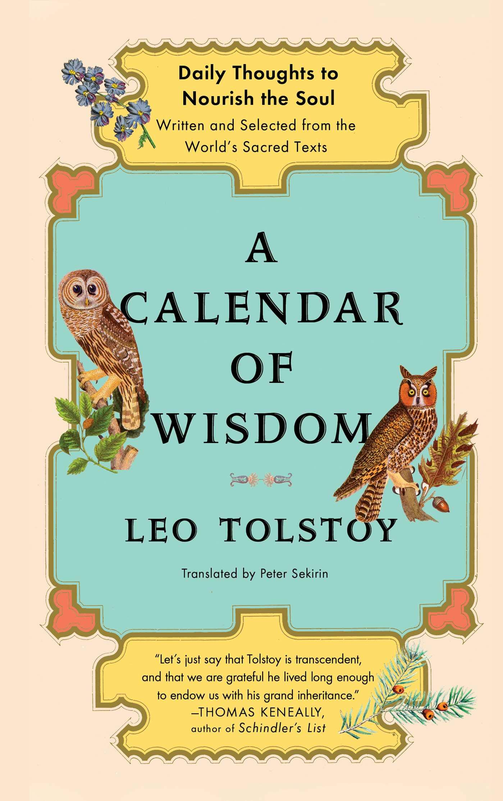

# A Calendar of Wisdom, by Tolstoy

In 2021, I followed [Tolstoy][]'s [Calendar of Wisdom][]. It's a
page-a-day calendar, circa 1910, with a little more gravitas. I like
the concept but I don't always agree with Tolstoy.

[Tolstoy]: https://en.wikipedia.org/wiki/Leo_Tolstoy "Wikipedia: Leo Tolstoy"
[Calendar of Wisdom]: https://en.wikipedia.org/wiki/A_Calendar_of_Wisdom "A Calendar of Wisdom"

> "Guiding your thoughts is one of the keys to self-perfection."
> (August 9)

Tolstoy is quite religious, pacifist, vegetarian, and
back-to-the-earth. He mixes quotes and paraphrases with his own
commentary and aphorisms. I can't quite recommend it all because I
find some things objectionable, but I like the idea of having
something to reflect on daily. Some of my most and least favorite
selections are below.

---

### Not bad, Tolstoy

> "To accept the dignity of another person is an axiom." (April 16)

> "_Effort is the necessary condition of moral perfection._" (July 23)

> "When a person tries to apply his intellect to the question “Why do
> I exist in this world?” he becomes dizzy. The human intellect cannot
> find the answers to such questions." (July 29)

> "Think good thoughts, and your thoughts will be turned into good
> actions. Everything begins in thought. Guiding your thoughts is one
> of the keys to self-perfection." (August 9)

> "_Real goodness is not something that can be acquired in an instant,
> but only through constant effort, because real goodness lies in
> constantly striving for perfection._" (September 4)

> "You should abstain from arguments. They are very illogical ways to
> convince people. Opinions are like nails: the stronger you hit them,
> the deeper inside they go." (November 4, quoting Decimus Junius
> Juvenalis)

> "The more urgently you want to speak, the more likely it is that you
> will say something foolish." (November 4)

---

### No thanks, Tolstoy

> "_A marriage is a special obligation between two people, of opposite
> sexes, to have children only with each other. To break this pact is
> a lie, a deception, and a crime._" (March 11)

> "We can improve this world only by distributing the true faith among
> the world's people." (March 17)

> "You should never feel depressed.
>
> A man should always feel happy; if he is unhappy, it means he is
> guilty." (June 29)

> "People know little, because they try to understand those things
> which are not open to them for understanding: God, eternity, spirit;
> or those which are not worth thinking about: how water becomes
> frozen, or a new theory of numbers, or how viruses can transmit
> illnesses." (July 27)

> "Only religion destroys egoism and selfishness, so that one starts
> to live life not only for himself. Only religion destroys the fear
> of death, only religion gives us the meaning of life, only religion
> creates equality among people, only religion sets a person free from
> outer pressures." (August 18)

> "It is dangerous to disseminate the idea that our life is purely the
> product of material forces and that it depends entirely on these
> forces." (August 22)

> "_Faith is the foundation on which all else rests; it is the root of
> all knowledge._" (August 28)

> "Though the mission of a woman's life is the same as that of a man's
> life and the service to God is fulfilled by the same means, namely
> love, for the majority of women the method of this service is more
> specific than for men. This is the birth and upbringing of new
> workers for the Lord throughout life." (December 1)

> "There is nothing more natural for a woman than self-sacrifice."
> (December 1)
