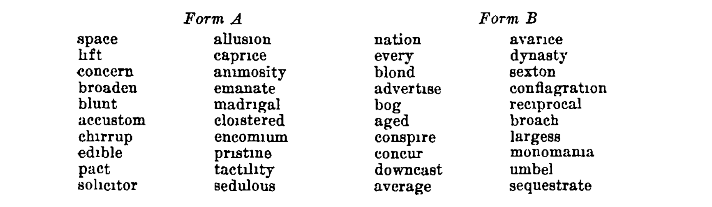

# Try the GSS WORDSUM questions!

The [General Social Survey][] includes a [WORDSUM][] vocabulary test
component that is often used as a proxy measure for [IQ][]. Want to see
how well you can do? Try these 20 questions!

[General Social Survey]: https://en.wikipedia.org/wiki/General_Social_Survey "Wikipedia: General Social Survey"
[WORDSUM]: https://en.wikipedia.org/wiki/Wordsum "Wikipedia: Wordsum"
[IQ]: https://en.wikipedia.org/wiki/Intelligence_quotient "Wikipedia: Intelligence quotient"

---

<table width="100%"><tr><td width="60%">

For each initial word, find the other word which means the same or
most nearly the same.

In the example at right, “animal” is selected because it has the
closest meaning to “beast.”

</td><td style="padding-left: 10%;">

<b>beast</b>
 
<input type="radio" name="ex" id="ex_1" disabled />
<label for="ex_1">afraid</label>
 
<input type="radio" name="ex" id="ex_2" disabled />
<label for="ex_2">words</label>
 
<input type="radio" name="ex" id="ex_3" disabled />
<label for="ex_3">large</label>
 
<input type="radio" name="ex" id="ex_4" checked />
<label for="ex_4">animal</label>
 
<input type="radio" name="ex" id="ex_5" disabled />
<label for="ex_5">separate</label>

</td></tr></table>

---

<b>space</b>
 
<input type="radio" name="01" id="01_1" />
<label for="01_1">school</label>
 
<input type="radio" name="01" id="01_2" />
<label for="01_2">noon</label>
 
<input type="radio" name="01" id="01_3" />
<label for="01_3">captain</label>
 
<input type="radio" name="01" id="01_4" class="correct" />
<label for="01_4" class="correct_label">room</label>
 
<input type="radio" name="01" id="01_5" />
<label for="01_5">board</label>

---

<b>lift</b>
 
<input type="radio" name="02" id="02_1" />
<label for="02_1">sort out</label>
 
<input type="radio" name="02" id="02_2" class="correct" />
<label for="02_2" class="correct_label">raise</label>
 
<input type="radio" name="02" id="02_3" />
<label for="02_3">value</label>
 
<input type="radio" name="02" id="02_4" />
<label for="02_4">enjoy</label>
 
<input type="radio" name="02" id="02_5" />
<label for="02_5">fancy</label>

---

<b>concern</b>
 
<input type="radio" name="03" id="03_1" />
<label for="03_1">see clearly</label>
 
<input type="radio" name="03" id="03_2" />
<label for="03_2">engage</label>
 
<input type="radio" name="03" id="03_3" />
<label for="03_3">furnish</label>
 
<input type="radio" name="03" id="03_4" />
<label for="03_4">disturb</label>
 
<input type="radio" name="03" id="03_5" class="correct" />
<label for="03_5" class="correct_label">have to do with</label>

---

<b>broaden</b>
 
<input type="radio" name="04" id="04_1" />
<label for="04_1">efface</label>
 
<input type="radio" name="04" id="04_2" />
<label for="04_2">make level</label>
 
<input type="radio" name="04" id="04_3" />
<label for="04_3">elapse</label>
 
<input type="radio" name="04" id="04_4" />
<label for="04_4">embroider</label>
 
<input type="radio" name="04" id="04_5" class="correct" />
<label for="04_5" class="correct_label">widen</label>

---

<b>blunt</b>
 
<input type="radio" name="05" id="05_1" class="correct" />
<label for="05_1" class="correct_label">dull</label>
 
<input type="radio" name="05" id="05_2" />
<label for="05_2">drowsy</label>
 
<input type="radio" name="05" id="05_3" />
<label for="05_3">deaf</label>
 
<input type="radio" name="05" id="05_4" />
<label for="05_4">doubtful</label>
 
<input type="radio" name="05" id="05_5" />
<label for="05_5">ugly</label>

---

<b>accustom</b>
 
<input type="radio" name="06" id="06_1" />
<label for="06_1">disappoint</label>
 
<input type="radio" name="06" id="06_2" />
<label for="06_2">customary</label>
 
<input type="radio" name="06" id="06_3" />
<label for="06_3">encounter</label>
 
<input type="radio" name="06" id="06_4" class="correct" />
<label for="06_4" class="correct_label">get used</label>
 
<input type="radio" name="06" id="06_5" />
<label for="06_5">business</label>

---

<b>chirrup</b>
 
<input type="radio" name="07" id="07_1" />
<label for="07_1">aspen</label>
 
<input type="radio" name="07" id="07_2" />
<label for="07_2">joyful</label>
 
<input type="radio" name="07" id="07_3" />
<label for="07_3">capsize</label>
 
<input type="radio" name="07" id="07_4" class="correct" />
<label for="07_4" class="correct_label">chirp</label>
 
<input type="radio" name="07" id="07_5" />
<label for="07_5">incite</label>

---

<b>edible</b>
 
<input type="radio" name="08" id="08_1" />
<label for="08_1">auspicious</label>
 
<input type="radio" name="08" id="08_2" />
<label for="08_2">eligible</label>
 
<input type="radio" name="08" id="08_3" class="correct" />
<label for="08_3" class="correct_label">fit to eat</label>
 
<input type="radio" name="08" id="08_4" />
<label for="08_4">sagacious</label>
 
<input type="radio" name="08" id="08_5" />
<label for="08_5">able to speak</label>

---

<b>pact</b>
 
<input type="radio" name="09" id="09_1" />
<label for="09_1">puissance</label>
 
<input type="radio" name="09" id="09_2" />
<label for="09_2">remonstrance</label>
 
<input type="radio" name="09" id="09_3" class="correct" />
<label for="09_3" class="correct_label">agreement</label>
 
<input type="radio" name="09" id="09_4" />
<label for="09_4">skillet</label>
 
<input type="radio" name="09" id="09_5" />
<label for="09_5">pressure</label>

---

<b>solicitor</b>
 
<input type="radio" name="10" id="10_1" class="correct" />
<label for="10_1" class="correct_label">lawyer</label>
 
<input type="radio" name="10" id="10_2" />
<label for="10_2">chieftain</label>
 
<input type="radio" name="10" id="10_3" />
<label for="10_3">watchman</label>
 
<input type="radio" name="10" id="10_4" />
<label for="10_4">maggot</label>
 
<input type="radio" name="10" id="10_5" />
<label for="10_5">constable</label>

---

<b>allusion</b>
 
<input type="radio" name="11" id="11_1" />
<label for="11_1">aria</label>
 
<input type="radio" name="11" id="11_2" />
<label for="11_2">illusion</label>
 
<input type="radio" name="11" id="11_3" />
<label for="11_3">eulogy</label>
 
<input type="radio" name="11" id="11_4" />
<label for="11_4">dream</label>
 
<input type="radio" name="11" id="11_5" class="correct" />
<label for="11_5" class="correct_label">reference</label>

---

<b>caprice</b>
 
<input type="radio" name="12" id="12_1" />
<label for="12_1">value</label>
 
<input type="radio" name="12" id="12_2" />
<label for="12_2">a star</label>
 
<input type="radio" name="12" id="12_3" />
<label for="12_3">grimace</label>
 
<input type="radio" name="12" id="12_4" class="correct" />
<label for="12_4" class="correct_label">whim</label>
 
<input type="radio" name="12" id="12_5" />
<label for="12_5">inducement</label>

---

<b>animosity</b>
 
<input type="radio" name="13" id="13_1" class="correct" />
<label for="13_1" class="correct_label">hatred</label>
 
<input type="radio" name="13" id="13_2" />
<label for="13_2">animation</label>
 
<input type="radio" name="13" id="13_3" />
<label for="13_3">disobedience</label>
 
<input type="radio" name="13" id="13_4" />
<label for="13_4">diversity</label>
 
<input type="radio" name="13" id="13_5" />
<label for="13_5">friendship</label>

---

<b>emanate</b>
 
<input type="radio" name="14" id="14_1" />
<label for="14_1">populate</label>
 
<input type="radio" name="14" id="14_2" />
<label for="14_2">free</label>
 
<input type="radio" name="14" id="14_3" />
<label for="14_3">prominent</label>
 
<input type="radio" name="14" id="14_4" />
<label for="14_4">rival</label>
 
<input type="radio" name="14" id="14_5" class="correct" />
<label for="14_5" class="correct_label">come</label>

---

<b>madrigal</b>
 
<input type="radio" name="15" id="15_1" class="correct" />
<label for="15_1" class="correct_label">song</label>
 
<input type="radio" name="15" id="15_2" />
<label for="15_2">mountebank</label>
 
<input type="radio" name="15" id="15_3" />
<label for="15_3">lunatic</label>
 
<input type="radio" name="15" id="15_4" />
<label for="15_4">ribald</label>
 
<input type="radio" name="15" id="15_5" />
<label for="15_5">sycophant</label>

---

<b>cloistered</b>
 
<input type="radio" name="16" id="16_1" />
<label for="16_1">miniature</label>
 
<input type="radio" name="16" id="16_2" />
<label for="16_2">bunched</label>
 
<input type="radio" name="16" id="16_3" />
<label for="16_3">arched</label>
 
<input type="radio" name="16" id="16_4" />
<label for="16_4">malady</label>
 
<input type="radio" name="16" id="16_5" class="correct" />
<label for="16_5" class="correct_label">secluded</label>

---

<b>encomium</b>
 
<input type="radio" name="17" id="17_1" />
<label for="17_1">repetition</label>
 
<input type="radio" name="17" id="17_2" />
<label for="17_2">friend</label>
 
<input type="radio" name="17" id="17_3" class="correct" />
<label for="17_3" class="correct_label">panegyric</label>
 
<input type="radio" name="17" id="17_4" />
<label for="17_4">abrasion</label>
 
<input type="radio" name="17" id="17_5" />
<label for="17_5">expulsion</label>

---

<b>pristine</b>
 
<input type="radio" name="18" id="18_1" />
<label for="18_1">flashing</label>
 
<input type="radio" name="18" id="18_2" />
<label for="18_2">earlier</label>
 
<input type="radio" name="18" id="18_3" class="correct" />
<label for="18_3" class="correct_label">primeval</label>
 
<input type="radio" name="18" id="18_4" />
<label for="18_4">bound</label>
 
<input type="radio" name="18" id="18_5" />
<label for="18_5">green</label>

---

<b>tactility</b>
 
<input type="radio" name="19" id="19_1" class="correct" />
<label for="19_1" class="correct_label">tangibility</label>
 
<input type="radio" name="19" id="19_2" />
<label for="19_2">grace</label>
 
<input type="radio" name="19" id="19_3" />
<label for="19_3">subtlety</label>
 
<input type="radio" name="19" id="19_4" />
<label for="19_4">extensibility</label>
 
<input type="radio" name="19" id="19_5" />
<label for="19_5">manageableness</label>

---

<b>sedulous</b>
 
<input type="radio" name="20" id="20_1" />
<label for="20_1">muddied</label>
 
<input type="radio" name="20" id="20_2" />
<label for="20_2">sluggish</label>
 
<input type="radio" name="20" id="20_3" />
<label for="20_3">stupid</label>
 
<input type="radio" name="20" id="20_4" class="correct" />
<label for="20_4" class="correct_label">assiduous</label>
 
<input type="radio" name="20" id="20_5" />
<label for="20_5">corrupting</label>

---

<input type="submit"
  value="Show scoring and italicize correct answers"
  onclick="
    document.getElementById('scoring').style.visibility = 'visible';
    document.getElementById('show_scoring').style.visibility = 'hidden';
    document.querySelectorAll('.correct_label').forEach(
      element => element.classList.add('marked_correct'))" />

<h3>0 of 10 points (0 correct of 20 questions)</h3>

<input type="submit"
  value="Hide scoring and un-italicize correct answers"
  onclick="
    document.getElementById('scoring').style.visibility = 'hidden';
    document.getElementById('show_scoring').style.visibility = 'visible';
    document.querySelectorAll('.correct_label').forEach(
      element => element.classList.remove('marked_correct'))" />

---

Caveats:

 * I'm pretty sure I've identified the right answers, but I haven't
   seen an answer key (just the relevant test booklets).
 * The actual [WORDSUM][] has 10 questions, not 20. I know that those
   ten questions are among these 20, but I don't know _which_. For
   more detail, read on.

Here's an [excerpt][] on the history of [WORDSUM][]:

[excerpt]: https://gss.norc.org/Documents/reports/methodological-reports/MR111%20The%20Psychometric%20Properties%20of%20the%20GSS%20Wordsum%20Vocabulary%20Test.pdf "The Psychometric Properties of the GSS Wordsum Vocabulary Test"

> In the early 1920s, Edward L. Thorndike developed a lengthy
> vocabulary test as part of the I.E.R. Intelligence Scale CAVD to
> measure, in his words, “verbal intelligence.” As in the modern-day
> Wordsum test, each question asked respondents to identify the word
> or phrase in a set of five whose meaning was closest to a target
> word. Robert L. Thorndike (1942) later extracted two subsets of the
> original test, each containing twenty items of varying difficulty.
> For each subset, two target words were selected at each of ten
> difficulty levels. The ten items in Wordsum (labeled with letters
> A though J) were selected from the first of these two subsets.

It's not perfectly accurate to say Thorndike developed a lengthy
vocabulary test. The I.E.R Intelligence Scale CAVD, [copyright][] 1925
and 1926, is 17 levels (A through Q) and each level has ten vocabulary
questions in multiple choice format, among other question types.

[copyright]: https://copyright.cornell.edu/publicdomain "Copyright at Cornell Libraries: Copyright Term and the Public Domain"

Thorndike 1942 is [Two screening tests of verbal intelligence][],
which describes how two 20-word tests “containing two words from each
of the levels of CAVD from H through Q” (the more difficult end of the
spectrum; levels A through E use pictures) were constructed.

[Two screening tests of verbal intelligence]: https://psycnet.apa.org/record/1942-04205-001 "Thorndike, R. L. (1942). Two screening tests of verbal intelligence. Journal of Applied Psychology, 26(2), 128–135."

The first subset then is _Form A_, and those are the questions
included above. I don't know _which_ ten words from Form A's twenty
are in WORDSUM, however. As [GSS Codebook Appendix D][] explains:

[GSS Codebook Appendix D]: https://gssdataexplorer.norc.org/documents/444/display "GSS Codebook Appendix D"

> To minimize the admittedly small possibility that some form of
> publicity would affect the public's knowledge of the words included
> in the test, they are not reported here.

I think it's fascinating that a vocab test from the 1920s is part of
the GSS, which continues to be administered in the 2020s. I think it's
fascinating that WORDSUM has been used for evidence that
[Intelligence makes people think like economists][], among many other
things.

[Intelligence makes people think like economists]: https://www.semanticscholar.org/paper/Intelligence-makes-people-think-like-economists%3A-Caplan-Miller/ef579356c5c461914e3c0ff896c7949554be1774 "Intelligence makes people think like economists: Evidence from the General Social Survey"

I think the benefit of knowing what the WORDSUM questions are far
outweighs any risk “that some form of publicity would affect the
public's knowledge of the words included in the test.” Frankly, I'm
not sure WORDSUM deserves an encomium.

