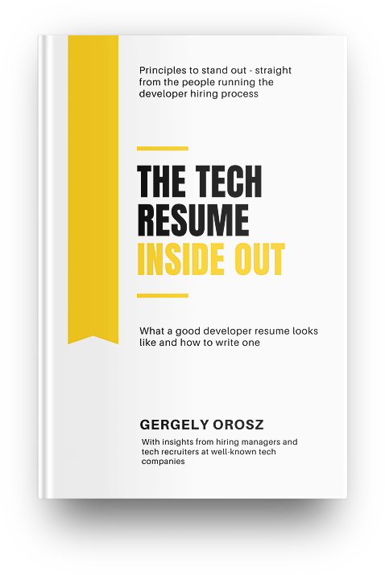

# The Tech Resume Inside Out, by Orosz

I read [this][] when I was re-doing my resume last spring, and I think
it helped. Here are some changes to my resume that I made based on its
advice:

[this]: https://thetechresume.com/ "The Tech Resume Inside Out: What a Good Developer Resume Looks Like"

 * With double the experience, I cut the length in half to get to one
   page.
 * I dropped my full address, keeping just city and state.
 * I put job titles before and more prominently than employer names.
 * Instead of paragraphs describing jobs, 16 bullet-points, all single
   lines.
 * Lots of active voice, immediate quantitative detail, and specifics.
 * Instead of a separate section, programming languages etc. mentioned
   in context.
 * I dropped months, so dates of employment only include years.

I didn't make a separate resume for _every_ position I applied for,
but I did distribute at least six different versions for different
kinds of roles.

Do resumes matter? I'm not sure. You probably still need to have one
though. And it may be that the _less_ they matter, the better the
signal you provide by _still_ having a good one. People who are great
do the little things well.

If nothing else, thinking about your resume can focus your work: How
would what I'm doing today look on my resume? If you're doing
something that would seem pointless on a resume, maybe you should do
something else.

