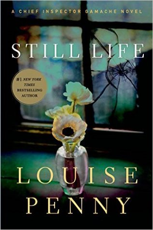

# Still Life, by Louise Penny

Put on your Sony ‘Discman’ and grab your palm pilot, because it's
[Louise Penny][]'s first book featuring
[Chief Inspector Armand Gamache][] (read "Galonche") from 2006!

[Chief Inspector Armand Gamache]: https://en.wikipedia.org/wiki/Chief_Inspector_Armand_Gamache "Chief Inspector Armand Gamache"
[Louise Penny]: https://en.wikipedia.org/wiki/Louise_Penny "Wikpedia: Louise Penny"

> ‘Life is change. If you aren’t growing and evolving you’re standing
> still, and the rest of the world is surging ahead. Most of these
> people are very immature. They lead “still” lives, waiting.’ (Myrna,
> page 140)

I would be very pleased if I wrote a book as good as this. It's
charming fun with a bit of morality play blended in.

> ‘We choose our thoughts. We choose our perceptions. We choose our
> attitudes. We may not think so. We may not believe it, but we do. I
> absolutely know we do. I’ve seen enough evidence, time after time,
> tragedy after tragedy. Triumph after triumph. It’s about choice.’
> (Gamache, page 80)

Stoic? Positive psychology? Right wing?

There's little sympathy for men's-rights-style whining:

> "We’re not respected just by virtue of being English. It’s not the
> same thing. Do you have any idea how much our lives have changed in
> the last twenty years? All the rights we’ve lost?" (Ben Hadley, page
> 50)

I enjoyed the art world dalliance, which reminded me somewhat of the
end of Vonnegut's Bluebeard. And Nichol! Who's never been Nichol? So
awful! So fun to hate, and/or pity.

I collected things of varying degrees of Canadianness that I looked
up. (Do compound bows have built-in triggers in Montreal?)

 * as hard as the [Canadian Shield][]: a large area of exposed
   Precambrian rock
 * [beaver stick][]: just what it sounds like
 * [Canadiens][]: the Montreal hockey team
 * cured Canadian bacon: but they mean regular bacon
 * _dépanneur_: A convenience store, especially one that sells
   alcohol (in Quebec)
 * [Eaton's catalogue][]: one of the first mail-order catalogs
   distributed by a Canadian retail store
 * He’s a Golden Mile boy: refers to a rich [area][] of Montreal
 * Inspector Clouseau: The Chief Inspector from The Pink Panther
 * Inuk island: apparently Inuk is interchangeable with Inuit? Is this
   a specific place?
 * "Lee Valley catalogue": "Lee Valley Tools Ltd. is a Canadian
   business specializing in tools and gifts for woodworking and
   gardening."
 * Lune Moon: a funny Canadian [snack cake][]
 * ‘May I have his co-ordinates, please?’ (page 61) was asking for a
   person's location. Is this a common phrasing?
 * Méteo Media: "a Canadian French-language weather information
   specialty channel and web site"
 * tabarouette, tabarnouche: "Mild version of french-canadian curse
   word tabarnak."
 * Tabernacle: This is a curse, somehow?
 * tête carrée: "square head" / blockhead
 * three extra large ‘All Dressed’ from Pizza Pizza: "Montreal
   [slang][] for the works"
 * tins of soft drinks: Is this what they say in Quebec?
 * toques: normal winter hats, but in Canada (read "tooks")
 * to twig: To realise something; to catch on; to recognize someone or
   something (British?)
 * village cozy: A [mystery genre][] referenced by a character. Still
   Life is pretty close to a village cozy.
 * ‘yes yes’ cookies: Apparently these are like the Girl Scouts'
   "Samoas"

[Canadian Shield]: https://en.wikipedia.org/wiki/Canadian_Shield
[beaver stick]: https://carnegiemnh.org/b-is-for-beaver-sticks/
[Canadiens]: https://en.wikipedia.org/wiki/Montreal_Canadiens
[Eaton's catalogue]: https://en.wikipedia.org/wiki/Eaton%27s_catalogue
[area]: https://en.wikipedia.org/wiki/Golden_Square_Mile "Golden Square Mile"
[snack cake]: https://www.flickr.com/photos/hazboy/30114619898 "Lune Moons"
[slang]: https://good-pizza-great-pizza.fandom.com/wiki/List_of_orders#All-Dressed
[mystery genre]: https://en.wikipedia.org/wiki/Cozy_mystery "Wikipedia: Cozy mystery"

