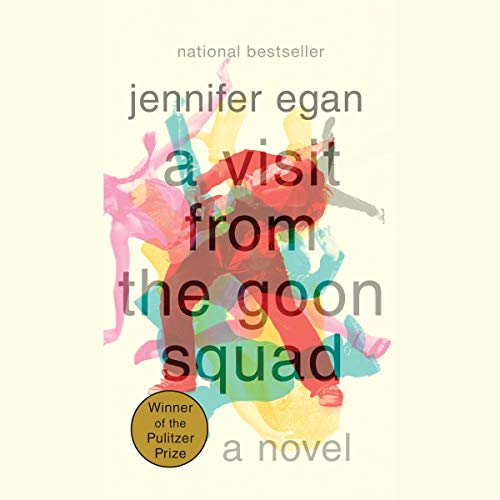

# A Visit from the Goon Squad, by Egan

“Time's a goon, right?” This book is very much as described
[on Wikipedia][]. I enjoyed it. It shows things from different
people's perspectives and gives you a lot of things to react to.
There's largely no singular narrative, the good aren't rewarded, the
bad aren't punished. It's most disappointing when hints of arc or
closure appear toward the end.

[on Wikipedia]: https://en.wikipedia.org/wiki/A_Visit_from_the_Goon_Squad "Wikipedia: A Visit from the Goon Squad"

