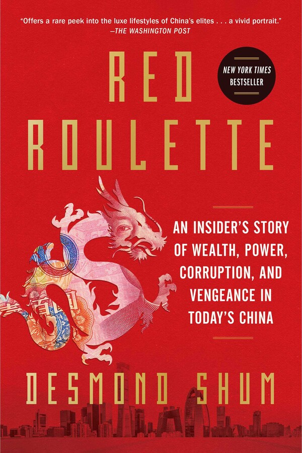

# Red Roulette, by Shum

The success of this [book][] is that [Shum][] straddles sympathetic
and repulsive. He is deeply flawed and yet less flawed than the China
he describes. He is an unreliable narrator but perhaps among the most
reliable available. His viewpoint is part of the view.

[book]: https://en.wikipedia.org/wiki/Red_Roulette
[Shum]: https://en.wikipedia.org/wiki/Desmond_Shum

