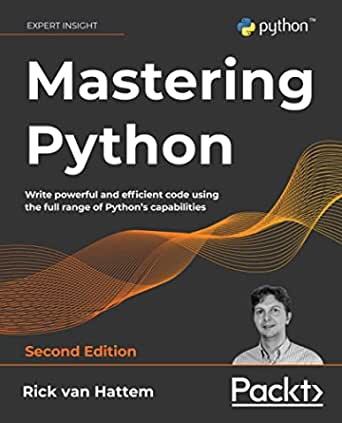

# Mastering Python, by van Hattem

[Sharma][] from [Packt][] sent me a review copy of the
[second edition][]. I skimmed it, and I like it a lot. It seems like
[van Hattem][] knows his stuff. The book is hugely inclusive and
erudite; you'll almost certainly learn new things. It includes the
[Y combinator][] as an example. It isn't perfect, but it's better than
[Jaworski and Ziadé's book][], I think, and I'll recommend it.

[Sharma]: https://www.linkedin.com/in/priyadarshini-sharma-95a35215b/ "Priyadarshini Sharma"
[Packt]: https://www.packtpub.com/
[second edition]: https://www.packtpub.com/product/mastering-python-second-edition/9781800207721 "Mastering Python - Second Edition"
[van Hattem]: https://w.wol.ph/about/ "Rick van Hattem (Wolph)"
[Y combinator]: https://en.wikipedia.org/wiki/Fixed-point_combinator#Fixed-point_combinators_in_lambda_calculus "Fixed-point combinators in lambda calculus"
[Jaworski and Ziadé's book]: /20190707-expert_python_programming_by_jaworski_and_ziade/ "Expert Python Programming by Jaworski and Ziadé"

