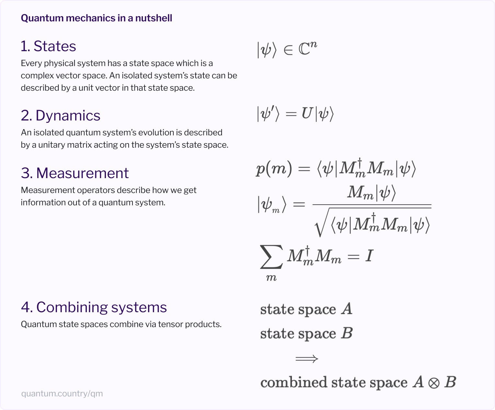

# Nielsen's Quantum Country

You can understand the force of gravity as proportional to one over
distance squared without understanding why that should be, and this is
the manner in which Nielsen explains quantum mechanics in his
[series of essays][]—and with considerable clarity.

[series of essays]: https://quantum.country/ "Quantum Country"

I knew [Nielsen][] first from his book
[Neural Networks and Deep Learning][]. I hadn't realized he was a
quantum physicist first! His popular [textbook][] with Chuang was
published in 2001, and his YouTube series
[Quantum computing for the determined][] came out in 2010. So the 2019
[Quantum Country][] was a return to the topic.

[Nielsen]: https://michaelnielsen.org/ "Michael Nielsen"
[Neural Networks and Deep Learning]: http://neuralnetworksanddeeplearning.com/ "Neural Networks and Deep Learning"
[textbook]: https://www.amazon.com/Quantum-Computation-Information-10th-Anniversary/dp/1107002176 "Quantum Computation and Quantum Information"
[Quantum computing for the determined]: https://www.youtube.com/playlist?list=PL1826E60FD05B44E4 "Quantum computing for the determined"
[Quantum Country]: https://quantum.country/ "Quantum Country"

[Matuschak][] is a co-author on the project, and my guess is he built
the “mnemonic medium” it uses. There are flashcards. The
implementation relies on an account mechanism that doesn't work very
well. I love spaced repetition ([1][], [2][]) but I think the strength
of the project is Nielsen's exposition.

[Matuschak]: https://andymatuschak.org/ "Andy Matuschak"
[1]: /20201009-anki_is_easy/ "Anki is easy"
[2]: /20210908-spaced_repetition_is_o_log_n_sustainable/ "Spaced repetition is O(log n) sustainable"

A few takeaways in addition to the summary image above:

 * Entanglement is key: Probabilities are not independent, which is
   how you get the exponential capability of quantum computing with
   more qubits. (See nutshell #4.)
     * The usual entangled pair is just one where all the probability
       is on 00 and 11, with none on 01 or 10.
 * Quantum search gives \\( O(\sqrt{n}) \\) general performance.
   ([Shor's factoring][] is faster but not much covered in the text.)
 * Quantum teleportation does _not_ move information faster than the
   speed of light, because you have to send classical information as
   part of the procedure.

[Shor's factoring]: https://en.wikipedia.org/wiki/Shor%27s_algorithm "Shor's algorithm"

A few explicitly unresolved issues:

 * How do we feel, after [Bell inequality][] results, about not having
   [local realism][]? (I would rather give up locality, I guess, but
   Nielsen suggests giving up realism. Trippy.)
 * The interpretation problem: What does a quantum state even mean?
 * The measurement problem: What does it even mean to measure a
   system?

[Bell inequality]: https://en.wikipedia.org/wiki/Bell%27s_theorem "Bell's theorem"
[local realism]: https://en.wikipedia.org/wiki/Principle_of_locality#Quantum_mechanics

The whole thing is great. Fun with linear algebra! Check it out!
