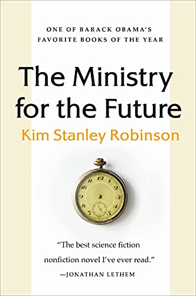

# The Ministry for the Future, by Robinson

576 [pages][] in 106 chapters. One from POV of the market. Another: a
photon. Writing often in this style. One chapter a list of NGOs by
country. Repeated references to Zürich's [statue][] of Ganymede.
Eco-fantasy from a [lover][] of Antarctica. Largely okay with
terrorism.

[pages]: https://en.wikipedia.org/wiki/The_Ministry_for_the_Future "The Ministry for the Future"
[statue]: https://en.wikipedia.org/wiki/Ganymed_%28Z%C3%BCrich%29 "Ganymed (Zürich)"
[lover]: https://en.wikipedia.org/wiki/Kim_Stanley_Robinson "Kim Stanley Robinson"

---

Here are some of the core predictions and my thoughts on them:

 * The rich will start caring about poor people affected by climate
   disasters.
     * In the book a heatwave kills 20 million people in India,
       jump-starting a lot of action. Certainly people would take
       note, but I'm not sure even this kind of disaster would
       catalyze global empathy.
 * Eco-terrorism will lead to lots of good changes to behavior and
   policy.
     * People deliberately give cows mad cow disease, so people stop
       eating meat. Lots of planes are crashed by swarms of drones, so
       people stop flying. I think it's unlikely the crimes would be
       committed, and I think if they were it's still unlikely the
       changes would result.
 * Agriculture will all switch to organic and it will go great.
     * The author references [Sikkim][] as an organic success story.
       More recently, it's hard not to think of the failure in
       [Sri Lanka][]. I don't think the world wants to have
       agriculture be more labor-intensive and less productive.
 * Everyone will switch to one privacy-first internet service.
     * In the book it's called "YourLock" and it isn't clear how it
       works. Quantum encryption doesn't make this suddenly something
       people will want to use.
 * Blockchain-based "carbon coin" will encourage carbon sequestration.
     * The book has all fiat currency becoming blockchain-based, and
       also central banks issue these "carbon coins" with guarantees
       on their value increasing over time. The author is really
       jazzed about this but I don't know why it's that much better
       than direct compensation in fiat currency, for example.
 * Modern Monetary Theory is right: You can print money without
   causing inflation.
     * This probably seemed realistic in 2020. In 2022, it seems
       suspect.
 * We're going post-capitalism.
     * The author isn't super clear, in places favoring central
       planning that works (because of AI?) and elsewhere holding up
       [Mondragón][] and unions as exemplars.
 * Guaranteed jobs for all!
     * Is a guaranteed job different from Universal Basic Income?
       (What prevents me from not turning up and just collecting the
       pay? If you can be fired is it a guaranteed job?)
 * 10x max ratio from lowest to highest income.
     * Hmm! Would this be cool?
 * Global refugee passports
     * This seems nice!
 * Airships
     * At least this is sort of a plausible story for why we would use
       airships (to avoid burning carbon). Better story than
       steam-punk.

[Sikkim]: https://en.wikipedia.org/wiki/Sikkim "Sikkim"
[Sri Lanka]: https://foreignpolicy.com/2022/03/05/sri-lanka-organic-farming-crisis/ "In Sri Lanka, Organic Farming Went Catastrophically Wrong"
[Mondragón]: https://en.wikipedia.org/wiki/Mondragon_Corporation "Mondragon Corporation"

As a novel, it's not great. As a collection of ideas to think about,
it does introduce a few, but it's not very convincing. It does prompt
some thought. What's really going to happen?

A few quotes follow.

---

> "For a while, therefore, it looked like the great heat wave would be
> like mass shootings in the United States—mourned by all, deplored by
> all, and then immediately forgotten or superseded by the next one,
> until they came in a daily drumbeat and became the new normal."
> (page 25)

---

> "Ideology, n. An imaginary relationship to a real situation. In
> common usage, what the other person has, especially when
> systematically distorting the facts. But it seems to us that an
> ideology is a necessary feature of cognition, and if anyone were to
> lack one, which we doubt, they would be badly disabled. There is a
> real situation, that can’t be denied, but it is too big for any
> individual to know in full, and so we must create our understanding
> by way of an act of the imagination. So we all have an ideology, and
> this is a good thing. So much information pours into the mind,
> ranging from sensory experience to discursive and mediated inputs of
> all kinds, that some kind of personal organizing system is necessary
> to make sense of things in ways that allow one to decide and to act.
> Worldview, philosophy, religion, these are all synonyms for ideology
> as defined above; and so is science, although it’s the different
> one, the special one, by way of its perpetual cross-checking with
> reality tests of all kinds, and its continuous sharpening of focus.
> That surely makes science central to a most interesting project,
> which is to invent, improve, and put to use an ideology that
> explains in a coherent and useful way as much of the blooming
> buzzing inrush of the world as possible. What one would hope for in
> an ideology is clarity and explanatory breadth, and power. We leave
> the proof of this as an exercise for the reader." (page 42)

---

> "And yet even primitive math still takes mathematicians, the rest of
> us being so clueless." (page 60)

---

> "One-eight-billionth wasn’t a very big fraction, but then again
> there were poisons that worked in the parts-per-billion range, so it
> wasn’t entirely unprecedented for such a small agent to change
> things." (page 65)

---

> "Indian agriculture moving into its post–green revolution is also a
> giant step toward independent subtropical knowledge production,
> achieved in collaboration with Indonesian and African and South
> American permaculturists, and its importance going forward cannot be
> over-emphasized." (page 126)

---

> "Volatile people, you can’t trust them, that’s the thing; and they
> know it." (page 154)

---

> "Demonstrations are parties. People party and then go home. Nothing
> changes." (page 156)

---

[Jevons paradox][] (page 165)

[Jevons paradox]: https://en.wikipedia.org/wiki/Jevons_paradox "Jevons paradox"

---

> "The capitalizing of state power now had its roots in private
> wealth; thus the rich and the state became co-dependents, two
> aspects of the same power structure." (page 211)

---

[PIIGS][] (page 213)

[PIIGS]: https://en.wikipedia.org/wiki/PIGS_(economics) "PIGS (economics)"

---

> "The War for the Earth is often said to have begun on Crash Day."
> (page 229)

(When a bunch of airplanes were taken down all at once by drones.)

---

> "I don’t own my kids’ teacher, I don’t own my doctor, I don’t need
> to own my house." (page 248)

---

> "The Götterdämmerung Syndrome, as with most violent pathologies, is
> more often seen in men than women. It is often interpreted as an
> example of narcissistic rage. Those who feel it are usually
> privileged and entitled, and they become extremely angry when their
> privileges and sense of entitlement are being taken away. If then
> their choice gets reduced to admitting they are in error or
> destroying the world, a reduction they often feel to be the case,
> the obvious choice for them is to destroy the world; for they cannot
> admit they have ever erred." (page 298)

---

> "Make the next political economy. Invent post-capitalism!" (page
> 317)

---

> "No conspiracy theories, please, so fucking tedious those people—as
> if things secretly made sense!" (page 408)

---

> "They had created and paid out trillions of carbon coins, and yet
> had seen no signs of inflation, or deflation, for those who held
> that theory; no noticeable price change." (page 420)

---

> "This made for a kind of double standard, or rather something
> finally to replace the lost gold standard; they had now a carbon
> standard, and also the dollar to use for exchanges." (page 454)

---

> "Setting a generous definition of a universal necessary income,
> guaranteeing jobs to all, and capping personal annual income at ten
> times that minimum amount, as they had done in many countries, had
> immediately crushed Gini figures down. The EU had led the way, the
> US and China had followed, and then everywhere else had begun to
> leak their most educated young people to these flatter countries,
> until the countries losing educated people also instituted it.
> Guaranteed jobs, yes, but also universal basic services, and
> supported social reproduction, along with infrastructure and housing
> construction projects, had completed the rise out of poverty at the
> low end of the world income scale." (page 478)

---

> "Looking at the central bankers listening attentively to her, Mary
> saw it again; these people were as close to rulers of the world as
> existed." (page 510)

---

