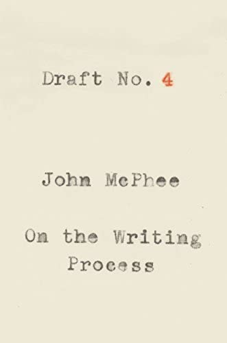

# Draft No. 4: On the Writing Process, by McPhee

The New Yorker's [John McPhee][] has collected essays about writing
nonfiction. It's largely show-don't-tell advice to write better, in
that he writes very well as he tells you about writing. It's a brief
and charming grandfatherly memoir from a confident practitioner.

[John McPhee]: https://en.wikipedia.org/wiki/John_McPhee

---

> "To some extent, the structure of a composition dictates itself, and
> to some extent it does not." (page 20)

---

> "O.K. then, what is a lead? For one thing, the lead is the hardest
> part of a story to write. And it is not impossible to write a very
> bad one. Here is an egregiously bad one from an article on chronic
> sleeplessness. It began: “Insomnia is the triumph of mind over
> mattress.” Why is that bad? It’s not bad at all if you want to be a
> slapstick comedian—if humor, at that stratum, is your purpose. If
> you are serious about the subject, you might seem to be indicating
> at the outset that you don’t have confidence in your material so you
> are trying to make up for it by waxing cute." (pages 49-50)

> "A lead should not be cheap, flashy, meretricious, blaring. After a
> tremendous fanfare of verbal trumpets, a mouse comes out of a hole
> blinking." (page 50)

> "Blind leads—wherein you withhold the name of the person you are
> writing about and reveal it after a paragraph or two—range from
> slightly cheap to very cheap." (page 50)

> "A lead is good not because it dances, fires cannons, or whistles
> like a train but because it is absolute to what follows." (page 51)

---

> "Another mantra, which I still write in chalk on the blackboard, is
> “A Thousand Details Add Up to One Impression.” It’s actually a quote
> from Cary Grant. Its implication is that few (if any) details are
> individually essential, while the details collectively are
> absolutely essential." (page 56)

---

> "Writing is a matter strictly of developing oneself." (page 82)

---

> "Editors have come along who use terms like “nut graph”—as in “What
> this piece needs is a good nut graph”—meaning a paragraph close to
> the beginning that encapsulates the subject and why you are writing
> about it. That sort of structural formalism is a part of the rote
> methodology that governs the thought of people who don’t have better
> ideas." (page 82)

---

> "Editors are counselors and can do a good deal more for writers in
> the first-draft stage than at the end of the publishing process."
> (page 83)

---

> "The last thing I would ever suggest to young writers is that they
> consciously try to write for the ages. Oh, yik, disgusting. Nobody
> should ever be trying that." (page 119)

---

> "Without the drafted version—if it did not exist—you obviously would
> not be thinking of things that would improve it. In short, you may
> be actually writing only two or three hours a day, but your mind, in
> one way or another, is working on it twenty-four hours a day—yes,
> while you sleep—but only if some sort of draft or earlier version
> already exists. Until it exists, writing has not really begun."
> (pages 159-260)

---

> "Forget market research. Never market-research your writing." (page 180)

---

> "Creative nonfiction is not making something up but making the most
> of what you have." (page 185)
