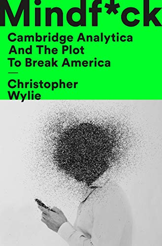

# Mindf*ck, by Wylie

Cambridge Analytica was a US brand for the UK's SCL (Strategic
Communication Laboratories) Group. They [got][] Americans to fill out
personality surveys and install an app that sent them Facebook
information on likes, friends, etc. They used all this to advance the
agendas of [Steve Bannon][] and [Bob Mercer][], for example.

[got]: https://en.wikipedia.org/wiki/Facebook%E2%80%93Cambridge_Analytica_data_scandal "Facebook–Cambridge Analytica data scandal"
[Steve Bannon]: https://en.wikipedia.org/wiki/Steve_Bannon
[Bob Mercer]: https://en.wikipedia.org/wiki/Robert_Mercer "Robert Mercer"

Facebook's crime in this seems to have been basically negligence. They
let a lot of information be accessible at the time, and people did
unsavory things with it. It's a little weird to call it a data breach,
since the system was working as intended.

I wonder how (or whether) Cambridge Analytica evaluated their
effectiveness... Trump became president, but was it _because of_
Cambridge Analytica? Or were they just pushing in a direction that
already had momentum? It is both horrifying and attractive to think
that manipulative actors are responsible for massive unpleasant
outcomes. But what share of the blame can be assigned?

> "Our system is broken, our laws don't work, our regulators are weak,
> our governments don't understand what's happening, and our
> technology is usurping our democracy." (page 248)

---

> "Bannon realized the power of cultivating the misogyny of of horny
> virgins." (page 62)

---

> "It turns out that Republicans can accept a batshit insane
> candidate, _so long as it's consistent insanity_." (page 71, italics
> in original)

---

> "This [idea to simulate behavior with computers] brought to mind
> experiments from the 1990s in a niche field of sociology called
> "[artificial societies][]," which involved attempts by crude
> multi-agent systems to "grow" societies in silico. I could remember
> as a teenager reading Isaac Asimov's [_Foundation_][] series, where
> scientists used large data sets about societies to create the field
> of "psychohistory," which allowed them to not only predict the
> future but also control it." (page 81)

[artificial societies]: https://en.wikipedia.org/wiki/Artificial_society "Artificial society"
[_Foundation_]: https://planspace.org/20200714-foundation_trilogy/ "Asimov's Foundation trilogy"

---

> "In 2012, Facebook [filed][] for a U.S. patent for "_Determining
> user personality characteristics from social networking system
> communications and characteristics_." Facebook's patent application
> explained that its interest in psychological profiling was because
> "inferred personality characteristics are stored in connection with
> the user's profile, and may be used for targeting, ranking,
> selecting versions of products, and various other purposes."" (page
> 96)

[filed]: https://patents.google.com/patent/US8825764B2/en "Determining user personality characteristics from social networking system communications and characteristics"

---

> "In fact, a 2015 [study][] by Youyou, Kosinski, and Stillwell showed
> that, using Facebook likes, a computer model reigned supreme in
> predicting human behavior." (page 103)

[study]: https://www.pnas.org/doi/10.1073/pnas.1418680112 "Computer-based personality judgments are more accurate than those made by humans"

---

> "It contained complete profiles of tens of thousands of users—name,
> gender, age, location, status updates, likes, friends—_everything_.
> Kogan said his Facebook app could even pull private messages."
> (pages 104-105)

The private messages bit is quite the unsupported claim.

---

> ""Think about it," I said to Bannon. "The message at a Tea Party
> rally is the same as at a Gay Pride parade: _Don't tread on me! Let
> me be who I am!_"" (page 117)

---

> "A select minority of people exhibit traits of narcissism (extreme
> self-centeredness), Machiavellianism (ruthless self-interest), and
> psychopathy (emotional detachment). In contrast to the Big Five
> traits found in everyone to some degree as part of normal
> psychology—openness, conscientiousness, extroversion, agreeableness,
> and neuroticism—these "[dark triad][]" traits are maladaptive,
> meaning that those who exhibit them are generally more prone to
> antisocial behavior, including criminal acts. From the data CA
> collected, the team was able to identify people who exhibited
> neuroticism and dark-triad traits, and those who were more prone to
> impulsive anger or conspiratorial thinking than average citizens.
> Cambridge Analytica would target them, introducing narratives via
> Facebook groups, ads, or articles that the firm knew from internal
> testing were likely to inflame the very narrow segments of people
> with these traits. CA wanted to provoke people, to get them to
> engage." (pages 119-120)

> "As it happens, the most engaging content on social media is often
> horrible or enraging." (page 120)

[dark triad]: https://en.wikipedia.org/wiki/Dark_triad "Dark triad"

Some of the [Big Five personality traits][] stuff reminded me of what
I've heard about [The Righteous Mind][]: describing Republicans as low
on openness and high on conscientiousness, while Democrats are the
reverse.

[Big Five personality traits]: https://en.wikipedia.org/wiki/Big_Five_personality_traits
[The Righteous Mind]: https://www.amazon.com/Righteous-Mind-Divided-Politics-Religion/dp/0307455777/

---

> "Cambridge Analytica's research panels also identified that there
> were relationships between target attitudes and a psychological
> effect called the _just-world hypothesis_ (JWH). This is a cognitive
> bias where some people rely on a presumption of a fair world: The
> world is a fair place where bad things "happen for a reason" or will
> be offset by some sort of "moral balancing" in the universe. We
> found that people who displayed the JWH bias were, for example, more
> prone to victim-blaming in hypothetical scenarios of sexual assault.
> If the world is fair, then random bad things should not happen to
> innocent people, and therefore there must have been a fault in the
> victim's behavior. Finding ways to blame victims is psychologically
> prophylactic for some people because it helps them cope with anxiety
> induced by uncontrollable environmental threats while maintaining a
> comforting view that the world will still be fair _to them_.
>
> "Cambridge Analytica found that JWH was related to many attitudes,
> but that it had a special relationship with racial bias." (page 129)

This idea—the just-world hypothesis considered harmful—is very
interesting.

---

> "In 1988, George H. W. Bush's campaign ran the infamous
> [Willie Horton ad][], terrifying white voters with visions of
> wild-haired black criminals running amok." (page 131)

[Willie Horton ad]: https://youtu.be/Io9KMSSEZ0Y "Willie Horton 1988 Attack Ad"

---

> "... Cambridge Analytica was merely a front-facing brand for
> American clients that was entirely staffed by SCL personnel." (page
> 134)

---

> "In our invasion of America, we were purposefully activating the
> worst in people, from paranoia to racism." (page 144)

---

> "To Moscow, civil rights and the First Amendment are the American
> political system's most glaring vulnerabilities." (page 153)

---

> "Cambridge Analytica identified that many people in non-urban
> regions or in lower socioeconomic strata often externalized the
> notion of "the economy" to something that only the wealthy and
> metropolitan participated in. "The economy" was not their job in a
> local store; it was something that bankers did." (page 172)

---

Page 192 includes a reference to [Zelig][], which I hadn't known
about.

[Zelig]: https://en.wikipedia.org/wiki/Zelig "Zelig"

---

> "Later, it emerged that Facebook, in a panic about its PR crisis,
> had hired the secret communications firm
> [Definers Public Affairs][], which subsequently leaked out fake
> narratives filled with anti-Semitic tropes about its critics being
> part of a George Soros-funded conspiracy." (page 229)

[Definers Public Affairs]: https://en.wikipedia.org/wiki/Definers_Public_Affairs

---

Page 229 describes the 2013 "The Value of Science is in the Foresight"
by Valery Gerasimov ([PDF][]).

[PDF]: https://www.armyupress.army.mil/portals/7/military-review/archives/english/militaryreview_20160228_art008.pdf

---

> "Peter Thiel, the venture capitalist behind Facebook, Palantir, and
> Paypal, spoke at length about how he no longer believes "that
> freedom and democracy are compatible." And in elaborating his views
> on technology companies, he expounded on how CEOs are the new
> monarchs in a techno-feudal system of governance. We just don't call
> them monarchies in public, he said, because "anything that's not
> democracy makes people uncomfortable."" (page 237)

The quote is included in Thiel's "[The Education of a Libertarian][]."

[The Education of a Libertarian]: https://www.cato-unbound.org/2009/04/13/peter-thiel/education-libertarian/

---

> "Information Commissioner's Office ... eventually issuing Facebook
> the maximum fine allowable in law for data breaches." (page 247)

This appears to have been [£500,000][].

[£500,000]: https://www.theguardian.com/technology/2018/oct/25/facebook-fined-uk-privacy-access-user-data-cambridge-analytica "UK fines Facebook £500,000 for failing to protect user data"
