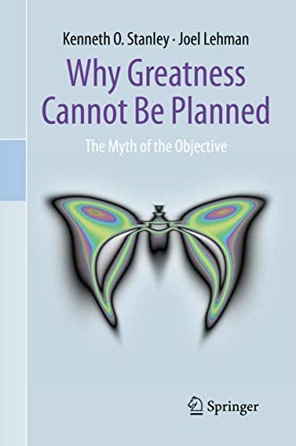

# Why greatness cannot be planned (Stanley and Lehman)

There are a lot of ways to misunderstand The Myth of the Objective. I
take it as a useful meditation, with aspects of
[The Tyranny of Metrics][] and [Against Method][], encouraging
exploration. Be flexible, be curious, don't follow a plan for the sake
of following a plan.

[The Tyranny of Metrics]: /20200425-tyranny_of_metrics_by_muller/
[Against Method]: https://en.wikipedia.org/wiki/Against_Method

I don't recall these AI researchers ever talking about local maxima or
explore/exploit trade-offs explicitly, as they seem to be trying to
write for a broad audience. Natural evolution, human innovation,
[Picbreeder][], and novelty search are their examples of unplanned
greatness. They point out that evolution is about [exploration][] as
much as adaptation, and critique the dominance in the AI community of
the experimentalist and theoretical heuristics.

[Picbreeder]: https://nbenko1.github.io/
[exploration]: https://www.pnas.org/doi/10.1073/pnas.0702207104 "The frailty of adaptive hypotheses for the origins of organismal complexity"

Is a goal local (we know how to get there) or is it "great" (requiring
steps into the unknown)? The authors are saying that if it's the
latter, we're better off exploring via other heuristics than focusing
only on a particular distant imagined goal.

They talk about "interestingness" a lot, and I think a missing note is
that "interesting" shouldn't necessarily _exclude_ a sense of what
takes us closer to some distant goal.

We should also be watching for opportunities to take things in a
different direction: if you find a path to something great on your way
to something good, you can follow that path! (Don't let the good be
the enemy of the great.)

I've sometimes been apologetic about the winding path of my life and
career, as if I should have had a plan from the start and followed it
without distraction. Would that have been better? I'm not sure. This
book makes me think that a life or career built from a kit represents
a failure to identify opportunities. What are the odds there was never
a way to improve on an earlier plan? Blinders make you faster, but
they limit where you go.

The book applies most to the "research" setting—where we really don't
know what the future is going to hold, where we don't know the
mechanics or topology of the search space. Objectives such as
"hovercraft like in Star Wars" or "economy like in Star Trek." There
are a lot of other things we'll find before we find these, and that's
not a bad thing.

---

> "The idea that all our pursuits can be distilled into neatly-defined
> objectives and then almost mechanically pursued offers a kind of
> comfort against the harsh unpredictability of life." (page 2)

---

> "... meeting a constraint is much different from what is usually
> _meant_ by objective-driven achievement." (page 34)

---

> "The best way to get computation is not to force great minds to
> waste their lives pondering a distant dream, but to let the great
> minds pursue their own interests in their present reality." (page
> 36)

This is in the example of developing computers, but the idea is one
that I feel applies especially well to [Effective Altruism][].

[Effective Altruism]: https://en.wikipedia.org/wiki/Effective_altruism

---

> "Deception applies to becoming rich just as everywhere else. For
> example, what sense would it make to decline an unpaid internship
> doing something you love simply because it doesn't make you any more
> rich? In fact, if you do become rich, it's probably because you
> _did_ pursue your passion, not because you pursued money per se.
> Passion is what drives you to that point, and then one day you might
> realize that you are only one stepping stone away from being rich.
> And _that_ is the moment, when you are one stepping stone away, when
> you make the move you need to make and become rich. But becoming
> rich didn't guide every life decision up to that point. On the
> contrary, a single-minded preoccupation with money is likely exactly
> the wrong road to abundant wealth." (page 37)

So... This works for some people. But it certainly doesn't work for
everyone.

---

> "There's much we cannot achieve by trying to achieve it." (page 38)

---

> "... being aimless isn't _always_ a good idea, but when it's paired
> with a thirst for exploration, it might indeed hint at great
> potential." (page 68)

---

On page 70, the authors mention that [DeMarco][], who I know as the
author of [Peopleware][], is also responsible for "You can't control
what you can't measure" in the earlier
[Controlling software projects][]. What a different perspective,
between these two books! The authors here focus on his much later
[Software Engineering: An Idea Whose Time Has Come and Gone?][], which
I like a lot.

[DeMarco]: https://en.wikipedia.org/wiki/Tom_DeMarco "Tom DeMarco"
[Peopleware]: /20200523-peopleware_productive_projects_and_teams/ "Peopleware: Productive Projects and Teams"
[Controlling software projects]: https://www.amazon.com/Controlling-Software-Projects-Management-Measurement/dp/0131717111
[Software Engineering: An Idea Whose Time Has Come and Gone?]: https://web.archive.org/web/20100801083400/http://www2.computer.org/cms/Computer.org/ComputingNow/homepage/2009/0709/rW_SO_Viewpoints.pdf

---

Page 71 has a bit about evaluating higher ed with the Collegiate
Learning Assessment ([CLA][]) and the Collegiate Assessment of
Academic Proficiency (CAAP).

For the CAAP, the only info I can find is on individual schools' sites
([example][]) and the [link][] to ACT redirects to a page that doesn't
mention it. Is CAAP defunct? (Are they both?)

[CLA]: https://en.wikipedia.org/wiki/Collegiate_Learning_Assessment
[example]: https://www.wabash.edu/alumni/news.cfm?news_ID=2641
[link]: http://www.act.org/caap

---

> "Splitting experts may be more of an achievement than unifying
> them." (page 82)

This is about expert review of proposals. May.

---

> "Some readers will detect a hint of Paul Feyerabend in this
> argument—he taught that science can't be distilled to any one
> objective methodology." (page 87)

[Feyerabend][]'s book on this is [Against Method][]. It's related in
the following way, I think: Feyerabend is saying we can't limit the
methods for getting to the next stepping stones. Stanley and Lehman
are saying we can't know which stepping stones will help us reach
further stepping stones. Ignoring either will limit where we can go.

[Feyerabend]: https://en.wikipedia.org/wiki/Paul_Feyerabend "Paul Feyerabend"

> "The only principle that does not inhibit progress is: anything
> goes." (page 119, quoting Feyerabend in Against Method)

---

> "The successful inventor asks where we can get from _here_ rather
> than how we can get _there_." (page 97)

I connect this to my [Is it worth doing even if it fails?][] In the
language of the book, things that are worth doing are things that can
be stepping stones: "succeed" or "fail" you learn something to build
on.

[Is it worth doing even if it fails?]: /20181204-worth_doing_even_if_it_fails/

---

> "When there's _no destination_ there _can't be a right path_." (page
> 98)

---

> "So if you're wondering how to escape the myth of the objective,
> just do things because they're interesting. Not everything needs to
> be guided by rigid objectives. If you have a strong feeling, go with
> it. If you don't have a clear objective, then you can't be wrong,
> because wherever you end up is okay. Assessment only goes so far. A
> great achievement is one that leads to more great achievements. If
> you set out to program computers but you're now making movies,
> you're probably doing something right." (page 99)

It's not just fun to have interests, it's useful. It expands the space
of stepping stones that you can build from.

It's also about motivation, isn't it? You're more likely to do more if
you're interested in doing it. And if you do more, you're more likely
to do more good things (hopefully).

If you're hiring, would you rather hire somebody with broad and active
interests? (Is this some part of "Googleyness"? Looks like that's
supposed to [include][] "enjoying fun" and "evidence that you've taken
some courageous or interesting paths in your life," which could be
related.)

[include]: https://www.businessinsider.com/google-googleyness-hiring-training-guide-change-2019-10

---

> "_To achieve our highest goals, we must be willing to abandon
> them._" (page 100)

---

> "While a new interpretation could imply that the earlier
> interpretations were _wrong_, in reality the same set of data can
> support more than one interpretation. So just being consistent with
> the data isn't enough to decide between competing interpretations."
> (page 111)

This relates to [Characteristics of good theories][], which continues
to surprise me by being one of the most popular things on my blog.

[Characteristics of good theories]: /20170825-characteristics_of_good_theories/

---

> "Seen this way, evolution is a special kind of non-objective search:
> a _minimal criteria search_." (page 114)

---

Page 126 quotes from Hooker's 1995
[Testing Heuristics: We Have It All Wrong][]: "Most experimental
studies of heuristic algorithms resemble track meets more than
scientific endeavors."

[Testing Heuristics: We Have It All Wrong]: http://akira.ruc.dk/~keld/teaching/algoritmedesign_f03/Artikler/01/Hooker95.pdf

This is a critique applicable to modern AI work, but modern AI is also
making tons of progress, often in harmony with benchmarking. New tests
are introduced, and new models come out that do them really well. How
separate are research and development, really?

I think [Marcus][] makes related arguments that this focus on
benchmarks may still prevent needed and very different work... Could
be. It's hard to argue with the success of the benchmark-oriented work
though. I guess the real message isn't "stop that" but "let's also."

[Marcus]: https://en.wikipedia.org/wiki/Gary_Marcus "Gary Marcus"

> "Judging by performance is a good idea for practitioners but is
> shaky at best for researchers—because of deception." (page 129)

---

> "_A good algorithm isn't one that performs better, but one that
> leads us to think of other algorithms._" (page 132)
