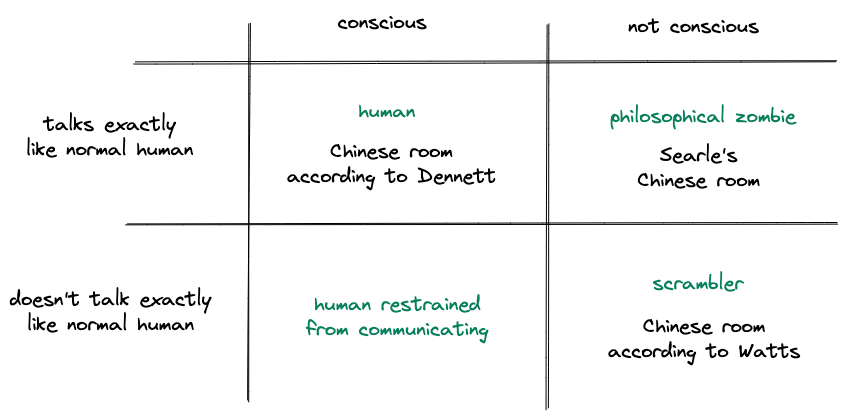
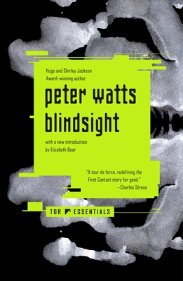

# Blindsight, by Watts

Thanks to an [invite][], I finally read [Blindsight][], by Peter
Watts. It's good. The central what-if is about whether consciousness
is necessary (or even helpful) for intelligent behavior.

[invite]: https://www.meetup.com/machine-learning-paper-club/events/289756240/ "Meetup: AIBC: Happy New Year Book Club!"
[Blindsight]: https://en.wikipedia.org/wiki/Blindsight_(Watts_novel) "Wikipedia: Blindsight (Watts novel)"

In this diagram, every quadrant exhibits intelligent behavior:

I think Watts uses the term [Chinese Room][] to mean something
different from what [Searle][] (and even [Dennett][]) mean. Searle's
Chinese Room is a kind of [philosophical zombie][], with linguistic
behavior indistinguishable from that of a conscious human, but no
consciousness. Dennett [says][] the Chinese Room _is_ conscious, which
is the kind of nonsense that will get you [fired from Google][].
Watt's aliens ("scramblers" and related systems) are empirically
distinguishable from humans in their use of language, and he says
they're a Chinese Room example because of this. That's a different
meaning for the term.

[Chinese Room]: https://en.wikipedia.org/wiki/Chinese_room "Wikipedia: Chinese room"
[Searle]: https://en.wikipedia.org/wiki/John_Searle "Wikipedia: John Searle"
[Dennett]: https://en.wikipedia.org/wiki/Daniel_Dennett "Wikipedia: Daniel Dennett"
[philosophical zombie]: https://en.wikipedia.org/wiki/Philosophical_zombie "Wikipedia: Philosophical zombie"
[says]: https://planspace.org/20220918-consciousness_explained_by_dennett/ "Consciousness Explained, by Dennett"
[fired from Google]: https://www.washingtonpost.com/technology/2022/07/22/google-ai-lamda-blake-lemoine-fired/ "Washington Post: Google fired engineer who said its AI was sentient"

We usually imagine intelligent aliens as being conscious, like humans,
and Watts's idea is to imagine aliens that are intelligent but not
conscious, like evolved computers, in the same category where I would
put all AI. Could this happen?

If nothing else, the book invites thought on how we view
consciousness. We generally accept that other humans are conscious,
not philosophical zombies. If we met an intelligent alien, would we so
easily assume its consciousness? Would this be important to how we
interact with it? How do we think of animal consciousness and what
this means ethically? Is it possible for AI to be conscious?

Definitely interesting enough that I'll read [Echopraxia][] too.

[Echopraxia]: https://en.wikipedia.org/wiki/Echopraxia_(novel) "Wikipedia: Echopraxia (novel)"

> "After four thousand years we can’t even prove that reality exists
> beyond the mind of the first-person dreamer." (page 52)
