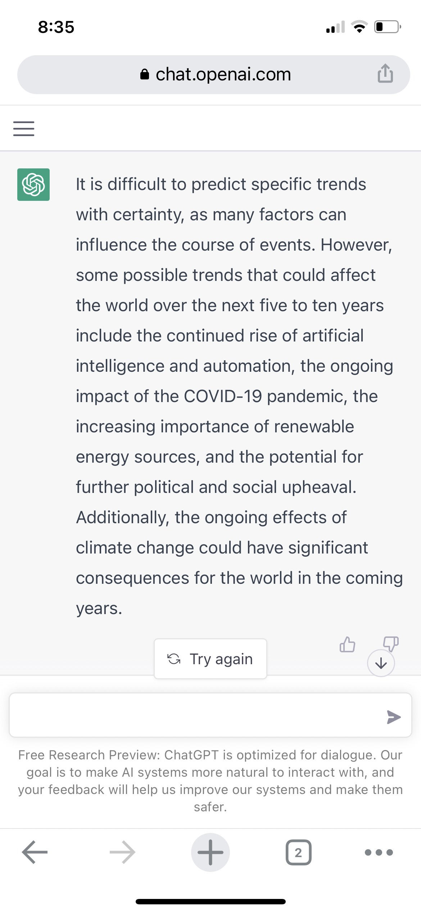

# Predicting the future from 2023

I've tried to predict the future the last three years: [2020][],
[2021][], [2022][]. I think that's probably enough for now. Here are
some 2023 [predictions from Vox][], if you want.

[2020]: /20200112-predicting_the_future_from_2020/ "Predicting the future from 2020"
[2021]: /20210102-predicting_the_future_from_2021/ "Predicting the future from 2021"
[2022]: /20220101-predicting_the_future_from_2022/) "Predicting the future from 2022"
[predictions from Vox]: https://www.vox.com/future-perfect/2023/1/2/23494204/biden-trump-putin-supreme-court-2023-predictions "23 things we think will happen in 2023"

If you make new predictions every year, you end up with a lot of them.
I managed to have at least one set of _conflicting_ predictions in
just three years.

The big trends don't change that much year to year, and I've already
thought about those some. Many of them are clear enough that even a
large language model knows them.

> What are important trends for the next five to ten years?

> "It is difficult to predict specific trends with certainty, as many
> factors can influence the course of events. However, some possible
> trends that could affect the world over the next five to ten years
> include the continued rise of artificial intelligence and
> automation, the ongoing impact of the COVID-19 pandemic, the
> increasing importance of renewable energy sources, and the potential
> for further political and social upheaval. Additionally, the ongoing
> effects of climate change could have significant consequences for
> the world in the coming years." ([ChatGPT][])

[ChatGPT]: https://openai.com/blog/chatgpt/ "ChatGPT: Optimizing Language Models for Dialogue"

This year there is a swing toward economic recession... Will it end?
Almost certainly yes, but it's a little scary.
