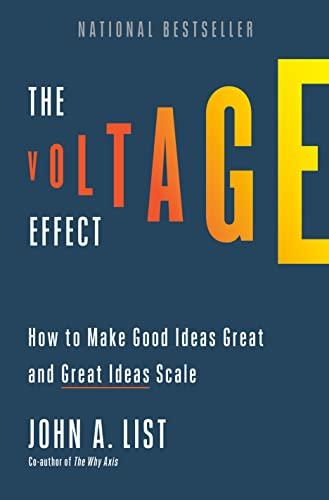

# The Voltage Effect, by List

The subtitle is "How to make good ideas great and great ideas scale,"
but a lot of it is about how to avoid bad ideas. The "Five Vital
Signs" are really five kinds of problems:

1. Reliability: Thinking a test is promising when it's not: "Dupers
   and false positives"
2. Validity of a test sample: "Know your audience" or "overestimating
   how big a slice of the pie your idea can capture" or
   "representativeness of population"
3. Scalability of the treatment: "situational validity" or "unscalable
   ingredients" and "program drift" and "noncompliance"
4. Unintended consequences: "Spillovers"
5. Just too expensive: "The cost trap"

Problems 4 and 5 could be special cases of 3.

Then there are four chapters that have some more positive
recommendations:

1. "using behavioral-economic incentives"
2. "exploiting easily missed opportunities on the margins of your operation"
3. "knowing when to quit in the short term in order to win in the long term"
4. "culture that is sustainable at scale"

It's a pop economics book. Marginal revolution, comparative advantage,
anecdotes from academia and Uber and Lyft and government. It's not
awful, but I didn't feel like it delivered quite what it promised.

---

> "Through my research and time working with policymakers, my personal
> credo had become that the only ideas worth pursuing are the ones
> with the potential to make a significant impact on human lives."
> (page 6)

---

> "... the one thing all great ideas have in common is that they are
> not guaranteed to succeed. ... the path from early promise to
> widespread impact requires one thing and one thing only:
> _scalability_—the capacity to grow and expand in a robust and
> sustainable way." (page 9)

Is this a contradiction? Great ideas may or may not be scalable? But
wouldn't a good idea be better if it was scalable?

Bad scalable ideas seem clearly allowed.

---

> "(a charity will attract more donations in the short run _and_ long
> run if they attract initial donors by promising to never bother them
> again rather than with the traditional strategy of constant
> follow-ups)" (page 10)

The reference is [Once and Done][] and I wonder whether it's been
replicated. The effect they find is strong, but their experiment is
with Smile Train, whose mailers include prominent photos of children
with cleft palates. The authors offered mechanism includes that "a
solicitation by a charity imposes a cost on the recipient," and in the
case of Smile Train that cost may be particularly high and not due
only to social pressure.

[Once and Done]: https://spihub.org/site/resource_files/publications/spi_wp_025_list.pdf "Once and Done: Leveraging Behavioral Economicsto Increase Charitable Contributions"

---

> "The book calls upon policy-makers to move their attention from
> evidence-based policy to policy-based evidence." (page 15)

List seems to want to make this his catch-phrase. It's repeated on (at
least) pages 15, 63, 87, and 233. I don't think it works as a slogan
because, for one, it isn't terribly clear. I _think_ he's advocating
for program evaluation?

---

> "[conjoint analysis][]" (page 53)

[conjoint analysis]: https://en.wikipedia.org/wiki/Conjoint_analysis

---

> "Logan believed that the extra perks combined with the 15% discount
> on rides (rather than the 7.5 percent discount we'd initially
> calculated) would motivate more JoGoods to join." (page 53)

This seems like an interesting story of data vs. executive
decision-making, but List doesn't elaborate further.

---

> "[backward induction][]" (page 87)

[backward induction]: https://en.wikipedia.org/wiki/Backward_induction

---

> "The spillover effect falls under a larger umbrella category
> popularly known as the law of unintended consequences." (page 91)

---

> "Based on my experience with the baseball fundraising, one would
> expect that making salaries transparent could drive resentful
> demoralization if people saw peers making more. But that is not the
> full story." (page 99)

He found that when he randomly paid some people less (for an identical
job) and they found out by talking to others, those paid less worked
less hard.

The more to the story he references is a study where when people
learned their managers made more than they thought, they worked
harder.
