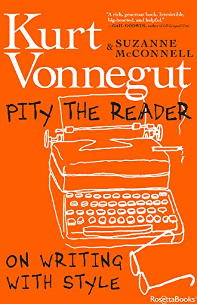

# Pity the Reader, by McConnell

Vonnegut is the headline, and there are a lot of quotes, but it's
McConnell's book: elegy, eulogy, paean. I was down on the man a little
after I read about his affair in a biography years ago, but this
reminded me of his quality.

Vonnegut was an activist author, which I think is good. He was also an
entertainer and technician. Too much writing might as well come from
ChatGPT: predictable word after word. "Don’t be predictable. End your
sentences with something unexpected. Keep me awake." (page 195) A good
sentence delights you with pleasant thrills like a fresh ski run. On
writing with style: keep the entropy low.

In the following quotes, I make no attempt to clarify whether they
come from Vonnegut or McConnell or a character etc.

> "fiction is melody, and journalism, new or old, is noise." (page 44)

> "Vonnegut earned no degree in anthropology." (page 52)

> "Commitment invites Fate to be your Fairy Godmother Collaborator, to
> close and open just the doors you need." (page 76)

> "I once read an interview with John Barth and Kurt Vonnegut and
> others in which Vonnegut stated that the reason all writers write,
> of course, is that they want to change the world. Whereupon Barth
> objected. No, he said. That wasn’t why he wrote. As I recall, Barth
> said, in effect, that he just liked to horse around with words."
> (page 84)

> "Our awareness is all that is alive and maybe sacred in any of us."
> (page 93)

> "Writing is a generosity, even to yourself." (page 94)

> "Vonnegut considered Galápagos his best book, by the way. Because
> his canary-in-the-coal-mine is on urgent tweet." (page 119)

> "Writers who are swoopers, it seems to me, find it wonderful that
> people are funny or tragic or whatever, worth reporting, without
> wondering why or how people are alive in the first place. Bashers,
> while ostensibly making sentence after sentence as efficient as
> possible, may actually be breaking down seeming doors and fences,
> cutting their ways through seeming barbed-wire entanglements, under
> fire and in an atmosphere of mustard gas, in search of answers to
> these eternal questions: “What in heck should we be doing? What in
> heck is really going on?”" (page 171)

> "The young man did not appear to be listening to his own radio. He
> may not even have understood English. The newscaster spoke with a
> barking sort of hilarity, as though life were a comical
> steeplechase, with unconventional steeds and hazards and vehicles
> involved. He made me feel that even I was a contestant—in a bathtub
> drawn by three aardvarks, perhaps. I had as good a chance as anybody
> to win." (page 176)

> "You have to play by the rules of the game of fiction well enough so
> that you can get across what is in the rag-and-bone shop of your
> heart. You have to be like a magician or pickpocket, distracting the
> audience by entertaining, while you are really saying those things
> you most want to say." (page 189)

> "I don’t praise plots as accurate representations of life, but as
> ways to keep readers reading." (page 202)

> "“The thing Kurt seemed to want most in a story,” his student Ronni
> Sandroff recalls, “was to be surprised. He once challenged us to
> pause before we turned to the next page in a book and try to guess
> how the sentence we were in the middle of would end. “You’ll almost
> always get it right,” he said." (page 212)

> "He warned against tiresomeness. He urged originality, freshness."
> (page 212)

> "Nothing in real life ends. “Millicent at last understands.” Nobody
> ever understands." (page 215)

> "it strikes me as gruesome and comical that in our culture we have
> an expectation that a man can always solve his problems. There is
> that implication that if you just have a little more energy, a
> little more fight, the problem can always be solved. This is so
> untrue that it makes me want to cry—or laugh." (page 270)

> "“Since I took up carpentry,” Mark the pediatrician avows, “I
> measure children much more carefully, sometimes to 1/32 of an
> inch.”" (page 351)
