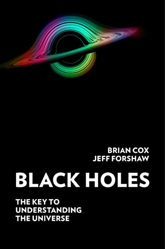

# Black Holes, by Cox and Forshaw

When I was in elementary school, I found a book about black holes in
the school library. It was wonderful, and it covered approximately the
first chapter of this year's very British [book][] from Cox and
Forshaw. I don't recall [Physics 247][] (2001) having much more than
that either. It's good to see that science has continued!

[book]: https://www.harpercollins.com/products/black-holes-brian-coxjeff-forshaw
[Physics 247]: https://guide.wisc.edu/courses/physics/

Hearing about black holes feels like exploring weird edge case
trade-offs in the design of the universe. Quantum mechanics gets
involved, multiplying the disregard for everyday experience. The
[spacetime interval][] and [Penrose diagrams][] increase clarity, and
the Principle of Maximal Ageing is nice. But then we also get
[Black hole complementarity][] (you both fall across the event horizon
_and_ get burned up at the event horizon) and
[the holographic principle][] and [ER = EPR][]. Wild! Keep it up,
science!

[spacetime interval]: https://en.wikipedia.org/wiki/Spacetime#Spacetime_interval
[Penrose diagrams]: https://en.wikipedia.org/wiki/Penrose_diagram
[Black hole complementarity]: https://en.wikipedia.org/wiki/Black_hole_complementarity
[ER = EPR]: https://en.wikipedia.org/wiki/ER_%3D_EPR
[the holographic principle]: https://en.wikipedia.org/wiki/Holographic_principle

The subtitle is "The key to understanding the universe." It's a
compelling hook, and extremes do highlight interesting questions, but
the authors eventually admit that explaining natural phenomena is also
meaningfully distinct from some kinds of understanding, and they
"leave questions of ultimate truth to others" (page 237).

---

> A singularity, a moment rather than a place when our knowledge of
> the laws of Nature breaks down. According to general relativity, the
> singularity lies at the end of time. There is also a singularity in
> our past, which marks the beginning of time: the Big Bang. (page 2)

---

> Georges Lemaître, a Catholic priest and one of the founders of
> modern cosmology, described the Big Bang singularity at the origin
> of our Universe as a day without a yesterday. A singularity formed
> by gravitational collapse is a moment with no tomorrow. (page 5)

---

> Sir Roger Penrose’s Nobel Prize-winning [paper][] ‘Gravitational
> Collapse and Space-Time Singularities’, a three-page tour-de-force
> in which Penrose proves that, in Wheeler’s words, ‘for just about
> any description of matter that anyone has imagined, a singularity
> must sit at the centre of a black hole’. (page 16)

[paper]: https://journals.aps.org/prl/pdf/10.1103/PhysRevLett.14.57

---

> in science, unlike modern-day politics, principles matter. (page 18)

Thought this was funny, but also true?

---

> Space and time may be emergent entities that do not exist in the
> deepest description of Nature. Instead, they are synthesised out of
> entangled quantum bits of information in a way that resembles a
> cleverly constructed computer code. If the Universe is designed, it
> seems, the designer is a programmer. (page 20)

I feel like they never really came back to this and really pay it off
completely, later in the book...

---

> The Large Hadron Collider at CERN is the world’s most powerful
> particle accelerator. The giant machine’s job is to make protons
> travel around its underground tunnel at 99.999999 per cent the speed
> of light, before smashing them together. The purpose is to explore
> the structure of matter and the forces of Nature that animate our
> world. The LHC is 27 kilometres in circumference from the point of
> view of someone standing on the ground in Geneva, marvelling at this
> great engineering achievement. From the point of view of the protons
> orbiting around the ring, the circumference is 4 metres. (page 25)

---

> That night down the pub. (page 30)

Is this British grammar? Can I be "down the" other things? "That day
down the library"?

---

> An entirely reasonable first response to that last paragraph is to
> ask what on earth are we talking about. (page 41)

Yes indeed.

---

> The point is that, in relativity theory, it is very important to say
> exactly how time differences are being determined. Seeing things
> (with instruments like eyes) can be very different from measuring
> the passage of time using a network of clocks and rulers. The effect
> we just discussed is known as the relativistic Doppler effect and it
> is sensitive to the location of the light detector (i.e. where the
> eyes are). (page 61)

---

> From the perspective of someone in freefall across the shell at the
> Schwarzschild radius the Equivalence Principle informs us that
> nothing untoward happens. (page 89)

---

> for a typical stellar mass black hole you’d be spaghettified before
> you even reached the horizon. (page 103)

But not a really big black hole! Then you get spaghettified well after
crossing the horizon.

---

> In particular, the idea that microscopic wormholes could be part of
> the structure of spacetime is part of the ER = EPR hypothesis we’ll
> meet in the final chapters. (page 130)

---

> Both the maximally extended Schwarzschild and Kerr solutions are
> vacuum solutions to Einstein’s equations–eternal black holes–and as
> far as we know, no such black holes exist. (page 141)

---

> Nature is not obliged to make physicists’ lives easier. (page 144)

---

> [Noether][] discovered that the law of conservation of energy is a
> direct consequence of time translational invariance, which when the
> jargon is stripped away means that the result of an experiment does
> not depend on what day of the week it is performed (all other things
> being equal). Likewise, the law of momentum conservation is a
> consequence of translational invariance in space, which means the
> result does not depend on where the experiment is performed (all
> other things being equal). (page 146)

[Noether]: https://en.wikipedia.org/wiki/Emmy_Noether "Emmy Noether"

---

> David L. Goodstein begins his textbook States of Matter with the
> following paragraph: ‘Ludwig Boltzmann, who spent much of his life
> studying statistical mechanics, died in 1906, by his own hand. Paul
> Ehrenfest, carrying on the work, died similarly in 1933. Now it is
> our turn to study Statistical Mechanics.’ (page 172)

Now here is writing that takes bold risks!

---

> The remainder of the book is about the quest to understand the deep
> origins of black hole thermodynamics; a quest that is edging us ever
> closer to a new theory of space and time. (page 187)

---

> Hawking’s discovery that black holes emit particles is of profound
> importance, not least because it suggests that the origin of the law
> of gravity is statistical. (page 190)

---

> It is now understood that vacuum fluctuations cause the electrons
> [in fluorescent lights] to fall back down to the lower energy levels
> inside the atom. They ‘tickle’ the atom and trigger the emission of
> light. (page 194)

---

> There is one logical possibility that could explain the results
> without resorting to quantum theory: every event in the Universe is
> predetermined, freewill does not exist and the results were baked in
> at the beginning of time. Putting that aside, we are left with
> quantum mechanics. (page 215)

[Superdeterminism](https://en.wikipedia.org/wiki/Superdeterminism)!

---

> the remarkable [Reeh–Schlieder theorem][], which states that it is
> possible to operate on some small region of the vacuum in such a way
> that anything can be created anywhere in the Universe. This
> phenomenal conjuring trick is theoretically possible because the
> vacuum is inexorably entangled. The outlandish nature of the theorem
> is diminished ever-so-slightly by the fact that the local operation
> required is not something that we could ever perform, which is a
> shame. (page 218)

[Reeh–Schlieder theorem]: https://en.wikipedia.org/wiki/Reeh%E2%80%93Schlieder_theorem

---

> From the perspective of someone freely falling through the horizon,
> they feel nothing and are oblivious to this magical encoding.
> Moreover, their fate is to be both spaghettified in the singularity
> (from their own perspective) and burnt up on the horizon (from an
> outsider’s perspective). But that is no problem for the laws of
> Nature because no observer can be present at both events. This is
> the essence of the black hole complementarity resolution to the
> black hole information paradox. Is it nonsense? (page 226)

---

> The inside of a black hole, in other words, is somehow ‘the same’ as
> the outside. This idea has become known as the holographic
> principle. (page 227)

---

> Gravity thus emerges as a result of the quantum mechanics of a
> system on the boundary. (page 237)

---

> We might ask which of these two descriptions is the real one. Is
> there really a black hole or is it just a hologram of the boundary
> physics? Or maybe the opposite is true, and the boundary physics is
> not real and is just a clever way to describe the black hole. Maybe
> trying to figure out what is ‘really’ true is to fall into a trap
> that has long plagued physicists because it leads to navel gazing
> without revealing deeper insight. There are plenty of people in the
> world who can perform that function, and too few physicists, so
> perhaps we should restrict ourselves to explaining natural phenomena
> and leave questions of ultimate truth to others. Rather, the
> holographic principle can be viewed as a realisation of
> complementarity. There are two equivalent descriptions of the world,
> and because they are equivalent there will be no contradictions:
> What is true in one will be true in the other. This is the power of
> the holographic principle, and Maldacena discovered a precise,
> mathematical realisation of it. (page 237)

---

> The wormhole appears when we allow the two quantum theories to
> become entangled. In other words, entanglement builds the wormhole
> connecting the two universes together: quantum entanglement and
> wormholes go hand in hand. This is a profoundly important connection
> between quantum theory and gravity. (page 240)
