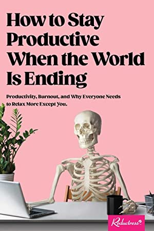

# How to stay productive when the world is ending

In the conclusion (“Congrats, you completed a book!”) the authors
clarify that [this][] is “a satirical book of essays about how the
double-bind of our need to work in order to have safety, security, and
predictability is making us powerless in an increasingly unsafe,
insecure, and unpredictable world.” They thank the Nap Bishop,
[Tricia Hersey][].

[this]: https://shop.reductress.com/products/how-to-stay-productive-when-the-world-is-ending
[Tricia Hersey]: https://en.wikipedia.org/wiki/Tricia_Hersey

The cover is a pretty good indication of the contents, especially if
you notice it's from [Reductress][], which is a sort of like a feminist
[Onion][] satirizing women's magazines.

[Reductress]: https://reductress.com/
[Onion]: https://en.wikipedia.org/wiki/The_Onion

An illustrative piece is titled “What is emotional labor?” and
includes this example:

> When you have to ask for your salad dressing “light, medium, or
> heavy” even though you know these are subjective terms, and no
> answer guarantees you will receive your desired amount of salad
> dressing

This kind of poking fun at privilege is easy to laugh along with. The
whole book is in turns funny and depressing, as they spend time with
more serious challenges as well. The satire sneaks in as a coffee
table book, and leaves the reader to fix modern capitalism.

