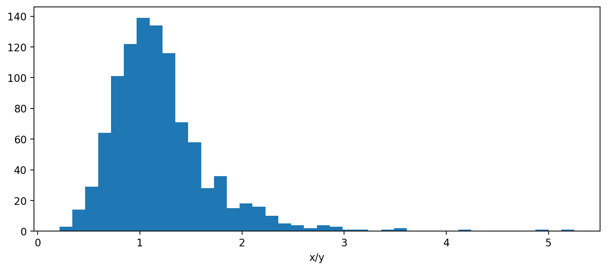

# Fieller intervals in Python

[Fieller's theorem][] provides a way to get a confidence interval for
a ratio, which is hard in general. An alternative is to
[use the delta method][] to estimate the variance of the ratio and use
that, but should your estimate of the ratio really be the middle of
the interval?

[Fieller's theorem]: https://en.wikipedia.org/wiki/Fieller%27s_theorem
[use the delta method]: /20211230-getting_var_ratio_can_be_hard/ "Getting var(X/Y) can be hard"


```python
import scipy.stats

def fieller_interval(mean_x, var_x, mean_y, var_y, alpha=0.05):
   """Confidence interval for X/Y; see arxiv.org/pdf/0710.2024.pdf"""
   z = scipy.stats.norm().ppf(1 - alpha / 2)
   t = z  # Uses z instead of t (assumes large n)
   divisor = mean_y**2 - (t**2 * var_y)
   center = (mean_y * mean_x) / divisor
   spread = (((mean_y * mean_x)**2 -
              ((mean_y**2 - (t**2 * var_y)) *
               (mean_x**2 - (t**2 * var_x))) )**0.5 /
             divisor)
   return center - spread, center + spread
```


Fieller's method uses its own center, which makes sense because the
distribution of a ratio is skewed in general.


```python
x = scipy.stats.norm(loc=110, scale=25).rvs(size=1000, random_state=110)
y = scipy.stats.norm(loc=100, scale=25).rvs(size=1000, random_state=100)
```

<!--
import matplotlib.pyplot as plt

plt.figure(figsize=(10, 4))
plt.hist(x/y, bins=40)
plt.xlabel('x/y')
plt.show()
-->




The estimate `x.mean() / y.mean()` is 1.1, which is good, but the
Fieller center is 1.5, which is a better center for the interval
because of the skewness. You can check that about the right fraction
of values are in the tails. ([Jupyter notebook][])

[Jupyter notebook]: https://github.com/ajschumacher/ajschumacher.github.io/blob/master/20230603-fieller_intervals_in_python/fieller.ipynb


(Be sure to use the variances you care about—more likely to be
variances of sample means in practice.)
