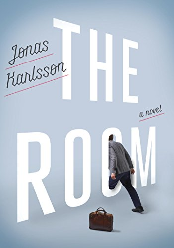

# The Room, by Karlsson

Karlsson's [Room][] is set in a kind of office, but more than that
it's a novel (almost a long parable) about epistemology, how people
believe in conspiracy theories, and the tragedy of modern retreats
from reality. By early reviews, the [film version][] isn't as good.

[Room]: https://www.penguinrandomhouse.com/books/235739/the-room-by-jonas-karlsson/ "The Room: A Novel, by Jonas Karlsson"
[film version]: https://en.wikipedia.org/wiki/Corner_Office_(film) "Corner Office (film)"

The narrator, Björn, seems to have (at least) an autism spectrum
disorder that brings to mind
[The Curious Incident of the Dog in the Night-Time][]. He also has
tons of self-importance, zero self-awareness, and a disdain for women
that all make him seem like an easy Proud Boys recruit. He describes
himself as working at an office for a non-corporate Authority but it's
easy to wonder whether it isn't really a care facility for people with
psychological difficulties. (And aren't we all limited in our ability
to know truth?)

[The Curious Incident of the Dog in the Night-Time]: https://en.wikipedia.org/wiki/The_Curious_Incident_of_the_Dog_in_the_Night-Time

Björn believes in, and apparently experiences, a room that none of his
colleagues at the office can see. When Björn finds that by measurement
there couldn't be a room where he thinks there is one, he concludes
that some trick must be at work as part of a conspiracy amongst the
office. A medical professional confesses to thinking that Björn is
just pretending to believe in the room—and who hasn't thought
similarly of flat-earthers?

After a confrontation at work and a tearful breakdown at home, Björn
changes. He describes himself having success at work. Is this real, or
has he inhabited his fantasies from earlier? Is he somehow really
successful, and the point is that people with strange views can
contribute to society? I lean toward the interpretation that the
narrator has become even less reliable.

As Björn becomes less and less connected with reality, his false sense
of power grows and he demands more and more, until he collides with
some aspects of office reality that he can't reinterpret. His
persecution complex runs wild and he eventually disappears completely
into his alternate reality. His isolation, once partial, is total.

---

> Someone had made a snowman in the courtyard below my window, but it
> wasn’t very good at all. (page 48)

He doesn't understand context, doesn't think there's any purpose or
measure other than his own.

---

> Stupid people don’t always know that they’re stupid. They might be
> aware that something is wrong, they might notice that things don’t
> usually turn out the way they imagined, but very few of them think
> it’s because of them. That they’re the root of their own problems,
> so to speak. And that sort of thing can be very difficult to
> explain. (page 49)

Irony via anosognosia.

---

> I tried to remember when I had last slept.

Almost a Tyler Durden vibe?

---

> “Since the time we agreed to have you working here, things have
> evidently changed dramatically. I still thought you might be able to
> cope with the relatively simple tasks you were given. Sorting,
> archiving, et cetera. We knew you were a complex character, but no
> one mentioned anything about you being delusional.” (page 88, Karl
> the manager speaking)

---

> “Jan,” he said. “Thanks, I noticed,” I said, pointing at the name
> tag. (page 91)

This is one of at least two times that Björn is oblivious of his turn
to introduce himself.

---

> “I’d say that you’re putting it on.” (page 98)

This is the frustrated final comment from the medical assessor who
decides Björn doesn't need anything from a psychiatrist.

---

> “I think you maximize your potential better if you imagine a
> customer at the other end.” (page 112)

Björn is thinking of himself as a business, focused on performance and
success in terms of exchange. This may be partly his autistic bent,
but also partly a critique of some modern attitudes toward work and
success. “You are a brand” etc.

---

> “How’s anyone supposed to know if he’s there or not? This way we can
> never be sure.” (page 118)

This is someone asking how they can tell, if Björn is acting as if
he's believing in the room, they can tell whether he's actually
believing in the room or just acting that way.

---

> On the way home I felt I was being watched by a whole load of
> people. I thought everyone was looking at me. I had to stand at the
> front of the aisle on the bus because all the seats were taken, so
> anyone who felt like it could stare at me as much as they wanted. A
> small child with a pacifier in her mouth stared me right in the eyes
> for ages. In the end I couldn’t help saying: “Do we know each
> other?” I got no answer. The little girl just went on sucking the
> pacifier. Her mother gave me a disapproving stare. (page 119)

---

> On the radio, an actor was reading a novella he’d written himself.
> The story included a number, sixty-nine. The actor was claiming that
> it became ninety-six if you turned it round, which is obviously a
> total lie, and I suddenly felt how lonely it is, constantly finding
> yourself the only person who can see the truth in this gullible
> world. (page 120)

---

> “Perhaps we could agree on the formulation ‘the room does not exist
> for everyone’?” (page 168)

> “Either there is a room there, or there isn’t,” Ann said. “It’s not
> quite that simple,” Karl said. (page 169)

> “Can’t we say that the room exists a little bit?” (page 171)

Some fun epistemology talk... I can't help but wonder whether Karl
(the manager) is supposed to bring to mind Karl Popper.

---

> “In some ways it’s such a grandiose and detailed project,” I went
> on, “and so ingeniously malicious that I can’t help being rather
> fascinated.” (page 174)

Björn is referring to the conspiracy of everyone else pretending there
isn't a room.

---

> “The DG says that on this, the fourth floor, between the lift and
> the three toilets… there is absolutely no other space.” (page 180)

That's Karl the manager speaking, and the DG is the Director General,
who is at least the local "authority" of The Authority.

---

> This was really just a classic ruling-class tactic, wasn’t it?
> Making someone think they were mentally ill? (page 184)

Björn continues to think everybody's gaslighting him.

---

> I closed my eyes, took a deep breath, and walked into the wall. The
> wall closed around me, like yogurt around a spoon. (page 185)

This is right at the end; Björn's final hiding place, free from the
complexity of other people and the rest of the real world, "No angles
or corners for dirt to get into and hide." His retreat from reality is
complete.
