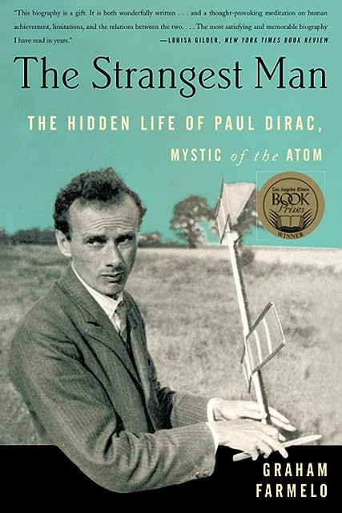

# The Strangest Man, by Farmelo

I think I like this Graham Farmelo, and I like his book about Dirac.
Farmelo is interested in connections between mathematics and physics,
and aesthetics in both. I think I'll read some of his other books too.

---

> [Charlie] Broad was a wonderfully idiosyncratic lecturer. He always
> appeared with a carefully prepared script, and he read every
> sentence twice, except for the jokes, which he delivered three
> times. (page 39)

---

> In the space-time of the special theory of relativity, things are
> different: the square of the distance between two points in
> space-time is equal to the sum of the squares of the spatial lengths
> _minus_ the square of the time. (page 42)

Is it fair to say that a [spacetime interval][] _is_ “the square of
the distance between two points in space-time”? Maybe?

[spacetime interval]: https://en.wikipedia.org/wiki/Spacetime#Spacetime_interval

---

> _A System of Logic,_ published in 1843, is a plain-spoken if
> laborious account of how empiricism can shape every aspect of human
> life. The book features Mill's agenda for science, which assumes
> that there is an underlying ‘uniformity of nature’. The aim of
> scientists should be to explain more and more observations in terms
> of fewer and fewer laws, every one of them grounded in experience
> and induced from it. (page 43)

[Mill's Methods][]!

[Mill's Methods]: https://en.wikipedia.org/wiki/Mill%27s_Methods

---

> All his life, Dirac had the same attitude to the written word as his
> contemporary George Orwell: ‘Good prose is like a window pane.’
> (page 75)

---

> Dirac knew that it was impossible to deduce the equation from first
> principles and that he would find it only through a happy guess.
> (page 141)

See also Polya on guessing...

---

> ‘Don't despise philosophers too much,’ she had counselled him after
> one of his visits, ‘a great deal that they say may be useless, but
> they are after something which matters.’ Mrs Whitehead had been on
> the receiving end of one of Dirac's tirades against the only
> academic discipline he openly disdained. One of his _bêtes noire_
> was teh internationally admired Trinity College philosopher Ludwig
> Wittgenstein, regarded by many as one of the cleverest academics in
> Cambridge. Several decades later, Dirac remarked that he was an
> ‘Awful fellow. Never stopped talking.’ (page 220)

---

> When Dirac focuses on the transcience of life, he is driven to an
> important moral conclusion: ‘A termination of one's life is
> necessary in the scheme of things <u>to provide a logical reason for
> unselfishness</u>. [...] The fact that there is an end to one's life
> compels one to take an interest in things that will continue to live
> after one is dead.’ (page 221)

I think one could argue exactly the opposite...

---

> In my case this article of faith is that the human race will
> continue to live for ever and will develop and progress <u>without
> limit</u>. This is an assumption that I must make for my peace of
> mind. Living is worthwhile if one can contribute in some small way
> to the endless chain of progress. (quoting Dirac, page 221)

See also: [The Beginning of Infinity][]

[The Beginning of Infinity]: /20220410-beginning_of_infinity_by_deutsch/

---

> Anderson later remarked that any experimenter who took the theory
> [Dirac's hole theory] at face value and who was working in a
> well-equipped laboratory ‘could have discovered the positron in a
> single afternoon’ using radioactive soures. (page 225)

This kind of thing is fascinating... What's still out there, that
could be seen in an afternoon, if we knew what to look for?

---

> He [Dirac] rarely spoke about science but did once exchange a few
> words with her about mathematics: she thought it was a human
> invention, while Dirac maintained that it had ‘always existed’ and
> had been ‘discovered’ by humans. (page 251)

---

> She [Manci] would probably not have welcomed Dirac's view that his
> religion was simply that ‘the world has to improve’. (page 257)

---

> For the physicists who were interested, a treat was in store:
> [at the 1945-12-06 lecture] they heard Dirac coin two of the
> best-known technical terms that he introduced: ‘fermions’, quantum
> particles that obey the laws that he and Fermi had set out in 1926,
> and ‘bosons’, the other type of quantum particles, which obey laws
> set out by Einstein and the Indian theoretician Stayendra Bose.
> (page 331)

---

> Dirac made the theme of his 1980 lecture ‘The Engineer and the
> Physicist’: ‘The main problem of the engineer is to decide which
> approximations to make.’ Good engineers make wise choices, often
> based on physical intuition, about the mathematical terms they can
> ignore in their equations: ‘The terms neglected must be small and
> their neglect must not have a big influence on the result. He must
> not neglect terms that are not small.’ (page 337)

---

> He brought the same attention to detail to Dostoevsky's _Crime and
> Punishment,_ which he thought was ‘nice’, though he pointed out that
> ‘In one of the chapters the author makes a mistake: he describes the
> sun as rising twice on the same day.’ (page 339)

Is there such a mistake???

---

> Bertrand Russell's fictional don, Professor Driuzdustades (page 347)

Russell has fiction!

---

> When you ask what are electrons and protons I ought to answer that
> this question is not a profitable one to ask and does not really
> have a meaning. The important thing about electrons and protons is
> not what they are but how they behave — how they move. I can
> describe the situation by comparing it to the game of chess. In
> chess, we have various chessmen, kings, knights, pawns and so on. If
> you ask what a chessman is, the answer would be [that] it is a piece
> of wood, or a piece of ivory, or perhaps just a sign written on
> paper, [or anything whatever]. It does not matter. Each chessman has
> a characteristic way of moving and this is all that matters about
> it. The whole game of chess follows from this way of moving the
> various chessmen [...] (page 354, quoting Dirac)

---

> PHYSICAL LAWS SHOULD HAVE MATHEMATICAL BEAUTY. (page 359, quoting
> Dirac's blackboard writing)
