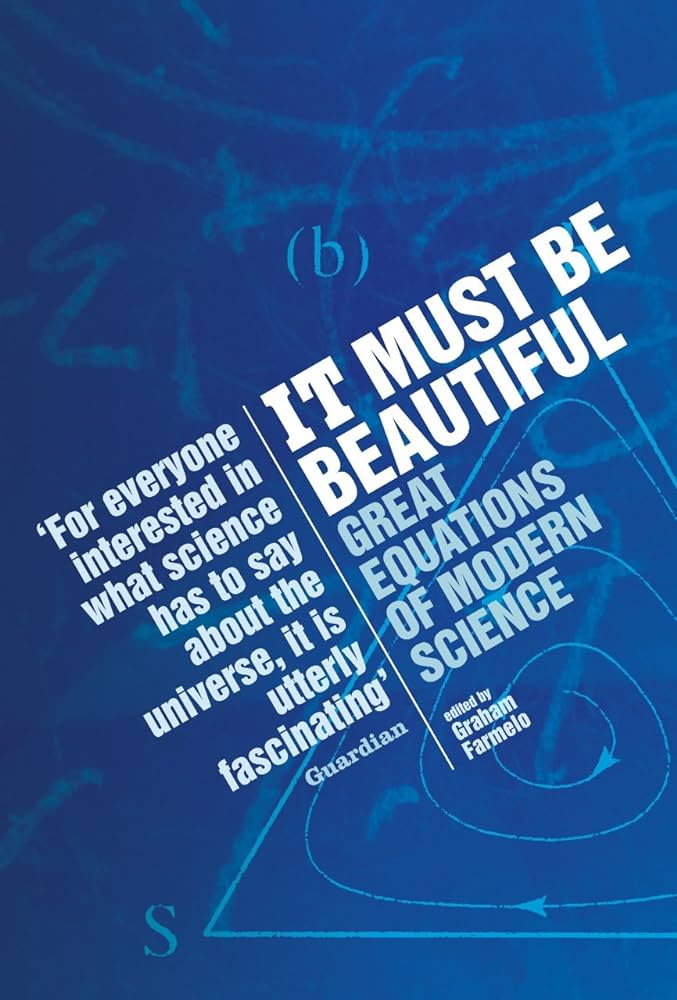

# It must be beautiful, edited by Farmelo

This is a nice collection of essays about some beautiful equations,
edited by the author of [a biography of Dirac][]. Not every equation
is fully explained, but there's great history and big-picture
explanation. The authors are frequently major contributors to the
fields.

[a biography of Dirac]: /20230816-strangest_man_by_farmelo/ "The Strangest Man, by Farmelo"

1. The Planck-Einstein Equation for the Energy of a Quantum: \\( E = hf\\)
2. The Logistic Map: \\( x_{next} = a x_{initial} (1 - x_{initial}) \\)
3. The Drake Equation: \\( N = R^* \cdot f_p \cdot n_e \cdot f_l \cdot f_i \cdot f_c \cdot L \\)
4. \\( E = m c^2 \\)
5. The Molina-Rowland Chemical Equations
    * \\( CFCl_3 \rightarrow CFCl_2 + Cl \\)
    * \\( Cl + O_3 \rightarrow ClO + O_2 \\)
    * \\( ClO + O \rightarrow Cl + O_2\\)
6. Schrödinger's Wave Equation: \\( \hat{H} \psi = E \psi \\)
7. The Dirac Equation: \\( \left[ \gamma^\mu \left( i \frac{\partial}{\partial x^\mu} - e A_\mu (x) \right) + m \right] \psi (x) = 0 \\)
8. Evolutionarily Stable Strategy: \\( E(S, S) > E(T, S) \\)
9. The Einstein Equation of General Relativity: \\( R_{ab} - \frac{1}{2}Rg_{ab} = -8\pi G T_{ab} \\)
10. Shannon's Equations
    * \\( I = -p \log_2 p \\)
    * \\( C = W \log_2 (1 + S/N) \\)
11. The Yang-Mills Equation: \\( \partial \mathbf{f}_{μν} / \partial x_ν + 2 \varepsilon (\mathbf{b}_ν \cdot \mathbf{f}\_{μν}) + \mathbf{J}_μ = 0 \\)

---

> "It was in large part thanks to this [logistic map] equation, one so
> simple that children can study it at school, that scientists in the
> 1970s came to see that some equations that appear to predict the
> future in terms of the past are completely unable to make such
> predictions, contrary to what most scientists had thought." (page
> xvii)

Maybe children _should_ study it at school, if they're not,
currently...

See also: [psychohistory][]

[psychohistory]: /20200714-foundation_trilogy/ "Asimov's Foundation trilogy"

---

> "The [wave-particle] problem's resolution came in the late 1920s,
> when physicists developed quantum theory into what became known as
> quantum field theory, which made possible a unified description of
> radiation and matter." (page 24)

---

[Period three implies chaos][] is one of the best paper names of all
time.

[Period three implies chaos]: https://www.johndcook.com/blog/2021/04/09/period-three-implies-chaos/ "explainer"

---

> "Avoiding detailed assumptions about this or that feature of the way
> particular objects were built or interacted, Einstein's theory
> hardly resembled the work of senior physicists of the time. Instead,
> it had an outsider's style—or perhaps a return to an older form of
> clarity." (page 75)

---

> "The sense of aesthetics that Shcrödinger alludes to here is his
> preference for a mathematics that is more familiar and also not as
> ugly as Heisenberg's 'transcendental algebra' (or matrices), but
> which also permits visualizability of atomic processes." (page 117)

Transcendental algebra?

---

> "In the pantheon of twentieth-century physics, Heisenberg is second
> only to Einstein." (page 129)

Feel like somebody told me that was [Dirac][]...

[Dirac]: /20230816-strangest_man_by_farmelo/ "The Strangest Man, by Farmelo"

---

> "As the physicist who did more to delve into the foundations of
> quantum theory than anyone else since Bohr, Einstein and Heisenberg,
> John Bell, once put it, 'for all practical purposes' quantum
> mechanics works well. He forcefully reminded us, however, that we
> still do not fully understand the Schrödinger equation." (page 131)

The citation here is [Against 'measurement'][], which is straight FIRE.

[Against 'measurement']: https://www.informationphilosopher.com/solutions/scientists/bell/Against_Measurement.pdf

---

> "Is it really possible, by logical processing or calculation, to
> arrive at essentially new insights—to get out more than you put in?
>
> "This question is especially timely today, since it lies at the
> heart of debates regarding the nature of machine
> intelligence—whether it may develop into a species of mind on a par
> with human intelligence, or even its eventual superior." (pages
> 155-156)

This was in _2002._

---

> "They [Dirac, Maxwell, Einstein] proceed by _experimental logic._
> That concept is an oxymoron only on the surface. In experimental
> logic, one formulates hypotheses in equations, and experiments with
> those equations. That is, one tries to improve the equations from
> the point of view of beauty and consistency, and then checks whether
> the 'improved' equations elucidate some feature of nature.
> Mathematicians recognize the technique of 'proof by contradiction':
> to prove _A,_ you assume the opposite of _A,_ and reach a
> contradiction. Experimental logic is 'validation by fruitfulness':
> to validate _A,_ assume it, and show that it leads to fruitful
> consequences. Relative to routine deductive logic, experimental
> logic abides by the Jesuit credo: 'It is more blessed to ask
> forgiveness than permission.'" (page 159)

> "Creative mathematics and physics rely not on perfect logic, but
> rather on an experimental logic. Experimental logic involves
> noticing patterns, playing with them, making assumptions to explain
> them, and—especially—recognizing beauty."

Abduction? With guess-and-check? And aesthetics?

---

> "As the anthropologists Robert Boyd and Peter Richerson once
> remarked, ‘To replace a world you do not understand by a model of
> the world you do not understand is no advance.’" (page 165)

---

> "There are questions that are too hard to think about without the
> aid of mathematics." (page 179)

---

> In fact, in the four dimensions of space-time, there are _twenty_
> independent components to the curvature, and these can be collected
> together to describe a mathematical entity referred to as the
> 'Rieman curvature tensor'. (page 191)

---

> "In 1918, the young German mathematician Emmy Noether discovered a
> deeply fundamental relationship between symmetry and the
> conservation of physical quantities, such as electric charge. She
> found that for every conserved quantity there is a related
> symmetry—and vice versa." (page 236)

---

> "In an essay on 'Beauty and theoretical physics,' Yang quotes
> Heisenberg as saying in 1973, 'We will have to abandon the
> philosophy of Democritus and the concept of elementary particles. We
> should accept instead the concept of fundamental symmetries.'" (page
> 251)

---

Dirac has a paper called "Pretty mathematics."

---

Something about the Einstein summation convention...
