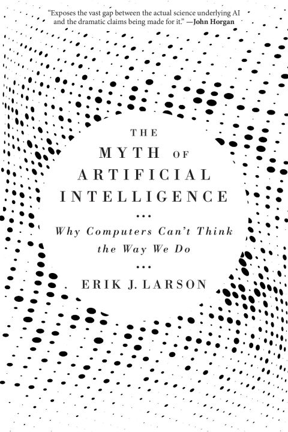
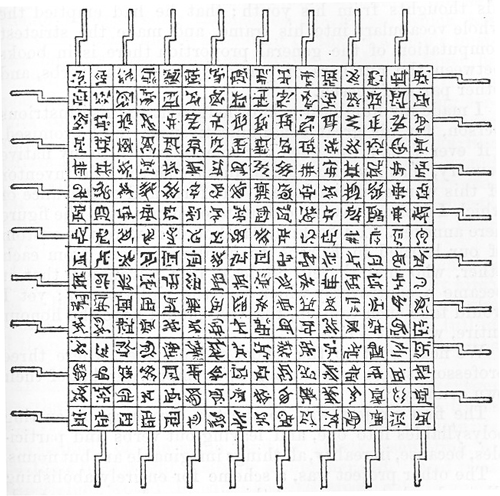

# The myth of artificial intelligence, by Larson

The relevant point in [Larson][]'s [book][] is that advances in AI
shouldn't undermine human intellectual flourishing. We shouldn't hand
over all our thinking to machines. He explores the example of the
[Human Brain Project][], arguing convincingly that its "big data"
computational focus was not effective. While I think it isn't quite so
black and white (AI can be a useful tool) I also support human
learning, not just machine learning.

[Larson]: https://en.wikipedia.org/wiki/Erik_J._Larson "Wikipedia: Erik J. Larson"
[book]: https://www.hup.harvard.edu/books/9780674278660 "The Myth of Artificial Intelligence: Why Computers Can’t Think the Way We Do"
[Human Brain Project]: https://en.wikipedia.org/wiki/Human_Brain_Project "Wikipedia: Human Brain Project"

The book doesn't deliver on its subtitle, "Why computers can't think
the way we do." It doesn't even really argue for "can't," but only for
"don't, so far." Like [Marcus][], Larson is arguing that we need
something more than deep learning and other extant approaches.

[Marcus]: https://en.wikipedia.org/wiki/Gary_Marcus "Wikipedia: Gary Marcus"

> The myth of artificial intelligence is that its arrival is
> inevitable, and only a matter of time—that we have already embarked
> on the path that will lead to human-level AI, and then
> superintelligence. (page 1)

Larson's main argument is that current machine learning doesn't do
[abduction][], and it should. This is close to Marcus arguing for
algebraic reasoning. It is even close to me, [arguing][] for going
from Behaviorist to Constructivist AI.

[abduction]: https://en.wikipedia.org/wiki/Abductive_reasoning "Wikipedia: Abductive reasoning"
[arguing]: /20170429-from_behaviorist_to_constructivist_ai/ "From Behaviorist to Constructivist AI"

This book came out before ChatGPT, which is relevant in at least two
ways.

First, it's more possible now to take seriously the idea that neural
generative models might really be, eventually, enough for AGI; this is
roughly what Sutskever seems to [say][]. The human brain is a big mess
that somehow does smart-seeming things. A generative transformer is a
big mess that somehow does smart-seeming things. Maybe they can
achieve equivalent results? This is not a proof, but it might be a
plausibility argument.

[say]: https://www.youtube.com/watch?v=YEUclZdj_Sc "Youtube: Why next-token prediction is enough for AGI - Ilya Sutskever (OpenAI Chief Scientist)"

Second, Larson spends a good deal of time on examples to show that
models weren't solving some problems very well, when he published.
Many of these examples haven't aged well for his argument, as models
now do better.

> For instance (and ironically), Google Translate as of October 2020
> still gets Bar-Hillel's 1960s example wrong. Bar-Hillel asked how to
> program a machine to translate _The box is in the pen_ correctly.
> Here, _pen_ is ambiguous. (page 202)

In December 2023, Google Translate still fails.

But ChatGPT [succeeds][], as far as I can tell.

[succeeds]: https://chat.openai.com/share/b4dfff5f-413b-466c-af57-c0c4d64e2e7e

ChatGPT similarly has no problem with challenges like "Can a crocodile
run a steeplechase?" (page 196) (It even titles the [chat][],
"Crocodile Steeplechase: Not Feasible.") And where Larson wrote "Their
[AI's] performance on Winograd schemas is not much better than random
guessing," (page 197) his 2016 reference score of [58%][] has been
improved as of 2022 to [90%][] (or higher).

[chat]: https://chat.openai.com/share/97595ce1-03c3-4c99-bc52-942752615dbb
[58%]: https://cs.nyu.edu/~davise/papers/WinogradSchemas/WS.html
[90%]: https://paperswithcode.com/dataset/wsc

Whether or not AGI will require explicit architectural support for
abduction (or symbolic reasoning, etc.) the performance limits of
current approaches are not entirely clear.

Really I wish Larson was a better spokesperson for ideas I agree with.
Supporting human learning is a good idea, I think (though Larson
unfortunately takes even this in strange hero-oriented directions).
Larson doesn't really address at all the point that LeCun sometimes
foregrounds, that current AI is hugely data-inefficient (it requires
tons of data) which could actually point to future directions for AI.
I can't endorse this book.

---

> Data science (the application of AI to “big data”) is at best a
> prosthetic for human ingenuity, which if used correctly can help us
> deal with our modern “data deluge.” (page 4)

Somewhat routinely, Larson defines things strangely. Data science is
not the application of AI to “big data,” and foundational
misalignments like this make it hard for Larson to land arguments.

---

> The Turing test is actually very difficult—no computer has ever
> passed it. (page 10)

There are plenty of articles claiming that this or that passed the
Turing test, but it seems that
[isturingtestpassed.github.io](https://isturingtestpassed.github.io/)
is correct: the answer is still no.

---

> Turing's great genius, and his great error, was in thinking that
> human intelligence reduces to problem-solving. (page 23)

There's a bunch of unclear language here. How is problem-solving
defined? What is excluded from that definition? What even is
intuition?

---

> Turing and colleagues called it the “weight of evidence,” borrowing
> a term coined by the American scientist and logician C. S. Peirce
> (who is prominently featured in Part Two of this book). (page 24)

The "it" here has no clear referent, but as it happens I've been
interested in [weight of evidence][] before, and it seems that this is
the same thing! How neat, to know it traces to Turing. One interesting
work of interpretation is Gillies' short [paper][], "The Turing-Good
Weight of Evidence Function and Popper's Measure of the Severity of a
Test."

[weight of evidence]: /20210917-weight_of_evidence_is_logistic_coefficients/ "Weight of Evidence is logistic coefficients"
[paper]: https://www.jstor.org/stable/688010

---

> Japan had invested millions in its high-profile
> [Fifth Generation project][] aimed at achieving success in robotics,
> and Japan too had failed, rather spectacularly. (page 55)

[Fifth Generation project]: https://en.wikipedia.org/wiki/Fifth_Generation_Computer_Systems "Fifth Generation Computer Systems"

At a quick search, Larson seems to be the only person saying the Fifth
Generation project was principally interested in robotics.

---

> Here, it's best to be clear: equating a mind with a computer is not
> scientific, it's philosophical. (page 69)

---

> Dan Gardner's excellent book _Future Babble_ documents the success
> rate of predictions in realms from history and geopolitics to the
> sciences. He found that theorists—experts with big visions of the
> future based on a particular theory they endorse—tend to make worse
> predictions than pragmatic people, who see the world as complicated
> and lacking a clear fit with any single theory. (page 69)

---

> Werner Heisenberg discovered his uncertainty principle by working
> out the consequences of the new physics of quanta. The principle
> states that it is impossible to isolate the position and the
> momentum of a subatomic particle simultaneously. This places
> fundamental limits on our ability to predict the individual
> movements of particles at the subatomic realm (because “seeing” the
> position of a particle requires impinging it with a photon, which
> also has the effect of knocking it off course). (page 72)

But it isn't "because" of that; this is a common misconception. Even
[wikipedia][] does better:

[wikipedia]: https://en.wikipedia.org/wiki/Uncertainty_principle "Uncertainty principle"

> Historically, the uncertainty principle has been confused with a
> related effect in physics, called the observer effect, which notes
> that measurements of certain systems cannot be made without
> affecting the system, that is, without changing something in a
> system. Heisenberg used such an observer effect at the quantum level
> (see below) as a physical "explanation" of quantum uncertainty. It
> has since become clearer, however, that the uncertainty principle is
> inherent in the properties of all wave-like systems, and that it
> arises in quantum mechanics simply due to the matter wave nature of
> all quantum objects.

---

> Statistical AI ends up with a long-tail problem, where common
> patterns (in the fat head of a distribution curve) are easy, but
> rare ones (in the long tail) are hard. (page 128)

This is true, and something of a missed opportunity to better tie into
the overall argument.

---

> Calling such systems _learners_ is ironic, because the meaning of
> the word _learn_ for humans essentially involves escaping narrow
> performances to gain more general understanding of things in the
> world. (page 141)

There's a good point in here somewhere on function approximation vs.
model-building; on interpolation vs. extrapolation.

---

> Big data is an inevitable consequence of Moore's law: as computers
> become more powerful, statistical techniques like machine learning
> become better, and new business models emerge—all from data and its
> analysis. (page 144)

I pulled this out just as an example of the kind of muddy reasoning
and poor use of language found throughout the book. This is the kind
of sort-of-but-are-you-sure-you-want-to-say-it-that-way output that
I'd expect from a language model.

---

> Much inference in the real world is defeasible, that is, proven
> wrong or incomplete by subsequent observation or learning (say, by
> reading a book). (page 163)

---

> Work on so-called [non-monotonic][] reasoning peaked in the 1980s
> and 1990s, but has since been largely abandoned, in large part
> because the extensions of deduction to make it more flexible for
> language understanding work only on “toy” examples that aren't
> useful in the real world. (page 167)

[non-monotonic]: https://en.wikipedia.org/wiki/Non-monotonic_logic "Non-monotonic logic"

---

> Many of the same researchers who worked on extending deduction in AI
> to make it defeasible also worked out deductive-based approaches to
> abduction in the 1980s and 1990s, notably with
> [abductive logic programming][] (ALP). (page 168)

[abductive logic programming]: https://en.wikipedia.org/wiki/Abductive_logic_programming "Abductive logic programming"

---

Page 172 has a breakdown like this:

 * Deduction: A→B; A ∴ B
 * Induction: A; B ∴ A→B
 * Abduction: A→B; B ∴ A

Nice to see compactly this way, I think...

---

> The strategy of exposing supervised learning systems to foreseeable
> exceptions, as is done with ongoing work on driverless cars, is a
> Sisyphean undertaking, because exceptions by their very nature
> cannot be completely foreseen. (pages 173-174)

(See the selection above from page 128.)

---

> a once-prominent field in AI known as
> [knowledge representation and reasoning][] (KR&R) (page 175)

[knowledge representation and reasoning]: https://en.wikipedia.org/wiki/Knowledge_representation_and_reasoning "Knowledge representation and reasoning"

---

> technically, entailment is stronger than material implication (page
> 176)

Poking around online, there are lots of people making claims about the
difference here, but it doesn't seem like everyone agrees... It seems
roughly like entailment is more causal, while implication can be
correlative.

---

> To abduce we must solve the selection problem among competing causes
> or factors, and to solve this problem, we must somehow grasp what is
> relevant in some situation or other. The problem is that no one has
> a clue how to do this. (page 183)

---

> noetic, or knowledge-based. (page 185)

This does not seem to be the sense in which the word is typically used.

---

> What people mean is almost never a literal function of what they
> word-for-word say. (page 206)

Yes... Though the world-knowledge bits of the book are the ones that
most fail in the face of LLMs.

---

> [Grice's Maxims][] (page 215)

Quantity, Quality, Relation, Manner

[Grice's Maxims]: https://en.wikipedia.org/wiki/Cooperative_principle#Grice's_maxims

---

> [Text REtrieval Conferences][] (page 221)

[Text REtrieval Conferences]: https://en.wikipedia.org/wiki/Text_Retrieval_Conference

---

> Writing about the experience
> [of working on early computing machines] in 1887 in an oddly
> prescient paper titled "Logical Machines," in the _American Journal
> of Psychology,_ Peirce begins characteristically with cautionary
> comment. "In the 'Voyage to Laputa' there is a description of a
> machine for evolving science automatically," he writes. "The
> intention is to ridicule the Organon of Aristotle and the Organon of
> Bacon by showing the absurdity of supposing any 'instrument' can do
> the work of the mind." Peirce, the skeptic, no doubt appreciated the
> wisdom of Swift's imagination. (page 232)

This is [Gulliver's Travels][]:

[Gulliver's Travels]: https://www.gutenberg.org/files/829/829-h/829-h.htm#part03

> Every one knew how laborious the usual method is of attaining to
> arts and sciences; whereas, by his contrivance, the most ignorant
> person, at a reasonable charge, and with a little bodily labour,
> might write books in philosophy, poetry, politics, laws,
> mathematics, and theology, without the least assistance from genius
> or study.

Is there a better description of ChatGPT than as a contrivance by
which "the most ignorant person, at a reasonable charge, and with a
little bodily labour, might write books in philosophy, poetry,
politics, laws, mathematics, and theology, without the least
assistance from genius or study"?

> He assured me “that this invention had employed all his thoughts
> from his youth; that he had emptied the whole vocabulary into his
> frame, and made the strictest computation of the general proportion
> there is in books between the numbers of particles, nouns, and
> verbs, and other parts of speech.”

A very early statistical NLP! And with a charming illustration:

---

> For scientists don't believe in vagaries like the "evolution of
> science" except as frosting, as backdrop. They really believe in
> scientific genius. They really are all possessed by Prometheus, by
> what innovators can dream and achieve. (page 239)

This is quite the generalization... Maybe you're not a real scientist
if you don't go in for a Great Man theory of science? Maybe the
[Ortega hypothesis][] is for the weak?

[Ortega hypothesis]: https://en.wikipedia.org/wiki/Ortega_hypothesis

---

> principles linking neurons together into circuits and larger
> functional units (mesa circuits) (page 250)

I don't find a lot of support for "mesa circuits" as a term people
use...

---

> we are actively attempting to cover up a key deficiency—a lack of
> flourishing human culture—with rhetoric about the inevitable rise of
> machines. (page 277)

---

> The problem of inference, like the problem of consciousness, is
> entrenched at the center of ongoing grand mysteries, and is really
> presupposed in our understanding of everything else. We should not
> be surprised that the undiscovered mind resists technological
> answers. It's possible that, as Horgan worried, we're out of ideas.
> If so, the myth represents our final, unrecoverable turn away from
> human possibility—a darkly comforting fairy tale, a pretense that
> out of our ashes something else, something great and alive, must
> surely and inevitably arise.
>
> If we're _not_ out of ideas, then we must do the hard and deliberate
> work of reinvesting in a culture of invention and human flourishing.
> For we will need our own general intelligence to find paths to the
> future, and a future better than the past. (pages 280-281)

This is interesting material.

I think a lot of "AI isn't as good as people" reduces to how we feel
about consciousness. You can't prove consciousness by behaviors or any
other observable. So do we extend our belief in consciousness to
machines?

On whether we're out of ideas, I like the arguments of [Deutsch][] and
[Wilczek][], which suggest that we're not.

[Deutsch]: /20220410-beginning_of_infinity_by_deutsch/ "The Beginning of Infinity, by Deutsch"
[Wilczek]: https://en.wikipedia.org/wiki/Frank_Wilczek "Wikipedia: Frank Wilczek"
