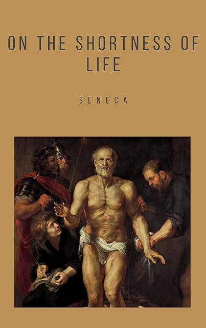

# Seneca's De Brevitate Vitae

I guess it's just an [essay][], but I spent a dollar and highlighted a
[Kindle version][] of On the Shortness of Life, so I'm probably making
the most of mine. It's a little bit like a much earlier version of
[How to Live on 24 Hours a Day][], except that it's quite specific in
what you _should_ be doing with your life: philosophy. Okay, senator.

[essay]: https://en.wikipedia.org/wiki/De_Brevitate_Vitae_(Seneca) "Wikipedia: De Brevitate Vitae (Seneca)"
[Kindle version]: https://www.amazon.com/gp/product/B084QKS7PG/ "Amazon: On the Shortness of Life Kindle Edition"
[How to Live on 24 Hours a Day]: /20201107-how_to_live_on_24_hours_a_day/ "How to Live on 24 Hours a Day, by Bennett"

> Of all men they alone are at leisure who take time for philosophy,
> they alone really live; for they are not content to be good
> guardians of their own lifetime only.

---

> It is not that we have a short space of time, but that we waste much
> of it.

---

> the life we receive is not short, but we make it so,

---

> Everyone hurries his life on and suffers from a yearning for the
> future and a weariness of the present.

---

> Men trifle with the most precious thing in the world; but they are
> blind to it because it is an incorporeal thing, because it does not
> come beneath the sight of the eyes, and for this reason it is
> counted a very cheap thing—nay, of almost no value at all.

---

> busy men find life very short.

---

> so enfeebled are they by the excessive lassitude of a pampered mind
> that they cannot find out by themselves whether they are hungry!

---

> it seems the part of a man who is very lowly and despicable to know
> what he is doing.

---

> They annex every age to their own; all the years that have gone
> before them are an addition to their store.

---

> Has some time passed by? This he embraces by recollection. Is time
> present? This he uses. Is it still to come? This he anticipates. He
> makes his life long by combining all times into one.

---

> They lose the day in expectation of the night, and the night in fear
> of the dawn.

---

> Reasons for anxiety will never be lacking, whether born of
> prosperity or of wretchedness; life pushes on in a succession of
> engrossments. We shall always pray for leisure, but never enjoy it.

---

> knowledge of their disease has caused the death of many.
