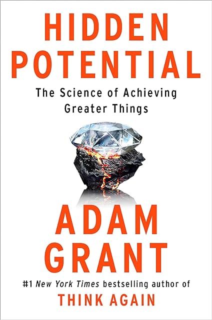

# (Audio) Hidden Potential, by Grant

Spotify has audiobooks now! Fifteen hours per month before charging
more. So I listened to [Hidden Potential][] while running. It was a
fun, inspiring listen. Everyone can be great!

[Hidden Potential]: https://adamgrant.net/book/hidden-potential/

I don't take many notes on audiobooks, but one study caught my ear:
[Are tenure track professors better teachers?][] Grant presented it as
saying that less experienced professors were better teachers, but that
isn't quite right; it's comparing tenure track professors to teaching
adjuncts. Also, it says the bad performance of tenure track folks is
because roughly a quarter of them were particularly bad, not that all
of them were bad. Neat study, anyway.

[Are tenure track professors better teachers?]: https://www.sesp.northwestern.edu/docs/publications/142575725559b6ba6c4706e.pdf

