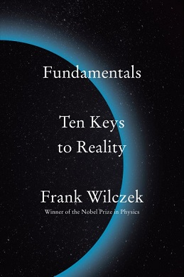

# Fundamentals: Ten Keys to Reality, by Wilczek

I liked [Wilczek][] on [Dirac][] in [It must be beautiful][], and I
like him a lot [here][]! This is Nobel-prize-winning [QCD][] and also
[time crystal][] guy. Just a beautiful intro to modern particle
physics, scientific perspective, an an optimism for open-ended future
development across all scientific disciplines that reminds me of
[The Beginning of Infinity][].

[Wilczek]: https://en.wikipedia.org/wiki/Frank_Wilczek "Wikipedia: Frank Wilczek"
[Dirac]: /20230816-strangest_man_by_farmelo/ "The Strangest Man, by Farmelo"
[It must be beautiful]: /20231119-it_must_be_beautiful/ "It must be beautiful, edited by Farmelo"
[here]: https://en.wikipedia.org/wiki/Fundamentals:_Ten_Keys_to_Reality "Wikipedia: Fundamentals: Ten Keys to Reality"
[QCD]: https://en.wikipedia.org/wiki/Quantum_chromodynamics "Wikipedia: Quantum chromodynamics"
[time crystal]: https://en.wikipedia.org/wiki/Time_crystal "Wikipedia: Time crystal"
[The Beginning of Infinity]: /20220410-beginning_of_infinity_by_deutsch/ "The Beginning of Infinity, by Deutsch"

---

> _Fundamentals_ is meant, as well, to offer an alternative to
> traditional religious fundamentalism. It takes up some of the same
> basic questions, but addresses them by consulting physical reality,
> rather than texts or traditions. (page xiii)

Of course, consulting physical reality is its own tradition...

---

> The method of Kepler, Galileo, and Newton combines the humble
> discipline of respecting the facts and learning from Nature with the
> systematic chutzpah of using what you think you've learned
> aggressively, applying it everywhere you can, even in situations
> that go beyond your original evidence. If it works, then you've
> discovered something useful; if it doesn't, then you've learned
> something important. I've called that attitude Radical Conservatism,
> and to me it's the essential innovation of the Scientific
> Revolution. (pages 4-5)

I don't know if he has priority, but I'm pretty sure Wilczek's sense
of Radical Conservatism isn't the most common...

See also [Characteristics of good theories][].

---

> Ptolemy's [geocentric] synthesis was a magnificent achievement, but
> it had two shortcomings. One was its complexity and, related to
> this, its ugliness. In particular, the recipes it used to calculate
> planetary motions brought in many numbers that were determined
> purely by fitting the calculations to observations, without deeper
> guiding principles connecting them. Copernicus (1473-1543) noticed
> that the values of some of those numbers were related to one another
> in surprisingly simple ways. These otherwise mysterious,
> "coincidental" relationships could be explained geometrically, if
> one assumed that Earth together with Venus, Mars, Jupiter, and
> Saturn all revolve around the Sun as center (and the Moon further
> revolves around Earth). (page 6)

I don't think I'd heard quite this explanation before... In light of
"end of science" arguments that big data pushes us more toward
"numbers ... determined purely by fitting the calculations to
observations" this Ptolemaic narrative could almost fit into a kind of
"we were once less wise in our theory, and now we become less wise
again" story.

Wilczek goes on to briefly cover how Kepler's work made the system
still simpler and better-working. Have we simplified everything as
much as it can be? Could we do better?

> But Galileo aspired to a different kind of understanding. He wanted
> to understand _something_ precisely, rather than _everything_
> vaguely. (page 7)

Finding the right questions, etc. etc.

---

> A more recent quotation from John R. Pierce, a pioneer of modern
> information science, beautifully captures the contrast between the
> modern concept of scientific understanding and all other approaches:
> "We require that our theories harmonize in detail with the very wide
> range of phenomena they seek to explain. And we insist that they
> provide us with useful guidance rather than with rationalizations."
> (page 9)

This reminds me of [Characteristics of good theories][].

[Characteristics of good theories]: /20170825-characteristics_of_good_theories/

Also, this [Pierce][] character came up a bunch in [Larson's book][]
as well. (But this book is much, much better.)

[Pierce]: https://en.wikipedia.org/wiki/John_R._Pierce "Wikipedia: John R. Pierce"
[Larson's book]: /20231231-myth_of_ai_by_larson/ "The myth of artificial intelligence, by Larson"

---

> Unlike the situation for stars or planets, which almost invariably
> are separated from their neighbors by distances many times their own
> size, the typical separation between galaxies is not vastly larger
> than the galaxies themselves. (page 27)

Huh! Neat.

---

> The Roman philosopher Seneca expressed the opposite of this thought
> [that human life is short] in "On the Shortness of Life." "Why do we
> complain about nature?" he writes. "It has acted generously; life,
> if you know how to use it, is long." (pages 43-44)

Oh interesting! It seems like [Bennett][] didn't know (or at least
didn't reference) Seneca's [work][] in his How to Live on 24 Hours a
Day.

[Bennett]: /20201107-how_to_live_on_24_hours_a_day/ "How to Live on 24 Hours a Day, by Bennett"
[work]: https://archive.org/stream/SenecaOnTheShortnessOfLife/Seneca+on+the+Shortness+of+Life_djvu.txt "Full text of 'Seneca On The Shortness Of Life'"

---

> 1. _The basic laws describe change._ It is useful to separate the
>    description of the world into two parts: states and laws. States
>    describe "what there is," while laws describe "how things
>    change."
> 2. _The basic laws are universal._ That is, the basic laws hold
>    everywhere, and for all times.
> 3. _The basic laws are local._ That is, the behavior of an object in
>    the immediate future depends only on current conditions in its
>    immediate vicinity. The standard scientific jargon for this
>    principle is _locality._
> 4. _The basic laws are precise._ The laws are precise, and they
>    admit no exceptions. Thus, they can be formulated as mathematical
>    equations. (pages 64-65)

Locality over reality.

---

> Fields, rather than particles, are the fundamental building blocks
> of matter in modern physics. (page 67)

---

Wilczek identifies "Mass" and "Charge" and "Spin" as the only three
basic, primary properties of matter. (page 73)

---

> (There's an interesting mathematical reason why physicists call the
> basic unit of angular momentum spin 1/2, rather than spin 1, but it
> is beyond the scope of this book.) (page 75)

It seems like this is related to the [spin–statistics theorem][] or
something? But come on, Wilczek, you big tease...

[spin–statistics theorem]: https://en.wikipedia.org/wiki/Spin%E2%80%93statistics_theorem

---

> Contrary to Democritus, though, our modern basic ingredients don't
> have hooks. They aren't even solid bodies. Indeed, thought it's
> convenient to call them "elementary particles," they aren't really
> particles. (That is, they have little in common with what the word
> "particle" suggests.) Our modern fundamental ingredients have no
> intrinsic size or shape. If we insist on visualizing them, we should
> think of structureless points where concentrations of mass, charge,
> and spin reside. We have, in places of "atoms and the void,"
> space-time and properties. (page 77)

Democritus was the early atomic theory guy.

---

> By being first, Franklin got to choose which kind of charge to call
> positive and which negative. He chose to call the charge that
> accumulates on glass, after it is rubbed with silk, positive. This
> was long before people knew about electrons. Unfortunately, it turns
> out that according to Franklin's choice the electron's charge is
> negative. It's much too late to undo that choice, since it has
> seeped into thousands of books, papers, and circuit diagrams.
> Therefore, we list the electron's charge as -1. (pages 81-82)

Benjamin Franklin.

---

> Once you get to thinking about materials as homes to quasiparticles,
> a profound question is not far off: Can we consider "empty space"
> itself to be a material, whose quasiparticles are our "elementary
> particles"? We can, and we should. It is a very fruitful line of
> thought, as you'll see in later chapters. (page 90)

I'm not sure that last promise was ever paid off very well...

---

> John Wheeler, the poet of relativity, summed it up this way:
> "Space-time tells matter how to move; matter tells space-time how to
> bend." (page 117)

Is that really a good way to sum up? It reminds me of the
stretched-sheet-of-rubber image, which I think is not so good...

---

> The Future of Comprehension (page 119)

I just thought this was a cool section heading.

---

> You should not fail to notice that 500 trillion is a great deal
> larger than 25, or even 95. (page 127)

Cute!

---

> H. G. Wells caught the spirit of thermal equilibrium memorably: "If
> anything is possible, then nothing is interesting." (page 151)

---

> How the Universe got Interesting (page 161)

Another fun heading.

---

> There are several kinds of anomalous color perception, misnamed
> "color blindness," that are not terribly rare. Around 95 percent of
> humans have similar color vision, based on three types of cone cells
> that vary little between individuals. There are theoretical reasons,
> based on genetics, to believe that a significant fraction of humans,
> specifically mothers and full sisters of males with the most common
> color anomaly, have four kinds of cone cells. These "tetrachromats"
> might have super-normal color vision. But as far as I know, direct
> evidence for this is surprisingly rare. (page 170)

[Huh!](https://en.wikipedia.org/wiki/Tetrachromacy)

---

> Let's recall that John Wheeler, the poet of general relativity,
> summed it up this way: "Space-time tells matter how to move; matter
> tells space-time how to bend." Wheeler's summary is catchy, but it
> is misleading, or at least incomplete, whithout this important
> addition: _Space-time is a form of matter, too._ (page 178)

---

> Although we understand _a lot_ about how the world works, there are
> still big mysteries. These three great questions came up earlier:
>
> * What triggered the big bang? Could it happen again?
>
> * Are there meaningful patterns hidden in the apparent sprawl of
>   fundamental particles and forces?
>
> * How, concretely, does mind emerge from matter? (Or does it?) (page
>   187)

---

On page 190, he uses "rock bottom" to refer to that final point in
explanation beyond which there is no further "why?" I think it's a
good thing to remember, that we can't avoid having such a rock bottom.

---

> "Dark energy" is another theoretically motivated modification to the
> law of gravity, also considered by Einstein. He called it by a
> different name: the cosmological constant. (page 195)

---

> There is immense satisfaction in describing the world in terms of
> its most elementary building blocks. It is tempting to say that this
> is the ideal description, while other, high-level descriptions are
> mere approximations—compromises, which reflect weakness in
> understanding. That attitude, which makes the perfect the enemy of
> the good, is superficially deep, but deeply superficial.
>
> In order to answer questions of interest, we often need to change
> focus. To discover—or invent—new concepts, and new ways of working
> with them, is an open-ended, creative activity. Computer scientists
> and software engineers are well aware that in designing useful
> algorithms, it is important to pay attention to how knowledge is
> represented. A good representation can make the difference between
> usable knowledge and knowledge that is there "in principle" but not
> really available, because it takes too long and too much trouble to
> locate and process. It's like the difference between owning bars of
> gold and knowing that in principle there are vast stores of gold
> atoms floating dissolved in the ocean.
>
> For that reason, complete understanding of the fundamental laws, if
> we ever achieved it, would be neither "the Theory of Everything" nor
> "the End of Science." (Those are two phrases, endemic in popular
> science journalism, that I find extremely irritating.) We would
> still need complementary descriptions of reality. There would still
> be plenty of great questions left unanswered, and plenty of great
> scientific work left to do.
>
> There always will be. (pages 215-216)

This is just the conclusion of a longer section on this topic, which I
like quite a lot. It reminds me of Deutsch's
[Beginning of Infinity](/20220410-beginning_of_infinity_by_deutsch/).

---

> Do people have choice in what they do, or are they puppets who dance
> to the tune of mathematical physics? That is a bad question, not
> unlike asking whether music is harmony or melody. (page 218)

---

> ...what the great biologist Francis Crick has called "the
> astonishing hypothesis": that mind, in all its aspects, is "no more
> than the behavior of a vast assembly of nerve cells and their
> associated molecules." (pages 225-226)

---

> ... there are three different kinds [sic] color charge, and eight
> different kinds of gluons that respond to them. (page 234)

What? This seems cool and fun.

---

> Now we come to a group of elementary particles nobody really knows
> what to make of. The bonus particles are all unstable. They were
> discovered among the debris of high-energy collisions, either in
> cosmic rays (early in the twentieth century) or at parcle
> accelerators (more recently). When the first of them, the muon, was
> discovered in 1936, the renowned physicist I. I. Rabi captured the
> community's bewilderment in a quip that's become legendary: "Who
> ordered that?" (page 236)

These are the charm, top, strange, and bottom quark, together with the
muon and tauon.

---

> The website of the Particle Data Group is http://pdg.lbl.gov. (page 238)

Nice!
