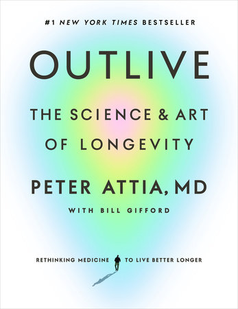

# (Audio) Outlive, by Attia

I was already thinking about improving my health, then my last
grandparent died, and this book was recommended in Spotify and by a
friend. It was gratifying to listen to while running because [Attia][]
kept saying how good exercise is.

[Attia]: https://peterattiamd.com/

He's a little bit of a tech bro. He talks about how he mellowed and
started taking one (1) day off per week. And is he responsible for the
popularity of [rucking][]? He used to be very into [keto][] and
fasting. He still seems to be a little quick to assume causation. But
still: Who doesn't want more healthspan?

[rucking]: https://www.goruck.com/pages/what-is-rucking
[keto]: https://en.wikipedia.org/wiki/Ketogenic_diet

 * Recommendations
     * Exercise
         * "Zone 2" sustained cardio
         * Intense cardio for improving VO2-max
         * Strength (with weights)
         * Stability (core, posture, flexitility...)
     * Diet
         * A lot of protein and fiber
         * Avoid too much other stuff
         * Keep bad cholesterol (LDL, but he prefers measuring
           [ApoB][]) _very_ low (usual guideline is under 100; he says
           under 20)
             * Maybe use statins and/or [metformin][] etc.
         * Minimal to no alcohol
         * _Don't get diabetes_
     * Get lots of tests done, screen early for cancer, etc.
     * Sleep (lots of good)
     * Emotional health (good)
     * [Rapamycin][] taken once a week
         * You can get this from [AgeLessRx][] or [HealthSpan][], for
           example.
 * Anchor phrases
     * Medicine 3.0: Where 1.0 was witchcraft/superstition, 2.0 is
       scientific "treat the disease" modern medicine, and 3.0 is his
       style of life-long health improvement to avoid diseases of
       aging etc. (Attia's practice is called "Early.")
     * The Four Horsemen
         * Heart disease, stroke, etc.
         * Cancer
         * Dementia etc.
         * Diabetes and friends ("metabolic disfunction") which he
           says is related to the other three
     * The Centenarian Decathlon: Work toward being able to do things
       when you're really old; overprepare because you will age.

[ApoB]: https://en.wikipedia.org/wiki/Apolipoprotein_B
[metformin]: https://en.wikipedia.org/wiki/Metformin
[Rapamycin]: https://en.wikipedia.org/wiki/Sirolimus
[AgeLessRx]: https://agelessrx.com/
[HealthSpan]: https://gethealthspan.com/

