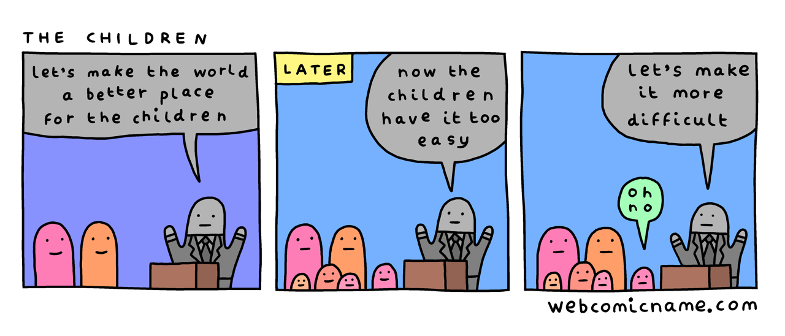

# (Audio) The Comfort Crisis, by Easter

Built from Men's Health articles, Easter's book gathers tales of his
hunting trips with the bros. Sometimes there are scientific and
philosophical digressions. I liked how the chapter about death came at
the moment between shooting and killing the wild reindeer.

Easter talks about the [Fogg][] Behavior Model (action requires
Motivation, Ability, and a Prompt) and suggests that scrolling on your
phone all the time is a bad idea. Okay. He also suggests that audible
white noise is caused by EM radiation in air. I struggle to find a
reasonable interpretation that makes this true. There's also a good
deal of "people used to do this long ago, therefore it's a good idea,"
which isn't necessarily wrong, but it's too easy to ignore whether
there's a good argument beyond the appeal to nature.

[Fogg]: https://en.wikipedia.org/wiki/B._J._Fogg "B. J. Fogg"

The thesis is basically that we should get off the couch, eat
healthier, and challenge ourselves. I agree, basically. I'm now
listening to Rushkoff's Survival of the Richest, which has some advice
which is similar in effect: Focus on the real world rather than
disappearing into a technologically mediated isolation pod. Rushkoff
gets there by a different path, and from his mouth it sounds like a
call to a pro-social future. From Easter, it sounds like rugged
individualism for reclaiming masculinity.

We're very lucky to be able to choose our level of difficulty, when we
can.

