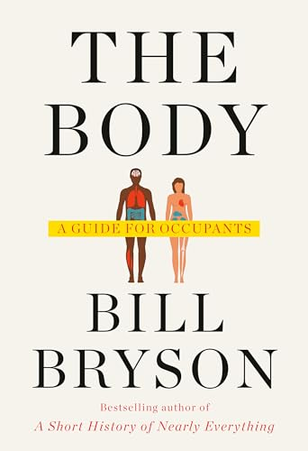

# (Audio) The Body, by Bryson

Bryson's intonation is a little like Werner Herzog's. His book on the
body is charmingly, gently amusing. It's a selection of fun facts and
good advice: exercise more, eat less, maybe get some more vitamin D
and choline. One reference is Haldane's 1926
[On Being the Right Size][], which has a similar sense of humor.
Bryson has a good time, and so does the reader (or listener).

[On Being the Right Size]: https://www.phys.ufl.edu/courses/phy3221/spring10/HaldaneRightSize.pdf

