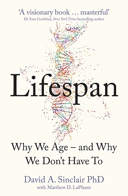

# (Audio) Lifespan, by Sinclair

I heard about [this book][] from a neighbor after I was talking about
[Outlive][]. Compared to Attia, [Sinclair][] is more academic, not as
into protein (especially animal protein), and more extreme in his
claims that aging is a curable disease explained by his "Information
Theory" of epigenetic aging. Sinclair takes metformin, resveratrol,
and NMN. (After the book he started taking rapamycin as well, based on
a YouTube interview.) The book is longer than it needs to be to cover
the topics of Sinclair's expertise. The audio book has little
interludes between Sinclair and his writer, which is sort of a fun
idea but I'm not sure it added much.

[this book]: https://en.wikipedia.org/wiki/Lifespan:_Why_We_Age_%E2%80%93_and_Why_We_Don%27t_Have_To "Lifespan: Why We Age – and Why We Don't Have To"
[Outlive]: /20240128-outlive_by_attia/ "(Audio) Outlive, by Attia"
[Sinclair]: https://en.wikipedia.org/wiki/David_A._Sinclair "David A. Sinclair"

