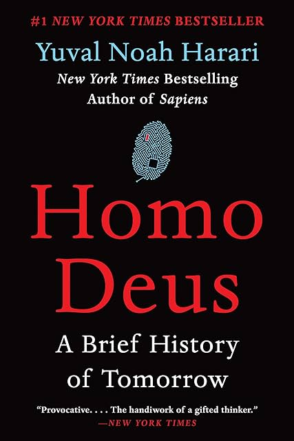

# (Audio) Homo Deus, by Harari

It feels like [Harari][] got the advance for [Homo Deus][] before
really thinking it through. It's rambling, over-long, without cohesive
thesis, and like a time capsule of science and tech news from 2014:
Big Data! Watson! Quantified Self! Mild [Accelerando][] flavor. I wish
I'd read the [Critical Reception][] section from Harari's Wikipedia
entry and skipped this book.

[Homo Deus]: https://en.wikipedia.org/wiki/Homo_Deus:_A_Brief_History_of_Tomorrow "Homo Deus: A Brief History of Tomorrow"
[Harari]: https://en.wikipedia.org/wiki/Yuval_Noah_Harari "Yuval Noah Harari"
[Accelerando]: /20191108-accelerando_by_stross/ "Accelerando, by Stross"
[Critical Reception]: https://en.wikipedia.org/wiki/Yuval_Noah_Harari#Critical_reception

My biggest gripe is probably that Harari argues (at length) that
animals have consciousness, and that animals are algorithms, and then
also claims without a second thought that algorithms implemented via
computer have no consciousness.

Harari also makes the fairly common error of scientific
exceptionalism: the belief that scientific ways of knowing are
fundamentally distinct from all others. For the number of words he
releases on related topics, this is frustrating.

Harari does say some reasonable things. I think he's correct in
pointing out limitations in our understanding of consciousness. (I
think this is such an interesting topic I wrote a [short story][]
about it.)

[short story]: /20230325-conversion_of_guelph_energy_to_mass/ "Conversion of Guelph energy to mass (p=0.049)"

I also like Harari's phrasing around learning history in order to be
liberated from it. But throughout the book, the moments of lucidity
make the languid and ludicrous majority that much more unbearable.

