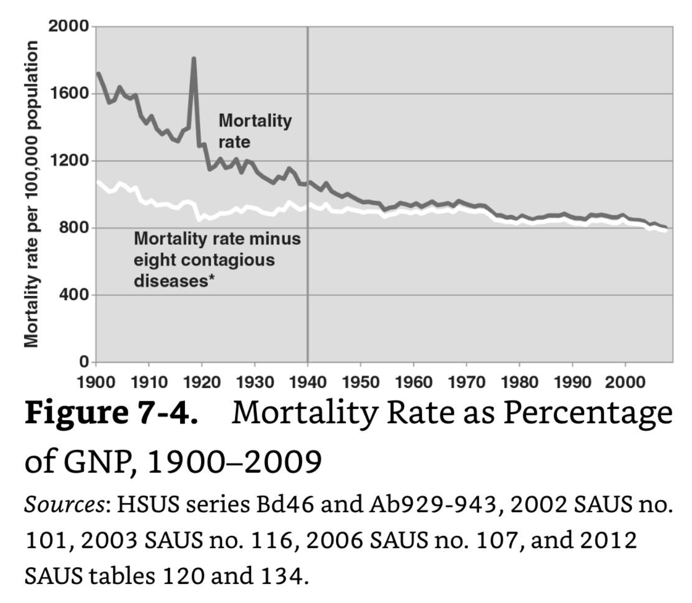
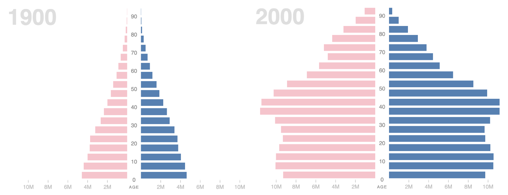
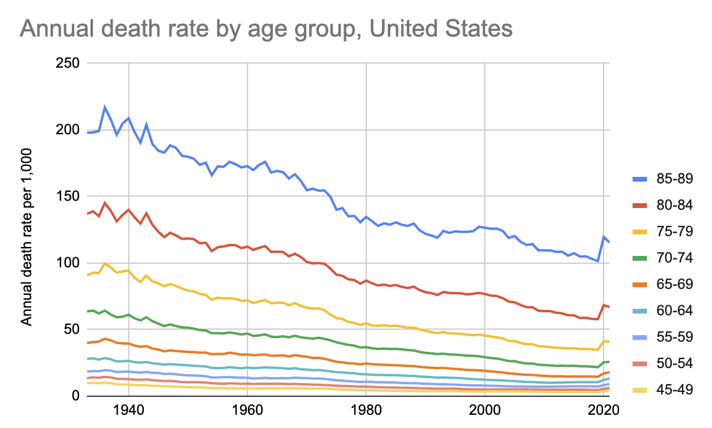
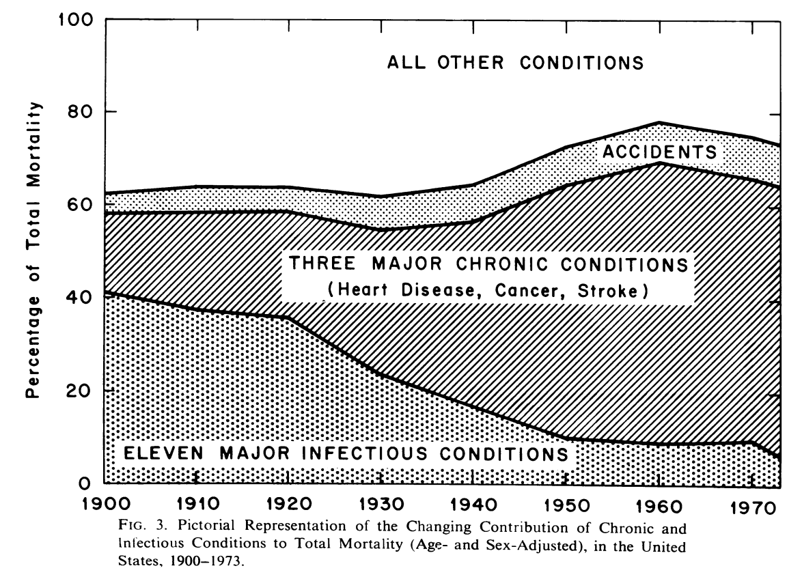
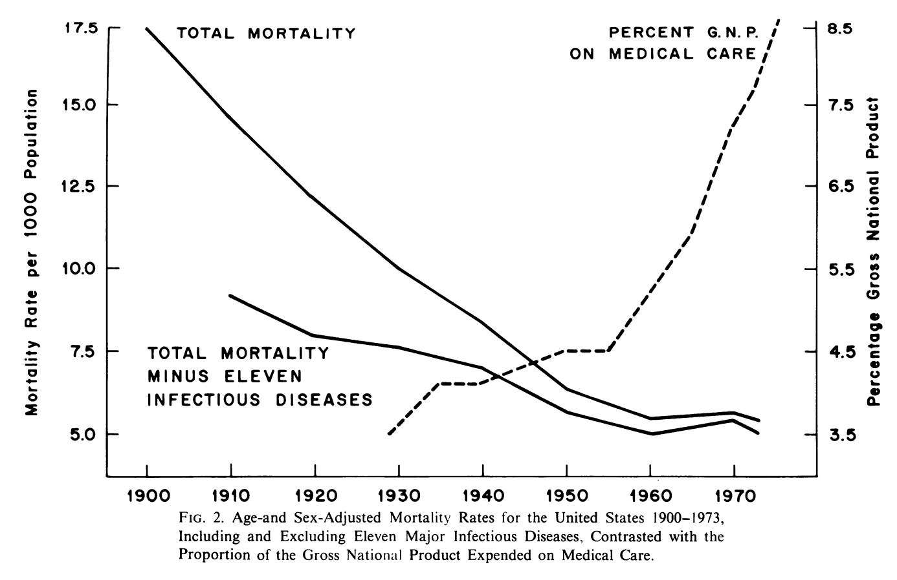
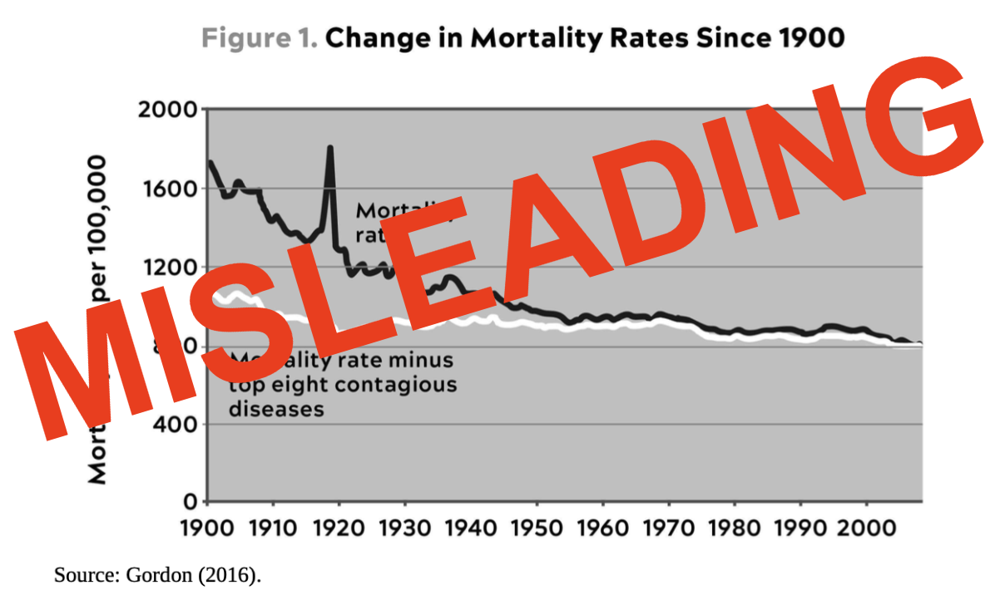

# Mortality rates have improved

A misleading graph from [The Rise and Fall of American Growth][] was
reproduced and again misinterpreted in [Outlive][]. The graph
correctly shows that US deaths from infectious disease have decreased
a lot over the last hundred years. The graph incorrectly makes it seem
like death rates from other causes have been stable over this period.
The age-adjusted death rate has decreased by around 50% since 1950.
Death rates at every age band have been meaningfully decreasing, apart
from the impact of COVID-19.

[The Rise and Fall of American Growth]: https://en.wikipedia.org/wiki/The_Rise_and_Fall_of_American_Growth "The Rise and Fall of American Growth, by Robert J. Gordon"
[Outlive]: /20240128-outlive_by_attia/ "Outlive, by Peter Attia"

Here's the graph in [Outlive][]:

What a remarkably horizontal white line! It supports Attia's position,
in that he's arguing that we need to invest more in fighting other
causes of death (heart disease, cancer, dementia, diabetes) so he's
trying to make them seem like big unsolved problems. And certainly,
they are big unsolved problems. But the claim that mortality rates
haven't been improving is misleading.

Let's first go to the graph in
[The Rise and Fall of American Growth][]:

Attia copied this graph fairly exactly, except for adding "top" before
and removing the asterisk after "diseases," which is just as well
since the asterisk doesn't seem to have an explanation in _Growth_
anyway.

Such a horizontal white line! Here, it supports Gordon's position, in
that he's arguing that things were getting better in the US from
1870-1970, but things aren't getting better so much any more. So
here's a decrease that stops decreasing by 1970.

The biggest problem with this presentation is that the data is not
age-adjusted, and as such it's sensitive to the distribution of ages
in the population. For example, with low death rates for people in
their early years, one way to lower the raw death rate is to arrange
for the birth of a lot of babies. The raw death rate doesn't tell us
much about anything in particular, and certainly isn't the "real"
death rate in any meaningful way. Let's compare with a [CDC graph][]
that is age-adjusted:

[CDC graph]: https://www.cdc.gov/nchs/data-visualization/mortality-trends/index.htm "Mortality Trends in the United States, 1900–2018"

The green line is the age-adjusted death rate. It was 1,446 in 1950,
1,222.6 in 1970, and 723.6 in 2018. That's a 50% improvement from
1950, and a 41% improvement from 1970.

Adjusting for age is important, because for example, when people don't
die young, you get more old people. Baby booms and so on also matter.
The population pyramid looks different now than it did in 1900.
Compare the 1900 and 2000 shapes as presented in a
[Stanford visualization][]:

[Stanford visualization]: http://vis.stanford.edu/jheer/d3/pyramid/shift.html "U.S. Census Population Pyramid, 1850-2000"

Both the raw and age-adjusted overall death rates don't tell us
everything about what's happening at every age, so let's look at that.
Here are death rates for the oldest nine age buckets in
[data from the Human Mortality Database][] from 1933 to 2021, shown
with a [quick graph][] I made.

[data from the Human Mortality Database]: https://ourworldindata.org/grapher/annual-death-rate-by-age-group "Annual death rate by age group, United States, 2021"
[quick graph]: https://docs.google.com/spreadsheets/d/1VjBsxGqajqBThla0JDQGSAnS2fXUeUTVBG95PD6pbE4/edit "age-band death rates over time"

Every age group is seeing decreasing death rates up until COVID-19
impacts 2020 numbers. I left out younger age bands to avoid crowding,
but those also show improvement, especially for the youngest.

For people 85-89, the death rate per 1,000 was 179.87 in 1950, and
154.77 in 1970. It was 103.14 in 2018. That's a 43% improvement since
1950, and 33% improvement from 1970. Even the COVID-19 spike takes us
back only to around the same levels as we saw in 2000.

Things have been improving. Improving since 1950, improving since
1970, improving since 2000 apart from COVID-19. It just isn't accurate
to suggest that death rates haven't been going down over these
periods. There's still room for improvement, but the real gains should
be celebrated, not ignored.

The question of whether life expectancies have leveled off or even
decreased over shorter, more recent periods is quite distinct from the
trend over these longer periods.

I attempted to [replicate][] Gordon's graph using the [HSUS][] data.
He cites Ab929-943, which includes ten columns of infectious disease
death, by my count. He uses Ab952 for the total death rate, I believe.

[replicate]: https://docs.google.com/spreadsheets/d/19kuO6mIAi-f3etXZtVNndLEqoGOHACjLvzokBCrYGqQ/edit "death rates from HSUS"
[HSUS]: https://en.wikipedia.org/wiki/Historical_Statistics_of_the_United_States "Historical Statistics of the United States"

It adds only confusion that Gordon's figure is titled "Mortality Rate
_as Percentage of GNP_" (emphasis added). He also cites HSUS series
Bd46 (percentage of GNP spent on health care from 1929 to 1997) and
2012 SAUS table 134 (health care spending). This seems to be a
leftover of an idea from an earlier paper. Gordon's footnote 22 says
that his figure "is an update of McKinlay and McKinlay (1977, figure
3, p. 416)" so let's track that down.

The paper is
[The Questionable Contribution of Medical Measures to the Decline of Mortality in the United States in the Twentieth Century][].
It has this Figure 3:

[The Questionable Contribution of Medical Measures to the Decline of Mortality in the United States in the Twentieth Century]: https://www.milbank.org/wp-content/uploads/mq/volume-55/issue-03/55-3-The-Questionable-Contribution-of-Medical-Measures-to-the-Decline-of-Mortality-in-the-United-States-in-the-Twentieth-Century.pdf

There is no horizontal white line here. The presentation is quite
different, arguably better for showing the decrease in death from
infectious disease. McKinlay and McKinlay seem to have known to use
age-adjusted statistics as well. More relevant to the discussion of
GNP, however, their paper has this Figure 2:

The point it's making is that increased spending on health care
doesn't seem to be driving a lot of increased reduction in death rate.
There's something to this argument, but 50 years later we can also see
(in the CDC graph above) that the period roughly 1955-1965 was a
fairly flat spot on the death rate graph, with improvement continuing
after it.

Gordon mentions the concern that spending on health care isn't
delivering matching results in death rate improvement, but it doesn't
make it into his figure apart from the title and data citations.

The horizontal white line is basically a coincidence as death has been
shifting from younger to older people over time and the population
pyramid has been changing shape. This graph is misleading.

