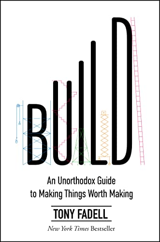

# (Audio) Build, by Fadell

The "advice encyclopedia" from the father of the iPod is [billed][] as
"an unorthodox guide" and maybe it is, depending on your orthodoxy.
Here are some of its recommendations as I recall them:

[billed]: https://www.buildc.com/the-book "Build, the Book"

 * Work really hard.
 * Be a perfectionist.
 * Micro-manage. ([Tony][] tries to clarify that what he recommends
   isn't micro-managing; the distinction is something like managing
   outputs as good vs. process as bad.)
 * Push people hard.
 * Have interviews done by a small group of people who will work with
   the new person, not a bunch of people from all over the company.
 * Don't have a lot of perks at the office.
 * Blame Google for Nest not going how you wanted.

[Tony]: https://en.wikipedia.org/wiki/Tony_Fadell "Tony Fadell"

I think the most interesting thing, to me, is the tension between
intrinsic motivation vs. external pushing for generating results. Tony
seems like a pusher, and he's gotten results. But do bosses have to be
so hard-driving?

Fadell comments on how much time he spent on "people problems" (HR or
personnel issues) as a leader. This might always be the case, but I
also wonder whether particular leadership styles (and related hiring
choices) lead to more of this. Fadell says he followed a "no assholes
rule" in hiring. Might anosognosia be at play?

I'm not sure I'd like to work with Fadell, but I tend to like his
goals and his [Build Collective][] seems to be supporting cool things.
(Ends vs. means?) The book is almost a promotional tie-in for this
venture operation.

[Build Collective]: https://www.buildc.com/ "Build Collective"

