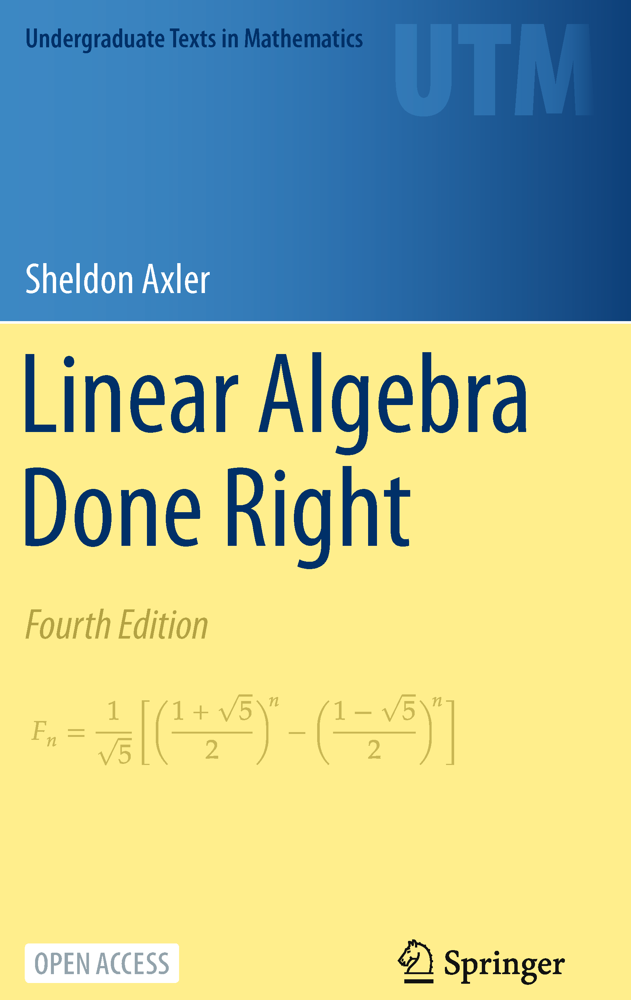

# Linear Algebra Done Right, by Axler

Axler's beautiful [textbook][], now in Open Access for the fourth
edition, is sort of an expansion of his 1995
[Down with Determinants!][] and is full of his characteristic
humanity, humor, joy, and good sense. I love the book's title most for
the implication that there _are_ different ways that linear algebra
can be done—and Axler's book is convincing evidence that developing
the subject without prioritizing determinants can be done well.

The equation on the cover is the closed form solution for the \\( n
\\)th Fibonacci number, derived using linear algebra in an exercise on
page 174, just one of the book's treasures.

[textbook]: https://linear.axler.net/
[Down with Determinants!]: https://www.axler.net/DwD.html "Down with Determinants!"

---

> Do not memorize the formula for the product of two complex
> numbers—you can always rederive it by recalling that \\( i^2 = -1
> \\) and then using the usual rules of arithmetic (as given by 1.3).
> (page 2)

I love seeing advice like this in textbooks; sort of a didactic
principle of emphasizing what's fundamental and what's a
consequence... On the other hand you don't want to re-derive
everything every time, but there's some optimization of what gets a
spot in memory...

---

> When we think of an element of \\( \mathbb{R}^2 \\) as an arrow, we
> refer to it as a vector.
>
> Whenever we use pictures in \\( \mathbb{R}^2 \\) or use the somewhat
> vague language of points and vectors, remember that these are just
> aids to our understanding, not substitutes for the actual
> mathematics that we will develop. (page 8)

Also good pedagogy here, I think: making a distinction between the
thing itself and a mental model or metaphor for it.

---

> Mathematical models of the economy can have thousands of variables,
> say \\( x_1, ..., x_{5000} \\), which means that we must work in \\(
> \mathbb{R}^{5000} \\). Such a space cannot be dealt with
> geometrically. However, the algebraic approach works well. Thus our
> subject is called **linear algebra**. (page 8)

I appreciate the attempt to justify the name, but I feel like this one
isn't completely satisfying... Good aspect: Gets at the centrality of
multi-dimensionality. Less good aspect: Doesn't really justify the
"linear" part.

---

> We could define a multiplication in \\( \mathbb{F}^n \\) in a
> similar fashion, starting with two elements of \\( \mathbb{F}^n \\)
> and getting another element of \\( \mathbb{F}^n \\) by multiplying
> corresponding coordinates. Experience shows that this definition is
> not useful for our purposes. Another type of multiplication, called
> scalar multiplication, will be central to our subject. (page 9)

I feel like the appeal to experience is not a satisfying justification
for matrix multiplication. I like the [flow metaphor][], and I think
even better can be done than my exposition there...

[flow metaphor]: /20210915-flow_metaphor_for_matrix_multiplication/ "The flow metaphor for matrix multiplication"

---

> In general, a vector space is an abstract entity whose elements
> might be lists, functions, or weird objects. (page 14)

Fun example of being both mathematically rigorous and friendly in
communication.

---

> I at once gave up my former occupations, set down natural history
> and all its progeny as a deformed and abortive creation, and
> entertained the greatest disdain for a would-be science which could
> never even step within the threshold of real knowledge. In this mood
> I betook myself to the mathematics and the branches of study
> appertaining to that science as being built upon secure foundations,
> and so worthy of my consideration.
>
> —Frankenstein, Mary Wollstonecraft Shelley (page 50)

Axler has inserted some fun quotes at the ends of sections here and
there; this is one I liked.

---

> We will frequently use the powerful fundamental theorem of linear
> maps, which states that the dimension of the domain of a linear map
> equals the dimension of the subspace that gets sent to 0 plus the
> dimension of the range. (page 51)

---

> Thus the linear functions of high school algebra are not the same as
> linear maps in the context of linear algebra. (page 56)

He's using zero-to-zero to show this here. I think this is a really
helpful thing to emphasize immediately.

---

> Consider linear maps \\( T: U \to V \\) and \\(S: V \to W \\). The
> composition \\( ST \\) is a linear map from \\( U \\) to \\( W \\).
> Does \\( M(ST) \\) equal \\( M(S)M(T) \\)? This question does not
> yet make sense because we have not defined the product of two
> matrices. We will choose a definition of matrix multiplication that
> forces this question to have a positive answer. (page 72)

Here is at least some justification of matrix multiplication. I think
it comes a little late, since matrices were introduced already, and
really they sort of co-design...

---

> Note that we define the product of two matrices only when the number
> of columns of the first matrix equals the number of rows of the
> second matrix. (73)

Couldn't this be made to feel less arbitrary?

---

> The fundamental theorem of algebra is an existence theorem. Its
> proof does not lead to a method for finding zeros. The quadratic
> formula gives the zeros explicitly for polynomials of degree 2.
> Similar but more complicated formulas exist for polynomials of
> degree 3 and 4. No such formulas exist for polynomials of degree 5
> and above. (page 124)

Axler does a lot to connect these algebra ideas and linear algebra,
which is pretty cool.

It's the [Abel–Ruffini theorem][] that shows there aren't formulas for
degree five and up. Is this mentioned when teaching the quadratic
formula? Would be cool to at least show the crazy equations for degree
three and four...

[Abel–Ruffini theorem]: https://en.wikipedia.org/wiki/Abel%E2%80%93Ruffini_theorem "Abel–Ruffini theorem"

A later example:

> This exercise shows that every monic polynomial is the minimal
> polynomial of some operator. Hence a formula or an algorithm that
> could produce exact eigenvalues for each operator on each \\(
> \mathbb{F}^n \\) could then produce exact zeros for each polynomial
> [by 5.27(a)]. Thus there is no such formula or algorithm. However,
> efficient numeric methods exist for obtaining very good
> approximations for the eigenvalues of an operator. (page 152)

---

> Now we begin our investigation of operators, which are linear maps
> from a vector space to itself. Their study constitutes the most
> important part of linear algebra. (page 132)

---

> The word eigenvalue is half-German, half-English. The German prefix
> eigen means “own” in the sense of characterizing an intrinsic
> property. (page 134)

I like this kind of explanation.

---

> The main reason that a richer theory exists for operators (which map
> a vector space into itself) than for more general linear maps is
> that operators can be raised to powers. (page 137)

---

> A central goal of linear algebra is to show that given an operator
> \\( T \\) on a finite-dimensional vector space \\( V \\), there
> exists a basis of \\( V \\) with respect to which \\( T \\) has a
> reasonably simple matrix. (page 154)

---

> You may recall from a previous course that every matrix of numbers
> can be changed to a matrix in what is called row echelon form. If
> one begins with a square matrix, the matrix in row echelon form will
> be an upper-triangular matrix. Do not confuse this upper-triangular
> matrix with the upper-triangular matrix of an operator with respect
> to some basis whose existence is proclaimed by 5.47 (if \\(
> \mathbb{F} = \mathbb{C} \\))—there is no connection between these
> upper-triangular matrices. (page 160)

---

> The Euclidean algorithm for polynomials (look it up) can quickly
> determine the greatest common divisor of two polynomials, without
> requiring any information about the zeros of the polynomials. (page
> 173)

I'm just amused by the "look it up".

---

> Thus the pseudoinverse provides what is called a best fit to the
> equation above. (page 222)

I thought a bit about how linear regression is solved. The thing
that's usually written down, \\( (X^T X)^{-1} X^T y \\), is really
crummy computationally if \\( X \\) isn't well-behaved, because of the
inverse...

It seems like nobody actually implements regression this way. In R,
`lm` is done via QR decomposition, anyway.

The pseudoinverse seems to work too, but doesn't always give the same
solution, when multiple solutions are possible. I suspect it isn't
used in practice because SVD is more work than QR. There may be more
reasons.

---

> Recall that an operator on \\( V \\) is called diagonalizable if the
> operator has a diagonal matrix with respect to some basis of \\( V
> \\). Recall also that this happens if and only if there is a basis
> of \\( V \\) consisting of eigenvectors of the operator (see 5.55).
> (page 243)

---

> 7.54 eigenvalues of unitary operators have absolute value 1 (page 262)

Makes me want to see some quantum examples...

---

> 8.50 trace of matrix of operator does not depend on basis (page 327)

How cool is this? Could it come earlier?

---

> Our definition of the determinant leads to the following magical
> proof that the determinant is multiplicative. (page 357)

We're having fun!

---

> Vandermonde matrices have important applications in polynomial
> interpolation, the discrete Fourier transform, and other areas of
> mathematics. (page 366)

Makes me want to read an applied book.

---

> I find that in my own elementary lectures, I have, for pedagogical
> reasons, pushed determinants more and more into the background. Too
> often I have had the experience that, while the students acquired
> facility with the formulas, which are so useful in abbreviating long
> expressions, they often failed to gain familiarity with their
> meaning, and skill in manipulation prevented the student from going
> into all the details of the subject and so gaining a mastery.
>
> —Elementary Mathematics from an Advanced Standpoint: Geometry, Felix
> Klein (page 369)
