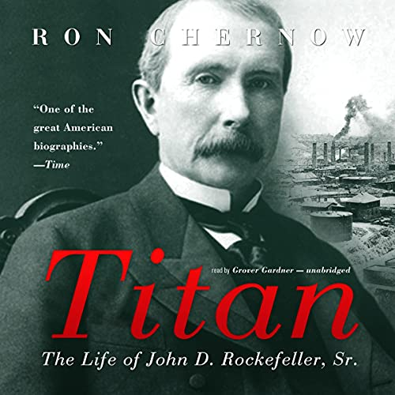

# (Audio) Titan, by Chernow

I wouldn't have chosen this, but it was a book club pick. It did turn
out to be interesting enough for me to make it through over 35 hours
of audio. [Chernow][] does well, and there's lots to say about
[Rockefeller][]. His dad was quite a character, and his son funded
Colonial Williamsburg, turns out. Topics of business, wealth, and the
good life remain relevant.

[Chernow]: https://en.wikipedia.org/wiki/Ron_Chernow "Ron Chernow"
[Rockefeller]: https://en.wikipedia.org/wiki/John_D._Rockefeller "John D. Rockefeller"

